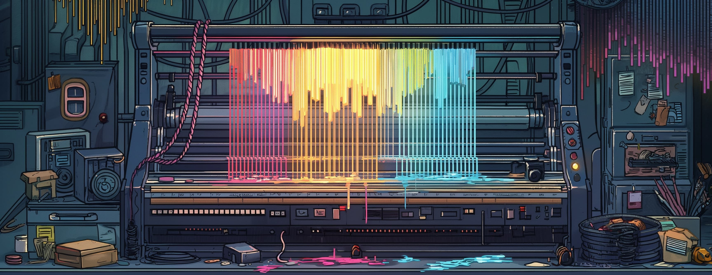

# Common Labs

Radioactive experiments. Turn back! You will find no API stability here.



## Overview

There's a frontend, and a backend.

All of the backend code lives within [Toolshed](./packages/toolshed), and is written in
Deno2.

All of the user-facing frontend code lives within [Jumble](./packages/jumble), and is
written with React.

## Running the backend

For a more detailed guide, see [./packages/toolshed/README.md](./packages/toolshed/README.md).

```bash
cd ./packages/toolshed
deno task dev
```

By default the backend will run at <http://localhost:8000>

## Running the frontend

Run the dev server

```bash
cd ./packages/jumble
deno task dev
```

By default, the frontend will run at <http://localhost:5173>, and it will point
to a local backend running at <http://localhost:8000>.

If you are not actively making updates to the backend, you can also point to the
backend running in the cloud, by running the following command:

```shell
TOOLSHED_API_URL=https://toolshed.saga-castor.ts.net/ deno task dev
```
