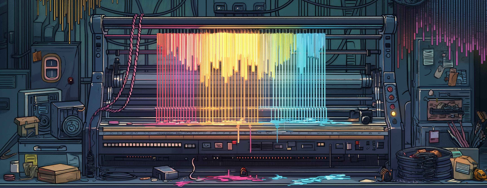

# Common Fabric Platform

**Common Labs** is where the Common Fabric platform is built in the open. This
is early, fast-moving work: interfaces change often, and there is no API
stability yet. You are welcome to explore the code, run and write patterns, and
contribute.



## What is Common Fabric?

Common Fabric is a nascent distributed computing platform that provides both a
runtime and storage layer. The design allows instrumentation of all information
flow in the system, enabling safe & private collaboration at scale.

### Core Concepts

**Patterns** are reactive programs that can be linked together to create data
and program networks. They're written in TypeScript (TSX) and run in a secure
sandbox environment. Patterns can:

- Process and transform data
- Render interactive UIs using `cf-` prefixed components
- React to changes from linked patterns
- Connect to external APIs

**Pieces** are deployed instances of patterns running in Common Fabric spaces.
Pieces can be linked together to create complex workflows where data flows
automatically between connected components.

**Spaces** are collaborative environments where pieces live and interact. Users
can run their own spaces or use hosted versions.

## Quick Start (Development)

1. Install [Deno 2](https://docs.deno.com/runtime/getting_started/installation/)
2. Clone this repo
3. Install the Git hooks: `deno task install-hooks` (optional)
4. Start local dev servers: `./scripts/start-local-dev.sh`
5. Access the application at <http://localhost:8000>

For Claude Code users, run [`/deps`](.claude/commands/deps.md) to verify
prerequisites, [`/start-local-dev`](.claude/commands/start-local-dev.md) to
start the dev servers, and [`/tour`](.claude/commands/tour.md) to get a
Claude-mediated introduction. See
[LOCAL_DEV_SERVERS.md](./docs/development/LOCAL_DEV_SERVERS.md) for
troubleshooting.

_New Common Tools employees are encouraged to visit go/trailhead._

## Architecture

This is a multi-package monorepo with several key components:

**Backend ([Toolshed](./packages/toolshed))**: The hosted platform backend,
written in Deno2, that provides the distributed runtime and storage.

**Frontend ([Shell](./packages/shell))**: A web client interface written with
Lit Web Components for interacting with Common Fabric spaces.

**CLI (cf)**: Command-line interface for managing pieces, linking patterns, and
deploying to spaces. Run `deno task cf --help` for command reference.

**UI Components ([packages/ui](./packages/ui))**: Custom VDOM layer and `cf-`
prefixed components for pattern UIs.

**Examples & Patterns ([packages/patterns](./packages/patterns))**: Example
patterns for building with Common Fabric.

**Pattern Development**: Patterns can be developed using the repo-local
`skills/pattern-dev/` skill package. Claude compatibility still exposes this as
`/pattern-dev`. See [Pattern Documentation](./docs/common/) for patterns,
components, and handlers.

## Development & Integrations

### AI Skills & Commands

This repository includes repo-local skills plus runtime-specific discovery
surfaces and Claude compatibility commands for common workflows:

- `skills/pattern-dev/` - Develop patterns with LLM assistance
- `skills/pattern-test/` - Write and run pattern tests
- `skills/pattern-deploy/` - Deploy patterns and test with CLI
- `/start-local-dev` - Start local dev servers
- `/deps` - Dependency and integration setup
- `/fix-issue` - Fix a specific issue
- `/oracle` - Investigate how things actually work

`skills/` is the canonical authored source. Codex discovers repo-local skills
through `/.agents/skills/`, while Claude compatibility preserves the existing
`/pattern-dev`, `/pattern-test`, and related skill names through
`/.claude/skills/`.

### Dependencies & Integrations

**Required**:

- [Deno 2](https://docs.deno.com/runtime/getting_started/installation/) -
  Runtime for backend and tooling

**Recommended Integrations**:

- [GitHub CLI](https://github.com/cli/cli) - For PR and issue workflows
- Browser automation for pattern testing uses the bundled `agent-browser` skill
  (no MCP setup required)
- Claude Code MCP integrations (run `/deps` in Claude Code for setup):
  - Playwright MCP — optional fallback browser driver for the `/tour` command

### Development Practices

- **CI/CD**: All changes must pass automated checks before merging
- **Testing**: Tests are critical - run with `deno task test`
- **Linting**: Use `deno task check` for type checking
- **Formatting**: Always run `deno fmt` before committing
- See [CLAUDE.md](./CLAUDE.md) for detailed coding guidelines

## Running the backend

For a more detailed guide, see
[./packages/toolshed/README.md](./packages/toolshed/README.md).

```bash
cd ./packages/toolshed
deno task dev
```

By default the backend will run at <http://localhost:8000>

## Running the frontend

**Recommended:** Use `./scripts/start-local-dev.sh` to start both backend and
frontend together. See
[LOCAL_DEV_SERVERS.md](./docs/development/LOCAL_DEV_SERVERS.md) for details.

**Manual setup** (if you need to run servers separately):

```bash
# Against local backend (use dev-local, NOT dev)
cd ./packages/shell
TOOLSHED_PORT=8000 deno task dev-local
```

**Important:** `deno task dev` points to the production backend. Use
`deno task dev-local` when running against a local Toolshed instance.

The frontend dev server runs at <http://localhost:5173>. Access the application
at <http://localhost:8000>, where toolshed proxies to shell.

If you are not running a local backend, you can point to the cloud:

```shell
cd ./packages/shell
deno task dev
```

## Contributing

We welcome contributions! You can submit a PR from a fork of the repo. You will
need to tell someone that you submitted the PR, though; we don't generally look
through the list of pending PRs. Just let us know in the `#runtime` channel; see
[Discord](#discord) below.

We use agentic development practices heavily. As this is a very new practice,
norms have not yet been established and techniques change weekly. We may
"review" your PR by recreating it, or by providing extensive feedback from an
agent.

Using agents is not a substitute for judgement. Check your agent's output; see
what it is doing. Have it prove its hypotheses and assumptions; perform manual
testing to check the user experience makes sense with your change. We rely
heavily on unit tests, integration tests, and lints to guide agents; add your
own to help future agents do even better.

When communicating with humans, make it clear what you are writing versus what
your bot is writing.

If you have commit access, we trust you to use your own judgement for when a PR
needs review by another human or not. If you are not sure if the PR should land,
it definitely needs review.

We use [Cubic](https://cubic.dev/); you should always take its review feedback
into account and leave a comment if you disagree.

PRs should only land when their tests are green.

Some tests are flaky. If a test job fails and you believe it is a flake, rerun
it. For bonus points, set an agent on reproducing the failure and proposing a
fix.

We have a CI job that checks the performance of the other jobs. If it fails,
check whether your PR might have in fact worsened performance. If not, you may
rerun the test (CI performance is extremely noisy). If you are adding tests or
have some other valid reason to be making the performance worse, use the escape
hatch described in the CI output to reset the baselines.

The performance job also checks for test coverage regressions. If your PR
introduces new uncovered lines, use the proposed agent prompt to direct your
agent at adding more coverage. In some rare circumstances this is impractical;
if necessary consider using the escape hatch described in the CI output to reset
the baselines.

We grant commit access to people we trust. Do not ask for commit access.

## Community

### Values

**Catalyze something far greater than yourself.** The value we create in the
world is both direct and indirect. Although the direct value is easiest to see,
the ripple effects in time and space of our indirect value are far greater. Lead
by gardening; catalyze greatness in those around you. Create significantly more
value than you capture. There's more to life than commercial value; inspire
meaning and significance around you. Create infinite games wherever you can.
Centralization tends to happen by default, but do what you can to prevent it
from happening quickly, and provide gentle pressure towards decentralization. If
you have to pick between the product or the ecosystem, pick the ecosystem.

**Survive, then thrive.** Get a good-enough, usable prototype as quickly as
humanly possible, and then as it gains momentum, continuously improve it to
converge on greatness. Working code is orders of magnitude more useful than
beautiful docs. Be scrappy and clever, and use existing components wherever
possible: lateral thinking with weathered technology. Good enough in practice is
much more valuable than great in theory.

**"Yes, and…".** Meet surprising new ideas with openness and curiosity. This is
not to say that every idea you come across is great, but challenge yourself to
find the seeds of greatness in everything you see and then build on those seeds.
Approach debate in a collaborative, not combative, stance. Understand that
diversity is strength, even if it can feel hard in the moment. Choose what to
build on deliberately, but don't close doors you don't have to. Be radically
open to those around you.

**Spread your wings.** Follow your highest and best use. Inspire yourself to
lean into your superpower and grow it, to continually become the best version of
yourself. Do work you would be proud to show your ancestors. Be authentic to
yourself at all times. Strive to act in a way that you can be proud not just of
what you accomplish, but how you accomplish it. Do right by others proactively
without having to be asked.

**Growth requires change.** Don't hold too tightly to what you are today. See
how to continually grow into a better version of yourself. Structure you lay
down should support, not constrain, and wherever possible it should be living
structure.

### Communication

This is a space for safe divergent thinking.

**Collaborative debate.** This is a
[collaborative debate](https://medium.com/@komorama/debate-should-be-collaborative-not-combative-185ff37f1d34)
environment where we explore an ambiguous strategic space together as equals.
Intellectual intensity is OK, emotional intensity is not. Assume good intentions
and seek to understand the perspectives of others.

**Don't try to shame other participants.** Don't make anyone feel bad for not
knowing something, or looking at something a different way than you do, or
coming to a different conclusion than you do on some topic. No jokes or sarcasm
that could be misread as shaming someone either (including yourself) — even if
the recipient gets it, others might not. The goal is to be a place where people
can feel comfortable taking intellectual risks and learn safely. Related: don't
be an ideologue and insist that everyone see something through whatever lens you
think is most important.

**Don't let the perfect be the enemy of the good.** Feel free to share
half-formed thoughts, incomplete sentences, etc. It's far better to share
something that might be interesting than hold back because it's not fully
formed.

**Don't try to force conversations to convergence.** Allow threads to wander and
branch. Don't try to drive towards a singular answer or way of looking at
things. If you say a few things but don't get any reactions, or people move on
to other topics, that's a good sign you might be dominating the conversation.

**Avoid charged or totalizing assertions.** The real world is not black and
white, but various shades of gray. Many of the topics we discuss are nuanced and
complex. Discussing them in totalizing ways, especially with charged language,
can make it harder for people to engage in a curious, open-minded way. Avoid
assertions like "FOO is dumb", "FOO can't work", or essentialist claims like
"FOO is \<reductive other thing\>", which might come across as adversarial or
not willing to engage collaboratively to unpack the nuance. Instead, try things
like "I fear that FOO won't work because REASON, I wonder how that might apply
here", or just declining to participate in that thread.

**Avoid topics that might be charged.** In a perfect world with a perfect vacuum
and an infinite, frictionless plane, it's fine to have an intellectual
discussion on any topic. We don't live in that world though, because each of us
is a human with particular experiences, embedded in a larger system. We should
stay away from topics that might have a strong emotional charge for any
potential participant or onlooker now or in the future. Conversations must stay
focused on topics that are non-controversial and related (even if indirectly) to
Common Tools and the ecosystem we're trying to catalyze. If someone is
uncomfortable with a topic you brought up, back off, even if you don't
understand why someone might be uncomfortable. If someone brings up a topic
you're uncomfortable with, please contact <conduct@common.tools>.

_See also our
[code of conduct](https://github.com/commontoolsinc/labs?tab=coc-ov-file)._

### Discord

We use Discord ([join here](https://discord.gg/GdmWeFMFGw)). Here's a quick
overview of some of the important channels:

- **`#general`:** general chit-chat about the project, the state of the
  industry, developments in AI, and generally anything that doesn't fit in
  another channel.
- **`#runtime`:** development chat about the Common Fabric runtime. This is
  where people are working; please only use this channel when contributing to
  the project.
- **`#quotes`:** insightful, fun, or inspiring quotes. We often use it to share
  silly things that our agents come up with.
- **`#craft`:** we consider our _craft_ to include the responsible use of
  agents, and we regularly share our experiences among the team to help us
  develop these skills here.

Some team members have `#<person>-log` channels, where they post what they are
working on, their thoughts, and generally keep the team updated as to their
activities. If you wish to reach out to a specific team member, you might be
able to do so by posting in their channel. (Posting to some log channels may be
restricted to team members only.)

### Glossary

- **agent:** an AI tool such as [Codex](https://openai.com/codex/) or
  [Claude Code](https://claude.com/claude-code) that can perform autonomous
  tasks such as coding. The Common Fabric runtime is designed to have patterns
  largely written by agents.
- **estuary:** the name of our production toolshed server.
- **loom:** you may hear people in the community refer to "Loom"; this is a
  product the Common Tools team is working on based on the open source work in
  this repository.
- **pattern:** a program that runs on the Common Fabric runtime. See the
  [pattern documentation](./docs/common/).
- **rapids:** the name of our staging toolshed server.
- **toolshed:** the backend server software that hosts the runtime. See
  [packages/toolshed](./packages/toolshed).
