# Charm Workflow System: A Comprehensive Guide

## Overview

The Charm Workflow System provides an LLM-powered approach to charm generation
and modification. It analyzes user intent, classifies operations into specific
workflows, and generates appropriate code through a structured pipeline. The
system is designed to be predictable, maintainable, and extensible.

## Code Execution Flow

```mermaid
flowchart TD
    %% Entry Point
    start([UI: user input]) --> A["imagine/modifyCharm"]
    A --> B["executeWorkflow"]
    
    %% Main processing function
    B --> C["processWorkflow"]
    
    %% 1. FORMAT stage
    C --> F1["1. FORMAT: processInputSection"]
    F1 --> FM["formatPromptWithMentions"]
    FM --> DP1[/"Form Packet 1:
    - rawInput
    - processedInput 
    - references"/]
    
    %% 2. CLASSIFY stage
    DP1 --> CL1["2. CLASSIFY: fillClassificationSection"]
    CL1 --> CL2["classifyIntent"]
    CL2 --> CL3["classifyWorkflow LLM"]
    CL3 --> DP2[/"Form Packet 2:
    - workflowType
    - confidence
    - reasoning"/]
    
    %% 3. PLAN stage
    DP2 --> P1["3. PLAN: fillPlanningSection"]
    P1 --> P2["generatePlan"]
    P2 --> P3["generateWorkflowPlan LLM"]
    P3 --> DP3[/"Form Packet 3:
    - steps
    - spec
    - schema
    - meta.isFilled = true"/]
    
    %% 4. GENERATE CODE stage - branching point
    DP3 --> G1["4. GENERATE: generateCode"]
    
    %% Workflow type decision
    G1 --> decision{Which workflow?}
    decision -->|"fix"| FIX["executeFixWorkflow"]
    decision -->|"edit"| EDIT["executeEditWorkflow"]
    decision -->|"rework"| REWORK["executeReworkWorkflow"]
    
    %% Fix & Edit Path (via iterate)
    FIX & EDIT --> IT1["iterate"]
    IT1 --> IT2["getIframeRecipe"]
    IT2 --> IT3["genSrc"]
    IT3 --> IT4["generateNewRecipeVersion"]
    IT4 --> DP4A[/"Data Packet 4A:
    - recipeId
    - newRecipeSrc
    - newSpec"/]
    
    %% Rework Path
    REWORK --> RW1["castNewRecipe"]
    RW1 --> RW2["scrub/turnCellsIntoAliases"]
    RW2 --> RW3["generateSpecAndSchema"]
    RW3 --> RW4["genSrc"]
    RW4 --> RW5["buildFullRecipe"]
    RW5 --> DP4B[/"Data Packet 4B:
    - newRecipeSrc
    - newSpec
    - scrubbed data"/]
    
    %% 5. COMPILE Stage - paths converge
    DP4A & DP4B --> CO1["5. COMPILE: compileAndRunRecipe"]
    CO1 --> CO2["compileRecipe"]
    CO2 --> CO3["tsToExports"]
    CO3 --> CO4["registerNewRecipe"]
    
    %% Result
    CO4 --> Result[/"Final Form:
    - generation.charm
    - meta.isComplete = true"/]
    Result --> final([Charm Cell])
```



### Pipeline Description

The workflow system flows through distinct stages with clear data assembly at
each step:

1. **FORMAT** - Processing input and references
   - `processInputSection` handles raw user input
   - `formatPromptWithMentions` resolves @mentions to charm references
   - **Output Packet**: Form with processed input and references

2. **CLASSIFY** - Determining the workflow type
   - `fillClassificationSection` orchestrates classification
   - `classifyIntent` analyzes input to choose workflow type
   - Forces "rework" workflow when other charms are referenced
   - **Output Packet**: Form with workflow type, confidence score, and reasoning

3. **PLAN** - Generating execution plan
   - `fillPlanningSection` develops the execution plan
   - `generatePlan` creates steps, spec updates, and schema updates
   - Preserves existing spec for "fix" workflow
   - **Output Packet**: Form with execution plan, spec, and schema

4. **GENERATE CODE** - Branching to workflow-specific implementation
   - Routes form to appropriate workflow function:

   **4A. ITERATE** (Fix & Edit workflows)
   - Both use `iterate()` but with different parameters
   - Fix: Preserves spec, only updates code
   - Edit: Updates both spec and code
   - `generateNewRecipeVersion` creates new recipe with updates
   - **Output Packet**: Recipe id, source, spec

   **4B. REWORK** (Rework workflow)
   - Uses `castNewRecipe()` to create entirely new charm
   - Processes charm references with `turnCellsIntoAliases`
   - Generates new spec and schema
   - **Output Packet**: Recipe source, spec, processed data references

5. **COMPILE** - Final recipe compilation and charm creation
   - `compileAndRunRecipe` takes recipe source and compiles it
   - `compileRecipe` handles TypeScript compilation
   - Updates form with the generated charm
   - **Output Packet**: Completed form with charm cell, ready to return

The form object is progressively enriched at each stage, with each stage
building on the data packet from the previous stage. The system only branches
after the planning stage when the workflow type must be handled differently.

## Entry Points

The workflow system can be initiated from several places in the UI:

1. **Command Center** (`CommandCenter.tsx`)
   - Global command palette (⌘K)
   - Processes user input and @mentions
   - Shows live preview with `useLiveSpecPreview` hook
   - Uses `handleImagineOperation()` in `commands.ts` to dispatch workflow
   - Entry point for both new charms and modifications to existing charms
   - Supports "Fast" vs "Smart" model selection for preview generation

2. **CharmDetailView** (`CharmDetailView.tsx`)
   - Operation tab in the bottom sheet when viewing a charm
   - Uses `useCharmOperation()` hook to manage operations
   - Handles iterate, extend, and variant generation workflows
   - Performs operations via `performOperation()` function

3. **Direct Functions**
   - External applications can call the core functions directly:
   - `executeWorkflow()`: Main entry point for all workflow processing
   - `imagine()`: Alias for `executeWorkflow()`, used in most places
   - `modifyCharm()`: Higher-level function for modifying existing charms

## Core Workflow Types

The system supports three primary workflows:

1. **Fix**
   - **Purpose**: Correct issues without changing functionality
   - **Updates**: Code only
   - **Schema**: Preserved
   - **Spec**: Preserved
   - **Example**: "Fix the alignment of the buttons"
   - **Implementation**: Uses `iterate()` with preserved spec

2. **Edit**
   - **Purpose**: Add features while preserving core data structure
   - **Updates**: Code and specification
   - **Schema**: Core structure preserved
   - **Example**: "Add dark mode support"
   - **Implementation**: Uses `iterate()` with spec updates

3. **Rework**
   - **Purpose**: Create something new, potentially combining data sources
   - **Updates**: Code, specification, and schema
   - **Schema**: Can be completely different
   - **Example**: "Create a dashboard combining my tasks and calendar"
   - **Implementation**: Uses `castNewRecipe()`
   - **References**: Can reference multiple charms

## Workflow Form Progression

The system builds up a `WorkflowForm` object throughout the process:

1. **Creation**: `createWorkflowForm(rawInput)` initializes the basic structure
   ```typescript
   {
     input: { rawInput, processedInput: rawInput, references: {} },
     classification: { workflowType: "edit", confidence: 0, reasoning: "" },
     plan: { steps: [] },
     meta: { isComplete: false, isFilled: false }
   }
   ```

2. **Input Processing**: `processInputSection(form, options)`
   - Processes @mentions in the input
   - Resolves references to other charms
   - Updates `form.input.processedInput` and `form.input.references`
   - Sets `charmManager` in `form.meta`

3. **Classification**: `fillClassificationSection(form, options)`
   - Determines workflow type via LLM or heuristic fallbacks
   - Forces "rework" workflow when other charms are referenced
   - Updates `form.classification`
   - Sets `modelId` in `form.meta`

4. **Planning**: `fillPlanningSection(form, options)`
   - Generates execution plan and updated spec/schema
   - For "fix" workflow, preserves existing spec
   - Updates `form.plan` with steps, spec, and schema
   - Sets `form.meta.isFilled = true`

5. **Generation**: `generateCode(form)`
   - Executes the appropriate workflow function
   - Sets `form.generation.charm` with the created charm
   - Sets `form.meta.isComplete = true`

## Charm References and @Mentions

When a user references another charm with an @mention:

1. The `formatPromptWithMentions()` function processes these references
2. The system forces a "rework" workflow even if manual override is attempted
3. The references are processed in `executeReworkWorkflow()` to create a new
   charm with access to referenced data

## UI Integration

1. **Live Preview**: The `useLiveSpecPreview` hook:
   - Processes input as the user types
   - Calls `generateWorkflowPreview()` which runs the workflow process in "dry
     run" mode
   - Provides dynamic feedback on classification, plan, and spec
   - Manages multiple loading states for different preview components
   - Supports "Fast" vs "Smart" model selection

2. **SpecPreview Component**:
   - Displays workflow type with confidence score
   - Shows execution plan as numbered steps
   - Conditionally shows spec (hidden for "fix" workflow)
   - Allows workflow type override through a toggle

## Execution Pipeline

The main entry point is `executeWorkflow()`, which:

1. Processes the full form with `processWorkflow(input, false, options)`
2. Routes execution to the appropriate workflow function:
   - `executeFixWorkflow()`: Preserves spec, updates implementation
   - `executeEditWorkflow()`: Updates spec and implementation
   - `executeReworkWorkflow()`: Creates new charm with new spec/schema

## Integration with existing components:

1. The system leverages existing functions:
   - `iterate()`: Core function for Fix/Edit workflows
   - `castNewRecipe()`: Core function for Rework workflow
   - `genSrc()`: Generates source code for all workflows

2. LLM integration:
   - `classifyWorkflow()`: LLM-based classification
   - `generateWorkflowPlan()`: LLM-based plan generation
   - `generateSpecAndSchema()`: For creating new specifications and schemas

## Fallback Mechanisms

The system includes fallbacks at each stage:

1. If LLM classification fails, it falls back to keyword heuristics
2. If plan generation fails, it provides default plans for each workflow
3. If mention processing fails, it continues with the raw input

## Key Implementation Details

- **Workflow Form**: Centralized data structure that evolves through the process
- **Force Rework**: References to other charms force the rework workflow
- **Input Processing**: Handles @mentions and creates charm references
- **Live Preview**: Progressive processing showing classification → plan → spec
- **Execution Plan**: Structured steps to fulfill the user's request

## Extensibility

The workflow system is designed to be extensible:

1. **New Workflow Types**: The `WorkflowType` type and `WORKFLOWS` record can be
   expanded
   - Add new entries to the `WORKFLOWS` record
   - Update classification logic to recognize new types
   - Implement specialized execution functions

2. **Model Selection**: The system supports different LLM models for different
   stages
   - Fast models for classification and preview
   - More powerful models for code generation
   - `getModelId()` function maps user-friendly names to model identifiers

3. **UI Customization**: The workflow UI components are decoupled
   - `SpecPreview` can be integrated in different contexts
   - `useLiveSpecPreview` hook can be used in custom components
   - Workflow type toggle allows manual override when appropriate
