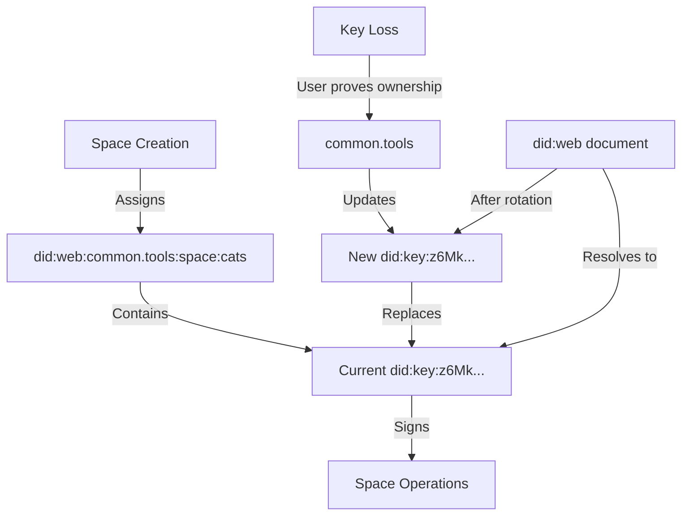
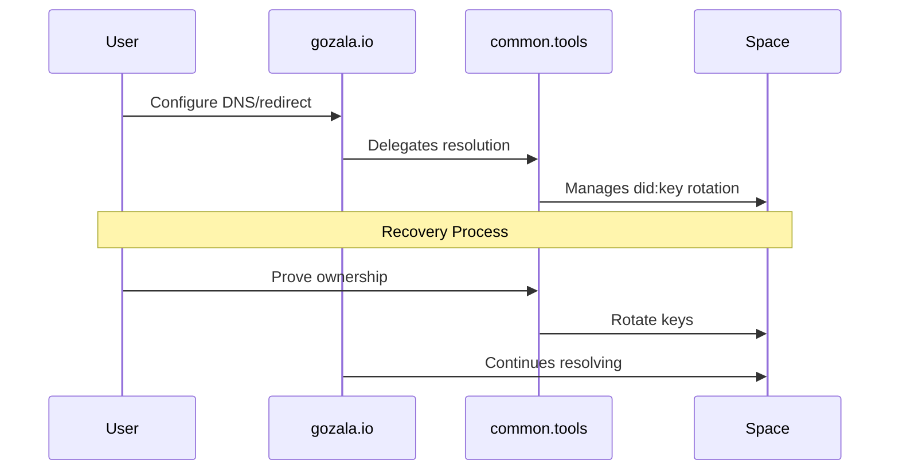

# Access Recovery

## Overview

Access recovery mechanisms balance convenience with privacy. Users should choose recovery methods based on their security requirements and risk tolerance. The fundamental tension is that convenient recovery methods often create linkability between spaces through shared recovery principals in the delegation chain.

## Recovery Methods

### 1. Mnemonic-Based Recovery

The simplest recovery mechanism uses [BIP39](https://github.com/bitcoin/bips/blob/master/bip-0039.mediawiki) mnemonic phrases to serialize keypairs during space creation.


**Advantages:**

- User-controlled, no third-party dependencies
- Familiar pattern from cryptocurrency wallets
- Works offline

**Limitations:**

- Not scalable for multiple spaces (mnemonic fatigue)
- Single point of failure if phrase is lost
- Security depends entirely on user storage practices

### 2. Verifiable Claims Recovery

Pioneered by Keybase and adopted by web3.storage, this method represents identities as [DID](https://www.w3.org/TR/did-core/) identifiers that can receive delegated access.


#### Email-Based Recovery Flow

The [did:mailto](https://github.com/storacha/specs/blob/main/did-mailto.md) specification enables email-based recovery:

1. **Setup**: User delegates space access to their `did:mailto:user@example.com`
2. **Recovery**: User creates verifiable claim via email
3. **Verification**: System verifies DKIM signatures to confirm email authenticity
4. **Redelegation**: Verified claim enables access delegation to new `did:key`

#### Attestation-Based Verification

To simplify the UX, [web3.storage session protocol](https://github.com/storacha/specs/blob/main/w3-session.md#authorization-session) introduces trusted attestations:


**Extensibility**: This pattern works with any verifiable identity system:

- Bluesky handles (using post merkle proofs)
- GitHub accounts (using signed gists)
- DNS domains (using TXT records)
- Phone numbers (using SMS verification)

### 3. Trusted Third Party Recovery

A pragmatic approach where users delegate recovery rights to a trusted service provider.


**Privacy Advantage**: All spaces show the same recovery principal (`did:web:common.tools`), preventing cross-space correlation.

**Trust Tradeoff**: The trusted party could be compelled to grant access to unauthorized parties.

### 4. Web-Based Identity Recovery

Instead of ephemeral `did:key` identifiers, spaces can use persistent `did:web` identifiers that enable key rotation through web infrastructure control.



#### Implementation Patterns

**1. Provider-Managed Identities**
- Space gets identifier like `did:web:common.tools:space:cats`
- Provider maintains did:web document mapping to current `did:key`
- Recovery through provider's authentication system
- Clear authority model: provider controls the namespace

**2. Bring Your Own Domain (BYOD)**
- Users provide `did:web:gozala.io` or `did:dns:gozala.io`
- Full control over key rotation
- Requires DNS/web server management
- Suitable for technical users or organizations

**3. Hybrid Delegation Model**


**Advantages:**
- User-friendly URLs with custom domains
- Provider switching without identifier changes
- Gradual decentralization path
- Clear authority and recovery model

**Configuration Example:**
```json
{
  "id": "did:web:gozala.io:space:projects",
  "controller": "did:web:gozala.io",
  "alsoKnownAs": ["did:web:common.tools:u:gozala:space:projects"],
  "verificationMethod": [{
    "id": "#key-1",
    "type": "Ed25519VerificationKey2020",
    "controller": "did:web:gozala.io:space:projects",
    "publicKeyMultibase": "z6Mk..."
  }],
  "service": [{
    "type": "SpaceProvider",
    "serviceEndpoint": "https://common.tools/api/v1/spaces/projects"
  }]
}
```

### 5. Threshold Signature Recovery

Using [BLS signatures](https://en.wikipedia.org/wiki/BLS_digital_signature) enables distributed recovery where `m` of `n` guardians must cooperate.


**Configuration Options:**

- Social recovery: Friends/family as guardians
- Institutional: Mix of personal and service provider guardians
- Geographic distribution: Guardians in different jurisdictions

**Implementation Considerations:**

- Guardian availability requirements
- Key share secure distribution
- Coordination protocols for recovery
- Time-locked recovery for additional security

## Security Considerations

### Delegation Chain Privacy

Each recovery method creates different privacy implications:

| Method | Cross-Space Linkability | Third-Party Trust | User Responsibility |
|--------|------------------------|-------------------|-------------------|
| Mnemonic | None | None | High |
| Verifiable Claims | Medium (by identity) | Verifier only | Medium |
| Trusted Third Party | Low | High | Low |
| Web-Based Identity | High (by domain) | Domain owner | Variable |
| Threshold | None | Distributed | Medium |

### Recovery Attack Vectors

1. **Phishing**: Attackers may create fake recovery interfaces
2. **Guardian Compromise**: In threshold schemes, targeting guardians
3. **Identity Takeover**: Email/social account compromise in verifiable claims
4. **Coercion**: Forcing users to initiate recovery

## Implementation Guidelines

### Choosing Recovery Methods

Users should consider:

- **Value at Risk**: Higher value spaces need stronger recovery
- **Usage Patterns**: Frequently accessed spaces benefit from convenient recovery
- **Threat Model**: Corporate vs personal use cases differ
- **Technical Expertise**: Some methods require more user sophistication

### Best Practices

1. **Multiple Recovery Methods**: Allow users to set up redundant recovery
2. **Recovery Testing**: Prompt users to test recovery before it's needed
3. **Time Delays**: Add configurable delays to recovery processes
4. **Audit Logs**: Record all recovery attempts and successes
5. **Notification**: Alert users of recovery attempts via multiple channels

## Future Directions

### Emerging Technologies

- **Secure Enclaves**: Hardware-based key recovery
- **Biometric Recovery**: Using biometric data for threshold signatures
- **Decentralized Recovery Networks**: P2P guardian networks
- **Smart Contract Recovery**: On-chain recovery logic for Web3 integration

### Standardization Efforts

Work is ongoing to standardize recovery protocols across:

- [DIF Recovery Methods](https://identity.foundation/)
- [W3C DID Working Group](https://www.w3.org/2019/did-wg/)
- [IETF OAuth Working Group](https://datatracker.ietf.org/wg/oauth/about/)

## References

- [varsig](https://github.com/ChainAgnostic/varsig): Variable signature schemes
- [did:mailto](https://github.com/storacha/specs/blob/main/did-mailto.md): Email DID method
- [did:key](https://www.w3.org/TR/did-core/#did-key): Key-based DID method
- [BIP39](https://github.com/bitcoin/bips/blob/master/bip-0039.mediawiki): Mnemonic code for generating deterministic keys
