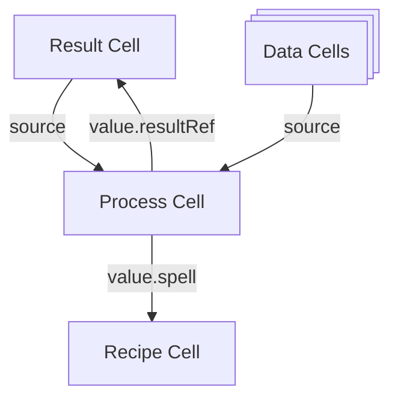

Here's a diagram of how cells are typically connected.

We often call the main result cell the "charm" and that cell's id is the id in the url.

```mermaid
flowchart TD
        A["Result Cell"]
        A --source--> B["Process Cell"]
        B --value.resultRef--> A
        B --value.spell--> C["Recipe Cell"]
        D@{ shape: procs, label: "Data Cells"} --source--> B
```