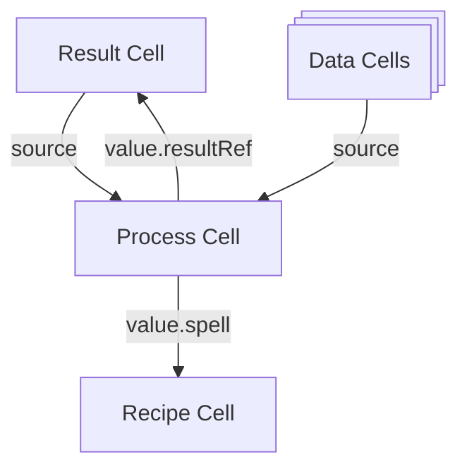

A `Page` (historically known as a `Charm`) is an instance of a `Pattern` bound to specific cells.

Here's a diagram of how cells are typically connected within a `Charm`:

We often call the main result cell the "charm".

