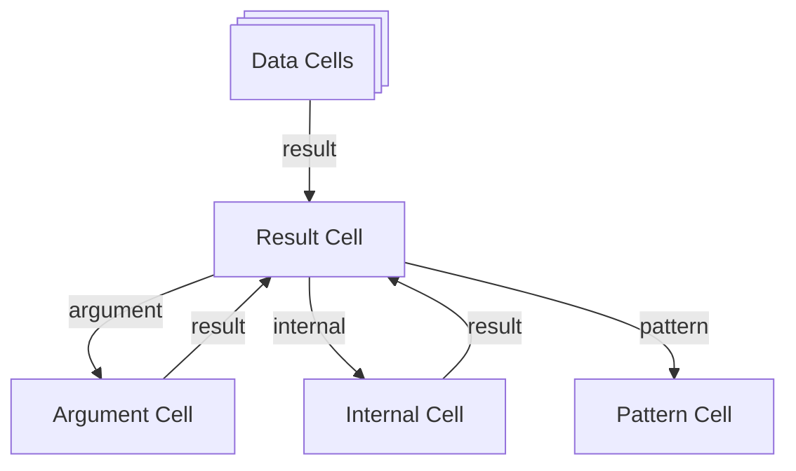

# Glossary

## ACL (Access Control List)

Defines who can read or write specific data in a space, forming part of the
data's access policy.

## Cell

Cell is a unit of reactivity, conceptually it is similar to a cell in a
spreadsheet. It holds a value that can be updated by writing into a cell. Cell
can also have subscribers that will be called whenever cell content is updated
allowing them to compute derived state which will end up propgating it to some
output cell.

## CFC (Contextual Flow Control)

A security model combining information flow control with contextual integrity;
enforces policies on how data is used, attached to schemas and validated both
statically and dynamically.

## Piece

Piece is a [pattern] invocation binding set of [cell]s as inputs and set of
[cell]s as outputs, creating an execution graph. It may help to think of [pattern]
as an open electric circuit, in this case [piece] would be a closed electric
circuit as current will flow through it. Different analogy could be to think of
[piece] as a process, where's [pattern] would be a program and [cell]s would be
program inputs and outputs.

There are a few more specific terms for cells within the piece:

- Result Cell -- This is the main piece cell. The UI will be built here.
- Argument Cell -- This holds some of the inputs of the piece.
- Internal Cell -- This is a temporary cell, but it holds the working state of the piece.
- Pattern Cell -- Contains the pattern source code.

## CRDT (Conflict-free Replicated Data Type)

A data structure that can resolve conflicts automatically in distributed
systems. Used selectively, e.g. for collaborative text editing.

## Space

Space is primarily a sharing boundary, designed to enforce access control.
Spaces are identified by unique [did:key] identifiers. Users control access and
permissions via [UCAN]s and [ACL]s.

> ℹ️ Currently each space has a corresponding sqlite database to store all of
> its state.

Space can be queried and updated using [memory protocol], which describes state
in terms of [fact](../../development/runtime-glossary.md#fact)s.

## [did:key]

A decentralized identifier derived from a keypair. Used to uniquely identify and
control a [Space].

## Event Handler

Code that reacts to events and may update other cells or trigger further
actions.

## Action

An event handler created with `action()` inside a pattern body. It closes over
pattern state directly and returns a [Stream]. The default way to handle UI
events; see [Handling Events](./action.md).

## Computed

A derived reactive value created with `computed()`. The body re-runs whenever
the reactive values it reads change. Use it for deriving data, not gating UI;
see [computed()](./computed/computed.md).

## Stream

A write-only channel for triggering events, typed `Stream<T>` in pattern
Output interfaces. A bound handler or action IS a stream; other pieces invoke
it via `.send()`. See
[Exporting Handlers as Streams](./handler.md#exporting-handlers-as-streams).

## PerSpace / PerUser / PerSession

Scoped cell types that set a value's sharing boundary: `PerSpace<T>` is shared
by everyone in a [space], `PerUser<T>` follows the authenticated user across
tabs and sessions, and `PerSession<T>` is fresh per browser session/tab. See
[Multi-User Patterns](../patterns/multi-user-patterns.md).

## LLM (Large Language Model)

AI models such as Claude or ChatGPT that can be called from patterns for
AI-generated outputs.

## Reactive Framework

The runtime engine behind Common Fabric that computes state updates in a
deterministic way, using dependency graphs of reactive cells.

## Pattern

A unit of computation that defines a reactive graph and describes a
transformation from a set of inputs to a set of outputs. In practice it is
manifested as a TypeScript function that takes an object with a set of
properties and returns an object with a set of outputs. Patterns can produce UI,
derived data, or streams and are used like components in other reactive
frameworks.

It is worth pointing out that while a TypeScript function is used it does not
actually define a computation, instead it is a way to build a computation
pipeline that flows through input [cell]s into output [cell]s.

## CTS (Common Fabric TypeScript)

Typescript dialect that is pre-processed in patterns to preserve familiar
Typescript patterns when using Cells and shared storage. This leverages the
typescript compiler to parse the AST (Abstract Syntax Tree) of the code, and
make appropriate transformations, including generating runtime schemas from
TypeScript types (e.g. for `generateObject<T>`). Use
`/// <cf-disable-transform />` on the first non-empty line of a file to opt
out of CTS transforms.

## Safe Rendering

The secure, isolated rendering of pattern-generated UI, considered part of the
Trusted Computing Base (TCB).

## TCB (Trusted Computing Base)

The minimal set of components that must be trusted to enforce security. This
includes rendering infrastructure (e.g. web components), and excludes
user-authored patterns, which are sandboxed.

## UCAN (User Controlled Authorization Network)

A capability-based auth system that allows delegating access rights using signed
tokens.

## VDOM (Virtual DOM)

A data representation of UI elements returned by patterns, which the runtime
turns into rendered HTML.

---

Storage internals (Fact, Memory, Storage Cache / Heap / Nursery) are documented
in the [Runtime Glossary](../../development/runtime-glossary.md).

[pattern]: #pattern
[cell]: #cell
[piece]: #piece
[acl]: #acl-access-control-list
[cfc]: #cfc-contextual-flow-control
[cts]: #cts-common-fabric-typescript
[crdt]: #crdt-conflict-free-replicated-data-type
[deno]: #deno
[did:key]: #didkey
[event-handler]: #event-handler
[llm]: #llm-large-language-model
[stream]: #stream
[reactive-framework]: #reactive-framework
[pattern]: #pattern
[safe-rendering]: #safe-rendering
[space]: #space
[tcb]: #tcb-trusted-computing-base
[ucan]: #ucan-user-controlled-authorization-network
[vdom]: #vdom-virtual-dom
[memory protocol]: https://github.com/commontoolsinc/RFC/blob/main/rfc/memory.md
[did:key]: https://w3c-ccg.github.io/did-key-spec
