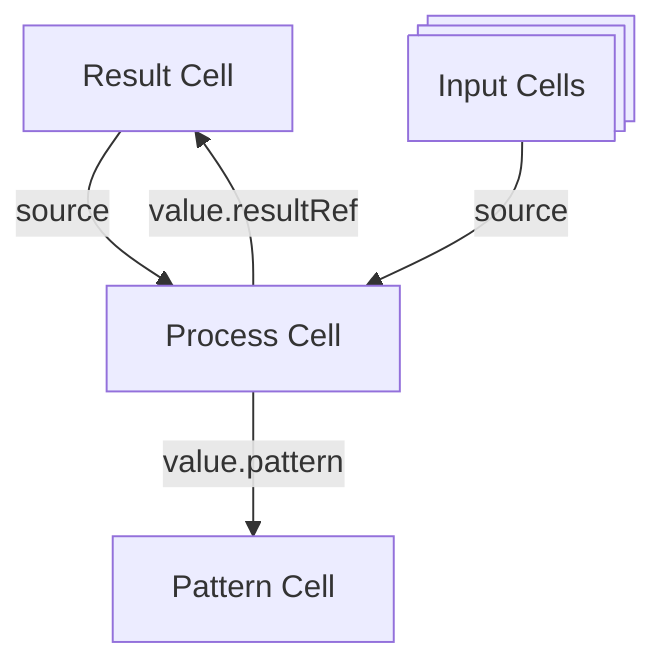

# Patterns

A pattern is a TypeScript/JSX program that defines reactive data transformations with an optional UI. You instantiate a pattern by binding it to specific cells.



## Input and Output Types

Explicitly define types for your pattern inputs and outputs. This makes your code clearer and helps catch errors early.

```typescript
interface TodoInput {
  items: Writable<Todo[]>;
  title: Writable<string>;
}

interface TodoOutput {
  items: Todo[];
  title: string;
  addItem: Stream<{ text: string }>;
}

export default pattern<TodoInput, TodoOutput>(({ items, title }) => {
  // ...
  return { items, title, addItem };
});
```

### Input Types

Input types describe what the pattern receives when instantiated. Use `Writable<>` for state the pattern intends to modify:

```typescript
interface MyInput {
  count: Writable<number>;     // Pattern will call .set() or .update()
  items: Writable<Item[]>;     // Pattern will call .push() or .set()
  label: string;               // Read-only (still reactive!)
}
```

**Guideline:** Most inputs should be `Writable<>` since patterns typically modify their state. Use plain types only for truly read-only data.

### Output Types

Output types describe what the pattern returns. They should exactly mirror the return object without additional wrapping:

```typescript
interface MyOutput {
  count: number;               // Not Writable<number>
  items: Item[];               // Not Writable<Item[]>
  increment: Stream<void>;     // Exported handler
}
```

The output type reflects the *shape* of the returned data, not how it's stored internally.

### Type Inference

You can omit type parameters and let TypeScript infer them:

```typescript
// Inferred types - acceptable for simple patterns
export default pattern(({ count, items }) => {
  return { count, items };
});
```

However, explicit types are recommended because they:
- Document intent clearly
- Catch type mismatches at compile time
- Make the pattern's contract visible in `schemas.tsx`

### Always Use Dual Type Parameters

**Always use `pattern<Input, Output>()`** for production patterns:

```typescript
// ✅ Correct - explicit Output enables testing and proper typing
export default pattern<TodoInput, TodoOutput>(({ items }) => {
  const addItem = addItemHandler({ items });
  return { items, addItem };
});

// ❌ Avoid - actions aren't typed, can't test via .send()
export default pattern<TodoInput>(({ items }) => {
  const addItem = addItemHandler({ items });
  return { items, addItem };  // addItem type is unknown
});
```

**Why this matters:**
- **Testing requires Output types** - To test via `instance.action.send()`, actions must be typed as `Stream<T>` in the Output interface
- **Sub-patterns require `[UI]` in Output** - When rendering a sub-pattern via `.map()`, the Output type must include `[UI]: VNode`
- **TypeScript verification** - Explicit Output types catch mismatches at compile time

Use `pattern<State>()` or `pattern<>()` only for throwaway prototypes.

### Output Types for Sub-Patterns

When a pattern will be rendered inside another pattern (e.g., Column inside Board), include `[NAME]` and `[UI]` in the Output type:

```typescript
import { NAME, UI, VNode, Stream } from "commontools";

interface ColumnOutput {
  [NAME]: string;
  [UI]: VNode;
  cardCount: number;
  addCard: Stream<{ title: string }>;
}
```

**Rendering syntax:** Use function calls, not JSX, for sub-patterns with Output types:

```tsx
// ✅ Correct - function call
{columns.map((col) => Column({ column: col }))}

// ❌ Wrong - JSX fails because OpaqueCell isn't a JSX Element
{columns.map((col) => <Column column={col} />)}
```

## See Also

- [Pattern Composition](../patterns/composition.md) - How sub-pattern rendering works
- [Writable](./types-and-schemas/writable.md) - Write intent in type signatures
- [Self-Reference](./self-reference.md) - Using `SELF` with dual type parameters
