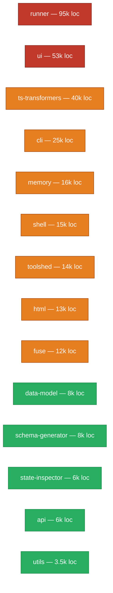
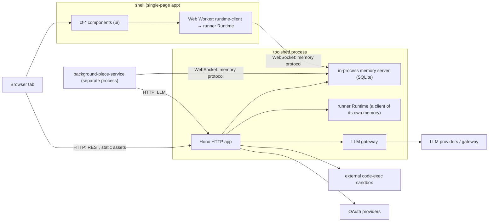

# Architecture orientation for new engineers

This folder is a map of the Common Fabric monorepo for someone who has never
seen it before. It was assembled by reading the actual source in every package
and by extracting the real import edges between packages, rather than by
restating intentions. Where the code disagrees with the older prose in
`AGENTS.md` or a package README, the disagreement is called out instead of
smoothed over.

Read the pages in roughly this order:

1. **This page** — the big picture: what the system is, the layer model, the
   deployed runtime topology, and a glossary.
2. [The dependency graph](dependency-graph.md) — which package imports which,
   measured from source, including the circular dependencies and the
   layering violations the layer model would prefer you not to notice.
3. [The runtime core](runtime-core.md) — `runner`, the reactive engine that
   everything else is arranged around.
4. [The storage substrate](storage-substrate.md) — `memory`, `data-model`,
   `identity`, and the two small leaf libraries underneath them.
5. [The compile pipeline](compile-pipeline.md) — how an author's `.tsx` file
   becomes a runnable module with JSON Schemas attached (`api`,
   `ts-transformers`, `js-compiler`, `schema-generator`).
6. [The client and rendering stack](client-render.md) — `html`, `ui`,
   `iframe-sandbox`, `shell`.
7. [The backend](backend.md) — `toolshed`, `background-piece-service`, `llm`.
8. [The CLI, pieces, and filesystem](cli-piece-fuse.md) — `cli`, `piece`,
   `runtime-client`, `fuse`.
9. [Examples, support libraries, and repo tooling](tooling-and-patterns.md) —
   `patterns`, `utils`, `static`, the test runner, the dev-server scripts, and
   the skills system.

A note on vocabulary before anything else: this repository was renamed from
**"charm"** to **"piece."** That rename is now essentially complete in source —
`background-charm-service` became `background-piece-service`, and a scan finds
"charm" only inside a Scrabble word list. What survives is the on-the-wire
`bgUpdater` stream name and a dated cause string in the background service (kept
so existing spaces don't break), plus some test file names and git history.
Treat the two words as the same concept. See the glossary at the bottom of this
page.

---

## What the system is, in one paragraph

Common Fabric runs small user-written reactive programs called **patterns**.
A pattern is written in TypeScript with JSX, and it is built out of reactive
**cells** that live in a durable, content-addressed store. A running instance of
a pattern is called a **piece**. Pieces live in a **space**, which is a store
identified by a cryptographic key (a Decentralized Identifier, written "DID").
When a cell changes, a scheduler re-runs only the computations that read that
cell, and the results flow out to the user interface, to other pieces, and back
to durable storage. The whole thing is designed so that every flow of
information can be observed and gated, which is what the "Contextual Flow
Control" (CFC) machinery in the runtime is for.

---

## The layer model ("pace layers")

`AGENTS.md` describes the repository as a stack of layers that change at
different speeds — the foundation changes slowly, the end-user programs change
constantly. The diagram below mirrors that list. `AGENTS.md` also carves out a
set of support and test packages that sit outside the layer stack (`utils`,
`content-hash`, `leb128`, `test-support`, `deno-web-test`, `integration`,
`generated-patterns`, `felt`, `static`, `vendor-astral`, `fs-sync-example`);
those are shown in the side box.

```mermaid
flowchart TB
    subgraph L7["7 · End-user programs (change constantly)"]
        patterns["patterns"]
        homeschemas["home-schemas"]
    end
    subgraph L6["6 · User interface"]
        ui["ui (cf-* web components)"]
    end
    subgraph L5["5 · Deployed product"]
        toolshed["toolshed (backend)"]
        shell["shell (web SPA)"]
        libshell["lib-shell"]
        rtc["runtime-client"]
    end
    subgraph L4["4 · Operation"]
        cli["cli (the cf command)"]
        bcs["background-piece-service"]
        fuse["fuse"]
        sinsp["state-inspector"]
        cfh["cf-harness"]
    end
    subgraph L3["3 · Capabilities"]
        piece["piece"]
        html["html (VDOM + JSX)"]
        llm["llm"]
    end
    subgraph L2["2 · System"]
        schemagen["schema-generator"]
        iframe["iframe-sandbox"]
        tstx["ts-transformers"]
        jsc["js-compiler"]
    end
    subgraph L1["1 · Foundation (changes slowly)"]
        api["api"]
        datamodel["data-model"]
        runner["runner"]
        identity["identity"]
        memory["memory"]
    end
    subgraph SUP["Support & test (outside the stack)"]
        utils["utils"]
        contenthash["content-hash"]
        leb128["leb128"]
        misc["test-support, deno-web-test, integration,<br/>generated-patterns, felt, static,<br/>vendor-astral, fs-sync-example"]
    end

    L7 --> L6 --> L5 --> L4 --> L3 --> L2 --> L1
    L1 -.-> SUP
```



The layer model is a useful first mental model, but it is aspirational, not
enforced. The real import graph has edges that point the "wrong way" — for
example the foundation-layer `runner` imports the capability-layer `html`, and
imports schemas from the end-user-layer `home-schemas`. Those exceptions are the
subject of [the dependency graph page](dependency-graph.md), and they matter
because they are exactly the places where a change in a "leaf" package can break
the "foundation."

---

## How big each package is

Sizes are non-test TypeScript lines, measured from source. They tell you where
the weight (and the reading time) actually is. Note that two large numbers are
not hand-written engineering: `patterns` is example programs, and most of
`static` is a single generated TypeScript standard-library declaration file.



(Excluded from this chart because they are examples, generated, or vendored:
`patterns` 321k, `generated-patterns` 39k, `vendor-astral` 29k, `cf-harness`
23k, `static` 13k. See the [tooling page](tooling-and-patterns.md).)

---

## The deployed runtime topology

This is what is actually running when the product is up. A browser loads the
`shell` single-page application (which `toolshed` itself serves). The shell does
its real work inside a Web Worker that holds a `runner` runtime; that worker
talks to `toolshed` over a WebSocket. `toolshed` is unusual in that it is *both*
the durable-storage server *and* a client of its own storage — it holds an
in-process memory server and also a `runner` runtime that connects back to it.
A separate `background-piece-service` process runs pieces on a timer when no
browser is open.



The detail of each box is on the [backend page](backend.md) and the
[client page](client-render.md). The single most important thing to internalize
here: **the WebSocket carrying the memory protocol is the real state channel.**
The REST endpoints are secondary. Durable cell state, subscriptions, and pushed
updates all travel over that socket.

---

## The one data-flow picture worth memorizing

Everything in the runtime is a variation on this loop. An author's code becomes
a graph of reactive computations; a write to a cell wakes the scheduler; the
scheduler re-runs only the dependent computations; their writes either wake more
computations or settle; settled state is committed to storage and rendered to
the screen.

```mermaid
flowchart LR
    author[".tsx pattern source"]
    compile["compile pipeline<br/>(ts-transformers + js-compiler)"]
    graph["pattern = serializable node graph<br/>(builder)"]
    instantiate["runner instantiates nodes<br/>into scheduler actions"]
    cells["Cells in a Space"]
    scheduler["scheduler<br/>(re-runs readers of changed cells)"]
    storage["memory<br/>(durable, content-addressed)"]
    render["html → DOM<br/>(ui web components)"]

    author --> compile --> graph --> instantiate --> scheduler
    scheduler <--> cells
    cells <--> storage
    scheduler --> render
    render -- "events" --> scheduler
```

The mechanics of the scheduler loop — why it is "pull-based," what a "settle"
is, how a write decides which readers to re-run — are on the
[runtime-core page](runtime-core.md).

---

## Glossary

These words appear everywhere and rarely get defined in one place.

- **Pattern** — a reactive program written in TypeScript/JSX. Older code called
  this a "recipe"; the current source has moved off that term.
- **Piece** — a running, deployed instance of a pattern, rooted at a result
  cell. Formerly called a "charm." The rename is now essentially complete in
  source; see the top of this page.
- **Space** — a durable store identified by a DID. Pieces and their cells live
  in a space. A space can be backed by its own derived keypair.
- **DID** — Decentralized Identifier, here always a `did:key:…` derived from an
  Ed25519 public key. Produced and verified by the `identity` package.
- **Cell** — a typed, reactive handle to a path inside a document inside a
  space. Reads and writes go through a transaction. A `Stream` is the
  write-only, event-channel sibling of a Cell.
- **Reactive** — the build-time stand-in for a future Cell, used while a
  pattern's graph is being constructed. Exported to authors as `cell`. (This was
  called `OpaqueRef` until that spelling was removed from the authoring surface;
  the name survives only as a backward-compatibility symbol check in
  `ts-transformers` and in git history.)
- **Schema** — a JSON Schema. The compile pipeline derives one from your
  TypeScript types and attaches it at every reactive boundary; subscriptions are
  driven by schema-plus-path queries.
- **CFC (Contextual Flow Control)** — the information-flow-control system. It
  labels data and gates writes and outward flows ("egress"). It lives mostly in
  `runner/src/cfc` and is enforced at commit and render time.
- **FabricValue** — the value model used across storage boundaries. It is JSON
  plus the things JSON cannot carry (bigint, Map, Set, dates, byte arrays,
  content hashes, links). Defined in `data-model`.
- **`cf`** — the command-line tool, run with `deno task cf …`. Implemented in
  the `cli` package.
- **toolshed** — the backend server process. It has no package name because it
  is an application, not a library.
