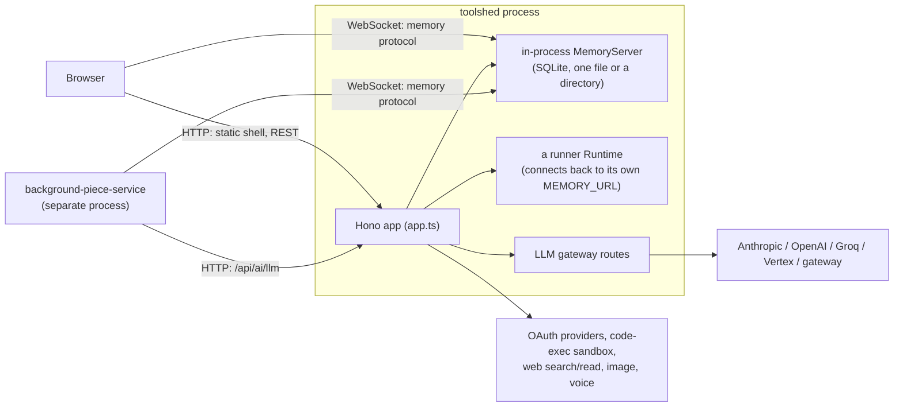
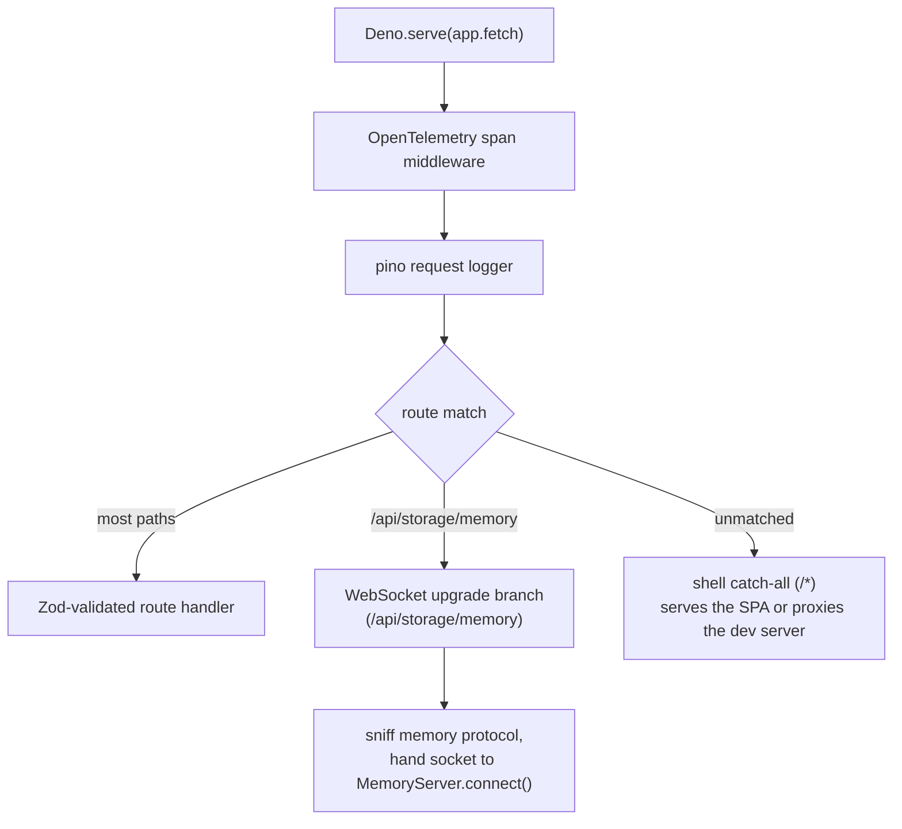
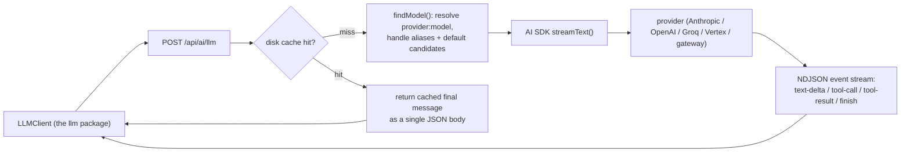
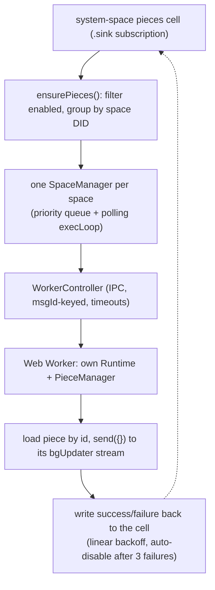

# The backend: `toolshed`, `background-piece-service`, `llm`

`toolshed` is the deployed backend. It is a single Deno process built on the
Hono HTTP framework, and it does an unusual amount: it is the durable-storage
server, it runs a runtime of its own, it is an LLM gateway, it does OAuth for a
handful of third-party providers, and it serves the `shell` frontend.
`background-piece-service` is a separate process that runs pieces on a timer.
`llm` is a thin client library that talks to `toolshed`'s LLM endpoints.

`toolshed` has **no package name** in its `deno.jsonc`, because it is an
application, not an importable library. It is launched from `index.ts`.

`background-piece-service` (package `@commonfabric/background-piece`) was called
`background-charm-service` until the charm-to-piece rename. The directory,
package, and source all say "piece" now — the word "charm" appears nowhere in
the package. A couple of persisted identifiers were deliberately left unchanged
so existing spaces keep resolving (the `bgUpdater` stream name and a dated cause
string); those are legacy-shaped, not "charm" — see the note under Technical
debt below.

---

## The deployed topology

The thing to internalize: **`toolshed` is both a memory server and a memory
client.** It serves the durable store over a WebSocket, and it also holds a
`runner` runtime that connects back to that same store to run patterns
server-side. New readers find this confusing until they see both wirings in
`index.ts`.

---

## The HTTP and WebSocket request lifecycle

The memory WebSocket handler is the most intricate file in `toolshed`. It
upgrades the request, takes the first text frame as the candidate handshake and
validates it against the memory protocol (buffering any later frames until the
handoff so none are lost), then hands the socket to the in-process memory server
and bridges frames in both directions. This is the channel `shell`, the `cli`,
and `background-piece-service` all use for durable state.

### The route groups

Most groups follow a `*.routes.ts` (the Zod/OpenAPI schema) plus `*.handlers.ts`
(the logic) plus `*.index.ts` (the wiring) convention. A few (`telemetry`,
`blobs`) skip the triad and register plain Hono routes inline in their
`*.index.ts` instead.

| Path | What it does |
|---|---|
| `/_health`, `/api/health/*` | liveness, stats, LLM provider health |
| `/api/storage/memory` | the durable-store WebSocket |
| `/api/ai/llm`, `/generateObject`, `/models` | the LLM gateway (streaming) |
| `/api/ai/img`, `/voice/transcribe`, `/webreader/*` | other AI capabilities |
| `/api/agent-tools/web-search`, `/web-read` | tools patterns and agents can call |
| `/api/integrations/*` | OAuth2 for ~8 providers, auto-wired from descriptors |
| `/api/patterns/:filename` | serves pattern source files |
| `/api/sandbox/exec` | proxies code execution to an external sandbox service |
| `/api/ingest/:id` | journal-sink ingest channel — posts external data into a space |
| `/api/webhooks[/:id]` | webhook CRUD and delivery |
| `/api/telemetry/*` | telemetry ingest |
| `/api/whoami`, `/api/meta`, `/api/blobs` | identity, build info, blobs |
| `/*` | the shell SPA (mounted last) |

---

## The LLM gateway

The provider abstraction lives in `toolshed`, not in the `llm` package — which
surprises people, because they look in `llm/` first and find only an HTTP
client. Models are keyed `provider:model` (for example
`anthropic:claude-sonnet-4-6`). The gateway uses the Vercel AI SDK for the
direct providers and also pulls a dynamic set of "gateway" models from an
internal endpoint.

The `llm` package itself is purely the consumer: `LLMClient.sendRequest`
POSTs to the endpoint and reassembles the streamed events. It also holds shared
prompt templates and a mock/fixture system that blocks live calls under test.
The `llm → runner` import cycle is a single line — `prompts/json-import.ts`
imports `createJsonSchema` from `runner`.

---

## The background piece service

This process runs pieces' `bgUpdater` handlers on a schedule, so background work
happens with no browser open. It watches a system-space cell listing the
registered pieces, groups them by space, and runs each space's pieces in an
isolated Web Worker.

The registered-pieces list is typed as `BGPieceEntry` (`schema.ts`), fetched via
`getBGPieces`, and watched with `piecesCell.sink(...)`. Isolation is strict: one
worker per space, and a terminal worker error disables the whole space and
recreates the worker. The default rerun interval is 60 seconds.

---

## Technical debt and sharp edges

- **The provider abstraction is in the wrong-feeling place.** It is in
  `toolshed/routes/ai/llm/models.ts`, not in the `llm` package. Look there.
- **OAuth providers are auto-wired from descriptors at startup.** Providers with
  missing credentials are silently skipped, and the shared
  `/api/integrations/bg` route attaches to whichever provider has credentials
  first. Non-obvious when an endpoint "isn't there."
- **The shell route's headers are deliberately non-isolating.** The COOP/COEP
  headers are set the way they are as defense-in-depth for the SES-sandboxed
  patterns. Do not "fix" them without understanding why.
- **`background-piece-service` carries the most TODOs in this group**, several
  about the scheduler being approximate: space managers should watch their own
  pieces, a terminal error cannot always be attributed to a specific piece (so a
  stray failure can disable a whole space), and sync is assumed never to return
  partial results. Others are about worker/piece lifecycle and cleanup.
- **`bcs` depends on hardcoded constants** — the system-space DID and a dated
  cause string `BG_CELL_CAUSE = "bgUpdater-2025-03-18"` in `schema.ts` — and
  requires a one-time admin grant before any piece is polled.
- **The rename kept a few backward-compat identifiers.** So existing spaces keep
  resolving, the charm→piece rename intentionally left the persisted/wire names
  alone: the `bgUpdater` handler-stream name, the cause string
  `BG_CELL_CAUSE = "bgUpdater-2025-03-18"`, and the derived system-space DID
  (`BG_SYSTEM_SPACE_ID`), all in `schema.ts`/`worker.ts`. None of them contain
  the word "charm"; they are simply legacy-shaped.
- **A tool-loop cap is hardcoded** (`stepCountIs(8)`) in `generateText.ts` as a
  runaway guard.

---

## Entry points and ports

- `toolshed` — entry `index.ts` (`deno task dev` or `production`). Built into a
  single binary by `Dockerfile.toolshed` at the repo root; a `COMPILED` sentinel
  file switches the shell route from dev-proxy to static serving.
- `background-piece-service` (`@commonfabric/background-piece`) — entry
  `src/main.ts` (`deno task start`). It now ships its own tests, so unlike
  `vendor-astral` it is no longer in the test runner's disabled list.
- `llm` — library only; `.`, `./types`, `./client`.
- `ports.json` (repo root): `toolshed` 8000, `shell` 5173, inspector 9229. The
  OpenTelemetry collector defaults to 4318.
