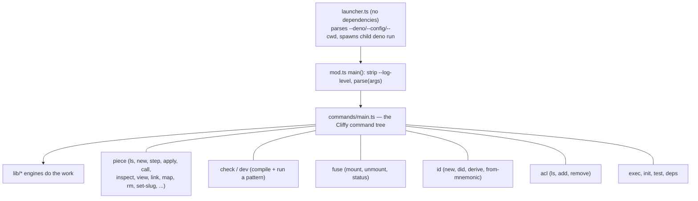
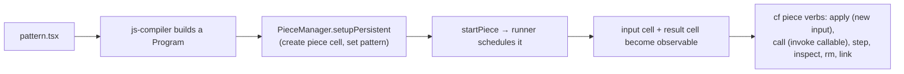
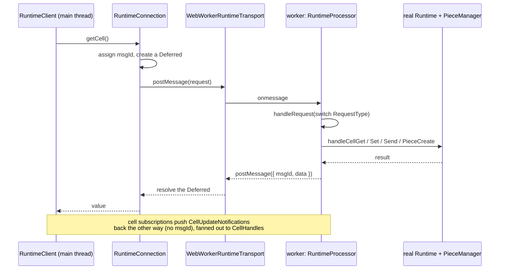
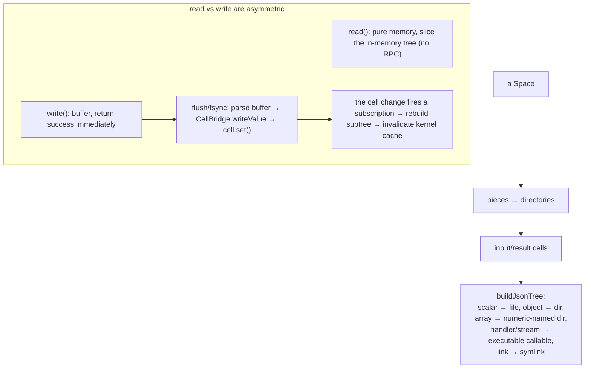

# The CLI, pieces, and the filesystem: `cli`, `piece`, `runtime-client`, `fuse`

This group is how a human or another process drives the runtime. `cli` is the
`cf` command. `piece` is the lifecycle layer for deployed pattern instances.
`runtime-client` is how a client talks to a runtime that lives in another thread.
`fuse` mounts a space as files. Two more packages ride along: `fs-sync-example`
is a worked example, and `cf-harness` is an experimental agent runtime that is
*not* a test harness despite its name.

---

## `cf`: command dispatch

The `cf` command has a two-stage entry. `launcher.ts` is a dependency-free Deno
script that parses a few launch flags and spawns a child `deno run` of the real
entry point. This indirection exists so `cf` can start before the import map is
active, which matters for sibling repositories and vendoring. The real entry
(`mod.ts`) builds a Cliffy command tree.

A launcher subtlety that bites people: `--config` is the *child Deno* import
map, not a `cf` or pattern config. Pass same-named flags through to `cf` after a
`--`.

---

## The piece lifecycle

A "piece" is a deployed instance of a pattern: a runtime cell with input and
result cells, plus the pattern source. `PieceManager` is the low-level layer
that talks directly to a `runner` `Runtime`; the `ops/` controllers
(`PiecesController`, `PieceController`) are the higher-level handles.

`PieceManager` also tracks the reference graph between pieces
(`getReadingFrom` / `getReadByPieces`), manages the default (home) pattern, and
handles ACLs through `PiecesController.acl()`.

---

## The runtime-client worker bridge

Clients (the shell, sometimes the CLI) do not hold a `runner` `Runtime`
directly. They hold a `RuntimeClient` on the main thread that proxies every
call across a boundary — currently a Web Worker — to a `RuntimeProcessor` that
holds the real runtime. This is the clearest "two sides of a boundary" picture
in the codebase.

The wire protocol (request types, notification types, response shapes) is in
`runtime-client/protocol/types.ts`. The worker side that owns the real runtime
is `runtime-client/backends/runtime-processor.ts`.

---

## The FUSE filesystem mapping

`fuse` mounts a space as a real filesystem. Pieces become directories, cell
values explode into nested files and directories, handlers and tools become
executable files, and inter-piece references become symlinks. Reads come from an
in-memory tree; writes are buffered and written back to cells on flush.

The asymmetry is a real sharp edge: `write(2)` returns success *before* the cell
mutation lands (fire-and-forget), so a disconnect between the reply and the
flush can silently lose data. The package's `RELIABILITY_DESIGN.md` and a
CFC-writeback state machine are the mitigation. The FFI struct layouts are
hand-maintained and differ between macOS (FUSE v2 / FUSE-T) and Linux
(FUSE v3 / libfuse3).

---

## The two passengers

- **`fs-sync-example`** is a worked example, not infrastructure: a daemon that
  keeps a todo-list pattern's cells in sync with a markdown file, demonstrating
  the compare-and-set retry loop and single-transaction commits. Its README has
  a clean diagram of the cell-to-file sync loop.
- **`cf-harness`** is the biggest naming trap in the repo. It is **not** a test
  harness for the runtime. It is an experimental, Common-Fabric-native agent
  runtime: a bounded model-to-tool-call-to-sandbox-execute loop, with a tool
  registry, Docker/gVisor sandboxing, SQLite session persistence, and CFC-aware
  deny/recovery shaping. Its design direction is that `runner` owns the
  authoritative CFC meaning and `cf-harness` transports and respects it. Loom is
  its first target. The `prompt-loop.ts` file (2889 lines) is monolithic.

---

## Technical debt and sharp edges

- **The "charm" rename is complete in this group.** No `charm` references
  remain in the source of these packages, and the charm-named test files are
  gone too. The former `background-charm-service` package is now
  `background-piece-service` (`@commonfabric/background-piece`). The main
  survivors repo-wide are the wire-level `bgUpdater` stream name, a dated cause
  string in that service, plain-English "charm" occurrences in test-data
  fixtures (a Scrabble word list, a Frankenstein excerpt), and git history.
- **`cli` is a hub, and a growing one** (about 25k non-test lines now). It
  imports `runner` (25), `identity` (9), `utils` (9), `js-compiler` (8),
  `piece`/`api` (5 each), and now `state-inspector` (2) — it wires the offline
  space-inspector (see the [storage page](storage-substrate.md)) into the `cf`
  command. A change in any of those can break the command line.
- **`PieceManager` has a flagged hot spot.** `piece/src/manager.ts:856` carries
  `// FIXME(JA): this really really really needs to be revisited`, and there is
  an elevated-permissions TODO at line 294.
- **`runtime-client` teardown is intentionally quiet.** After a `Dispose`, the
  worker silently acknowledges late requests and drops notifications. This is by
  design but surprising while debugging.
- **The biggest files to budget for:** `fuse/mod.ts` (3389) and
  `fuse/cell-bridge.ts` (3287); `cli/lib/test-runner.ts` (1899) and
  `cli/lib/piece.ts` (1417); `runtime-client/backends/runtime-processor.ts`
  (1798) and `protocol/types.ts` (1153).

---

## Public surfaces and the `cf` subcommands

- **`cli`** — `.` → `mod.ts`; the real entry is `launcher.ts` (the root `cf`
  task). Subcommands: `help`, `acl`, `piece` (with many verbs), `check`, `dev`
  (a hidden alias of `check`), `inspect` (the offline state-inspector), `view`,
  `wish`, `deps`, `exec`, `fuse`, `id`, `init`, `test`, and a hidden `deploy`
  that just prints guidance to use `piece new`.
- **`piece`** — `.` (`PieceManager`, `pieceId`, slug helpers), `./ops` (the
  controllers).
- **`runtime-client`** — `.` → `mod.ts`, `./transports/web-worker`.
- **`fuse`** — `.` → `mod.ts` (the daemon `main(argv)`).
- **`cf-harness`** — a large export map: `./engine`, `./prompt-loop`, `./cli`,
  `./tools`, `./skills/registry`, `./sandbox`, and the `./contracts/*` schemas.
