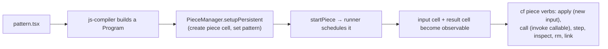
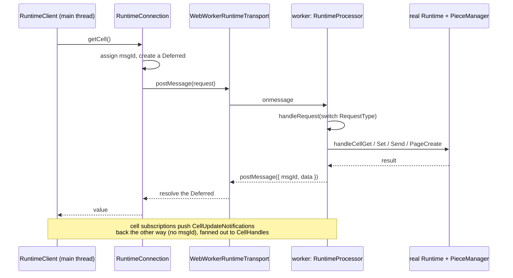
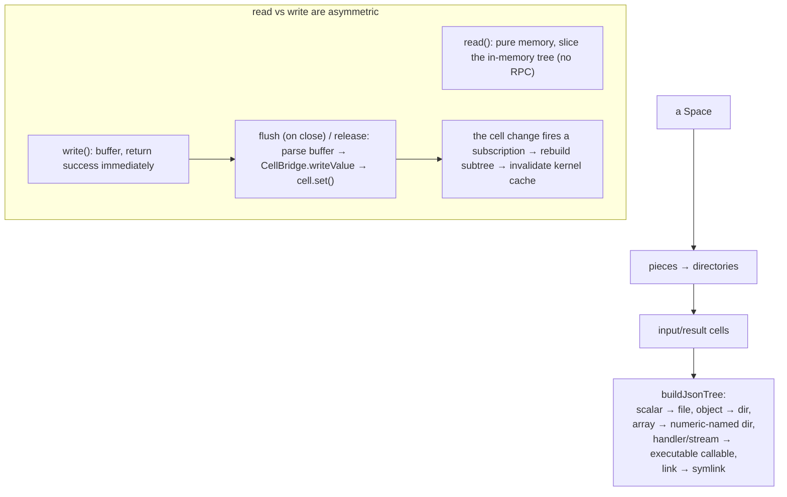

# The CLI, pieces, and the filesystem: `cli`, `piece`, `runtime-client`, `fuse`

This group is how a human or another process drives the runtime. `cli` is the
`cf` command. `piece` is the lifecycle layer for deployed pattern instances.
`runtime-client` is how a client talks to a runtime that lives in another thread.
`fuse` mounts a space as files. Two more packages ride along: `fs-sync-example`
is a worked example, and `cf-harness` is an experimental agent runtime that is
*not* a test harness despite its name.

---

## `cf`: command dispatch

The `cf` command has a two-stage entry. `launcher.ts` is a dependency-free Deno
script that parses a few launch flags and spawns a child `deno run` of the real
entry point. This indirection exists so `cf` can start before the import map is
active, which matters for sibling repositories and vendoring. The real entry
(`mod.ts`) builds a Cliffy command tree.

A launcher subtlety that bites people: `--config` is the *child Deno* import
map, not a `cf` or pattern config. Pass same-named flags through to `cf` after a
`--`.

The `lib/` engines do the real work: `dev.ts` compiles a pattern through the
runtime's *own* harness (`runtime.harness`, deliberately not a second `Engine`,
so verified-load registration and source maps stay on one engine) and optionally
evaluates it; `exec.ts` runs a mounted-callable file and auto-steps
(`pull()` + `synced()`); `test-runner.ts` is the pattern test runner. That test
runner recently grew a **multi-user mode**: a test file can
`export default { setup, participants: { alice, bob } }`, and each participant
runs in its own worker realm with its own identity against one shared in-process
storage server, coordinating steps with `{ label }` / `{ await }` markers (the
orchestrator reports a deadlock if every participant is parked). Assertions retry
with settling until the step timeout.

---

## The piece lifecycle

A "piece" is a deployed instance of a pattern: a runtime cell with input and
result cells, plus the pattern source. `PieceManager` is the low-level layer
that talks directly to a `runner` `Runtime`; the `ops/` controllers
(`PiecesController`, `PieceController`) are the higher-level handles.

`PieceManager` also tracks the reference graph between pieces
(`getReadingFrom` / `getReadByPieces`), manages the default (home) pattern, and
handles ACLs through `PiecesController.acl()` (whose `ACLManager` is actually
re-exported from `runner`, not defined in `piece`). The persistent lifecycle is a
small composition: `runPersistent` = `setupPersistent` (create the cell, set the
pattern, no scheduling) + `startPiece` (start, pull the result cell, wait for
`synced`); `stopPiece` stops it. The full `cf piece` verb set is `ls`, `new`,
`set-slug`, `step`, `apply`, `getsrc`, `setsrc`, `inspect`, `view`, `render`,
`link`, `get`, `set`, `map`, `call`, `rm`, `recreate-root`, and `set-home`
(`--reset` re-homes). A *slug* is a well-known entity id whose cell stores a
write-redirect link to the target piece, written inside a compare-and-set
`editWithRetry`.

---

## The runtime-client worker bridge

Clients (the shell, sometimes the CLI) do not hold a `runner` `Runtime`
directly. They hold a `RuntimeClient` on the main thread that proxies every
call across a boundary — currently a Web Worker — to a `RuntimeProcessor` that
holds the real runtime. This is the clearest "two sides of a boundary" picture
in the codebase.

The wire protocol (`runtime-client/protocol/types.ts`) has three enums: a
`RequestType` (request→response, `msgId`-correlated: `Initialize`/`Dispose`, the
`Cell*` ops, `GetCell`/`Idle`/`RuntimeSynced`/`UploadBlob`, the `Page*` ops, and
`VDomMount`/`Unmount`), a `NotificationType` (worker→main, no `msgId`:
`CellUpdate`, `ConsoleMessage`, `NavigateRequest`, `ErrorReport`, `Telemetry`,
`VDomBatch`, `PendingWritesChanged`, `VersionSkew`), and a `ClientNotificationType`
(main→worker, fire-and-forget: `VDomEvent`, `VDomBatchApplied`). A naming gotcha:
**this protocol calls pieces "pages"** — `PageCreate`, `PageHandle` — so the
main-thread proxies are `CellHandle<T>` and `PageHandle<T>`. The worker side that
owns the real runtime is `runtime-client/backends/runtime-processor.ts`.

---

## The FUSE filesystem mapping

`fuse` mounts a space as a real filesystem. Pieces become directories, cell
values explode into nested files and directories, handlers and tools become
executable files, and inter-piece references become symlinks. Reads come from an
in-memory tree; writes are buffered and written back to cells on flush.

The asymmetry is a real sharp edge: `write(2)` returns success *before* the cell
mutation lands (fire-and-forget), so a disconnect between the reply and the
flush can silently lose data. The package's `RELIABILITY_DESIGN.md` and a
CFC-writeback state machine (`cfc-writeback.ts`, a two-phase `trusted.cfc.*`
xattr protocol whose per-mutation FSM runs
`pending-prepare → mutation-applied → …`, with gVisor-compat `user.commonfabric.*`
aliases) are the mitigation. Other concrete details: JSON keys become path
components via a reversible percent-encoding (`path-codec.ts` escapes `/`, `:`, a
leading `.`, etc.; empty string → `%_empty`); a callable file is a self-invoking
shebang script (`#!<cli> exec`, `# schema:` comment lines you can `cat`, then a
body that re-invokes `cf exec`); virtual files have a fixed size cap. On a cell
change the daemon calls `fuse_lowlevel_notify_inval_entry`/`_inode`, but FUSE-T
returns ENOSYS for `notify_inval_entry`, so it falls back to per-inode
invalidation with short cache timeouts. The FFI struct layouts are hand-maintained
and differ between macOS (FUSE v2; FUSE-T preferred over macFUSE) and Linux
(FUSE v3 / libfuse3, using `fuse_session_new`/`_mount`).

---

## The two passengers

- **`fs-sync-example`** is a worked example, not infrastructure: a daemon that
  keeps a todo-list pattern's cells in sync with a markdown file. Its `doSync()`
  loops until `tx.commit()` returns no error; an `editWatermark` records how many
  edits already reached disk so a retry only applies new ones, and one transaction
  atomically applies edits, sets the todos cell, writes write-redirect links for
  optimistic creates, and clears the edit queue. A PID-liveness lockfile enforces
  single-process operation. It is the cleanest small demo of the compare-and-set
  retry loop and single-transaction commit.
- **`cf-harness`** is the biggest naming trap in the repo. It is **not** a test
  harness for the runtime. It is an experimental, Common-Fabric-native agent
  runtime: a bounded model-to-tool-call-to-sandbox-execute loop with a small set
  of built-in tools (`bash`, `bash-no-sandbox`, `read_file`, `view_image`,
  `web_fetch`, `read_skill_resource`, `run_skill_script`, `edit_file`,
  `write_file`, `delegate_task`), a Docker/gVisor sandbox (`docker-runsc-cfc`,
  default runtime `runsc-cfc`, mounts `/workspace` and `/fabric`), SQLite session
  persistence (WAL mode), an OpenAI-compatible gateway client, and CFC-aware
  deny/recovery shaping. Its design direction is that `runner` owns the
  authoritative CFC meaning and `cf-harness` transports and respects it. Loom is
  its first target. The `prompt-loop.ts` file is monolithic (several thousand
  lines).

---

## Technical debt and sharp edges

The debt and rough edges touching these packages are collected, together with
the rest of the repo's, in [TECHNICAL_DEBT.md](../TECHNICAL_DEBT.md).

---

## Public surfaces and the `cf` subcommands

- **`cli`** — `.` → `mod.ts`; the real entry is `launcher.ts` (the root `cf`
  task). Subcommands: `help`, `acl`, `piece` (with many verbs), `check`, `dev`
  (a hidden alias of `check`), `inspect` (the offline state-inspector), `view`,
  `wish`, `deps`, `exec`, `fuse`, `id`, `init`, `test`, and a hidden `deploy`
  that just prints guidance to use `piece new`.
- **`piece`** — `.` (`PieceManager`, `pieceId`, slug helpers), `./ops` (the
  controllers).
- **`runtime-client`** — `.` → `mod.ts`, `./transports/web-worker`.
- **`fuse`** — `.` → `mod.ts` (the daemon `main(argv)`).
- **`cf-harness`** — a large export map: `./engine`, `./prompt-loop`, `./cli`,
  `./tools`, `./skills/registry`, `./sandbox`, and the `./contracts/*` schemas.
