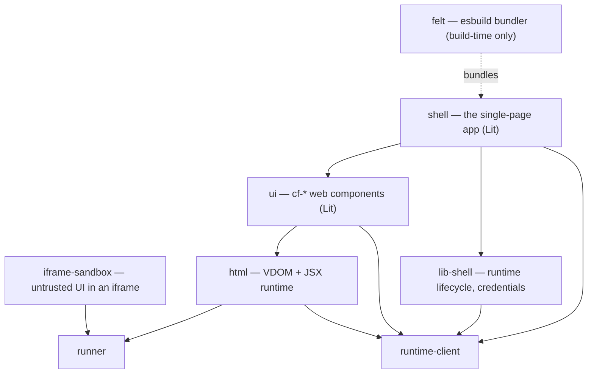
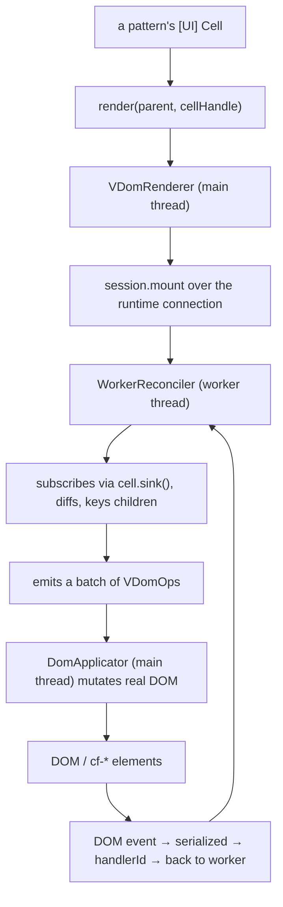
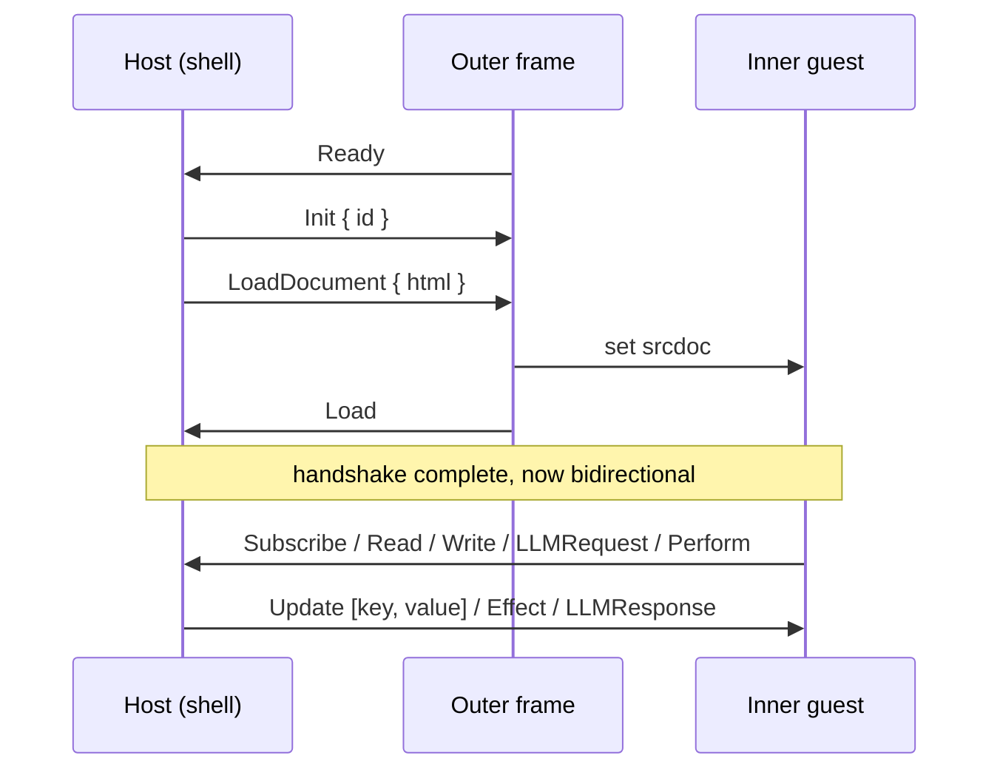
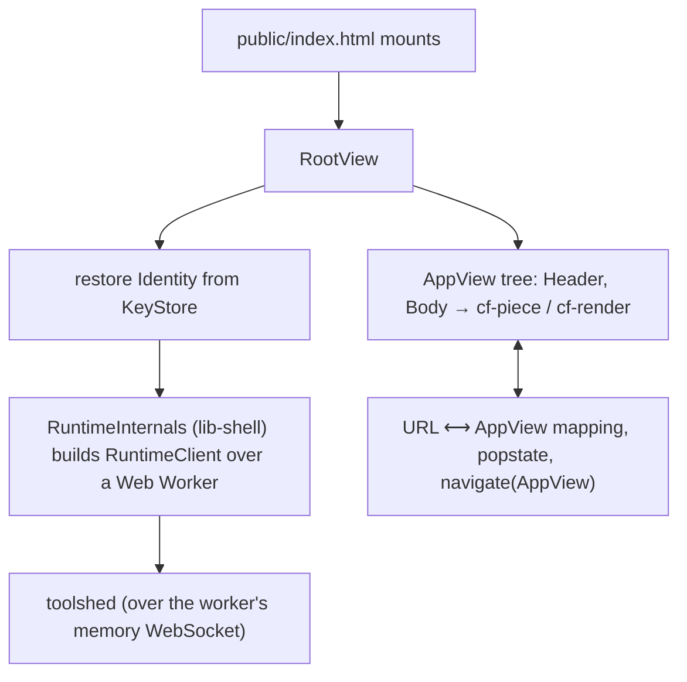

# The client and rendering stack: `html`, `ui`, `iframe-sandbox`, `shell`

This is how a reactive cell value becomes pixels. There are four packages in the
chain, plus two small support packages (`lib-shell`, `felt`). They layer like
this: `html` is a custom virtual-DOM layer and JSX runtime; `ui` is the
`cf-*` web-component library built on Lit; `iframe-sandbox` runs untrusted
pattern UI in an iframe; `shell` is the single-page application that ties it
together.

---

## How the packages relate

The repository sets `jsxImportSource` to `@commonfabric/html`, so every pattern
`.tsx` file compiles its JSX into `h()` calls in the `html` package. That is why
`html` is foundational to the whole client even though it is small.

---

## The render pipeline: cell to DOM, on a worker

There are two render paths in `html`. The live one runs the reconciler **in a
Web Worker**, where cell values are synchronous, and ships DOM-mutation
operations to the main thread over a message channel. (A legacy main-thread
renderer still exists in `render.ts`, selected by a flag.) Understanding the
worker path is understanding the client.

Two facts that catch people out:

- **Cell-backed VNodes are plain serializable JSON.** Event handlers cross the
  worker/main boundary as integer `handlerId`s, not closures (the reconciler will
  accept a raw function prop and register it to a `handlerId`, so a VNode can hold
  a function transiently, but nothing function-valued crosses the wire). This is
  why the reconciler can live in a worker at all.
- **The reconciler enforces CFC render policy.** It can replace blocked content
  with a `cf-cfc-blocked` placeholder (`CFC_BLOCKED_PLACEHOLDER_TAG`, carrying
  `data-cfc-blocked-reason`). If UI content "disappears," suspect the flow-control
  policy before suspecting a render bug.

The `VDomOp` vocabulary (`vdom-ops.ts`) is a small discriminated union:
`create-element` (optionally carrying a `space` for cross-space transclusion),
`create-text`, `update-text`, `set-prop`, `remove-prop`, `set-attrs` (a bulk
initial-render optimization), `set-event` (carries an integer `handlerId`, not a
function), `remove-event`, `set-binding` (carries a `cellRef` for a `$`-bound
prop, not a value), `insert-child`, `move-child`, and `remove-node`. Ops are
collected into a `VDomBatch { batchId, ops, rootId? }` and applied in order.
Children are keyed by `generateKey`, which `JSON.stringify`s the VNode with any
`Cell` replaced by its normalized link so the key is identical on both threads,
appending an occurrence suffix to disambiguate structurally-identical siblings.

On the component side, a `cf-*` element binds to a cell through a
`CellController` (a Lit reactive controller). The controller subscribes via the
main-thread `CellHandle.subscribe()` and calls `requestUpdate()` on change;
writing back calls `cellHandle.set(v)`, which sends a `CellSet` request over IPC
to the worker, and the worker applies it in a transaction
(`runtime.edit()` → `withTx(tx).set(v)` → `tx.commit()`). Debounce and blur
timing for inputs live on the controller (a short debounce by default). The runtime
and the current space arrive through Lit context (`runtimeContext`,
`spaceContext`).

`ui` holds over a hundred `cf-*` component directories under `v2/components/`; `v2/core/`
holds the controllers (`base-element.ts`, `cell-controller.ts` with typed
subclasses, `input-timing-controller.ts`, `mention-controller.ts`,
`form-field-controller.ts`, drag/debug/menu helpers), and `v2/styles/variables.ts`
holds the design tokens (`--cf-colors-*` base palette, `--cf-theme-*` semantic
contract). The authoritative, type-checked component catalog is not in `ui` — it
is a Common Fabric pattern at `packages/patterns/catalog/catalog.tsx`, with a
story file per component under `catalog/stories/`.

---

## The iframe sandbox protocol

Untrusted pattern UI runs inside a double-nested iframe under a strict
Content-Security-Policy. The guest never touches the host DOM or the host's
reactive data directly. Everything goes through a message protocol across three
frames: the host (the shell), an outer frame, and the inner guest document.

The outer frame validates the message origin against the known host origin
(`e.source === HOST_WINDOW && e.origin === HOST_ORIGIN`). The host side registers
a single `IframeContextHandler` whose methods
(`read`/`write`/`subscribe`/`onLLMRequest`/`onPerform`) wire guest requests to
the real reactive runtime. Why two frames: the CSP (`default-src 'none'`, then
per-directive allowances — `script-src` re-enables the host origin plus
`'unsafe-inline'` and three hardcoded CDNs `unpkg.com`/`cdn.tailwindcss.com`/
`esm.sh`) is set on the outer `srcdoc` so it propagates into the inner guest
`srcdoc` across browsers, which the per-element `csp` attribute doesn't do
reliably. The two iframes carry different `sandbox` attribute sets. Health
checking is compiled off (`HEALTH_CHECKING_ENABLED = false`). The README
documents the deliberately accepted security gaps (a hardcoded-CDN allowlist and
anchors with `target=_blank` are both exfiltration vectors, and `document.baseURI`
leaks the parent URL into the iframe).

---

## The shell single-page app

`shell` boots a Lit component tree, authenticates an identity, builds a
`RuntimeClient` running in a Web Worker, and renders pieces with `cf-render`.
Navigation is URL-driven with no router library: a small set of pure functions
maps URLs to an `AppView` and back, and all state changes go through immutable
`Command` objects.

`views/index.ts` registers eight views — `RootView` (`x-root-view`), `AppView`,
`BodyView`, `HeaderView`, `LoginView`, `QuickJumpView`, `ACLView`, `DebuggerView`
— and `DebuggerView` pulls in `SchedulerGraphView` and `SchedulerSourceView`.
Those last two are large (several thousand lines each) because the shell ships its own
scheduler-visualization and debugging tools. State changes go through a
three-variant `Command` union (`set-view` / `set-identity` / `set-config`) applied
by `applyCommand`, which clones the state and mutates the copy (immutable update);
`AppState.config` holds four boolean toggles. URL↔view mapping is pure
(`urlToAppView` / `appViewToUrlPath`, with an `.embed/` prefix for embed mode),
and navigation is a `globalThis` CustomEvent surface (`cf-navigate`,
`cf-replace-navigation`, `cf-open-external`, `cf-update-page-title`).

`RuntimeInternals` (in `lib-shell`) bundles one identity's resources: a single
`RuntimeClient` over one Web Worker serving all of that identity's spaces, with no
bound "current space" (default worker URL `/scripts/worker-runtime.js`).

---

## Technical debt and sharp edges

- **Two of the four repo cycles live here.** `ui ↔ shell` (four `cf-*`
  components import navigation helpers from `@commonfabric/shell/shared`, and the
  shell imports `cf-*` classes and Lit contexts back) and `runner ↔ html` (the
  runtime's builder imports `h()` from `html`, and `html` imports cell helpers
  back from `runner`). See the [dependency page](dependency-graph.md).
- **`cf-markdown` renders unsanitized HTML.** It uses `unsafeHTML` without
  sanitization — a cross-site-scripting risk if it is ever fed untrusted
  markdown. Worth knowing before you reuse it.
- **There are two render paths.** The worker-thread reconciler is live; the
  main-thread `renderNode`/`effect` path in `render.ts` is legacy but still
  present and still selectable by a flag.
- **`cf-*` components self-register on import.** Importing the module calls
  `customElements.define`. There is no separate registration step; if a
  component is "missing," check that its module was imported.
- **`v1` is gone but the `v2/` directory name remains.** `ui/src/index.ts` is
  just `export * from "./v2/index.ts"`. Everything is v2; the directory name is
  flagged for cleanup.
- **Several shell views are disabled pending a worker refactor.** `ACLView` and
  parts of `QuickJumpView` carry `TODO(runtime-worker-refactor)` and are
  currently inert.
- **The biggest files to budget for:** `html/src/jsx.d.ts` (the largest, but
  generated type declarations), `html/src/worker/reconciler.ts`, and the shell
  debug views — each several thousand lines.

---

## Public surfaces

- **`html`** — `.` (`h`, a few UI helpers), plus `./client`, `./jsx-runtime`,
  `./jsx-dev-runtime`, `./worker`, `./main`, `./vdom-ops`, `./mock-doc`,
  `./utils`, `./debug`.
- **`ui`** — `.` → `v2/index.ts` (the `BaseElement`, `DebugController`, the Lit
  contexts `runtimeContext`/`spaceContext`, the style tokens, and all `cf-*`
  classes, which self-register). Note `CellController` is *not* re-exported from
  the barrel — components import it by relative path from `v2/core/`.
- **`iframe-sandbox`** — `.` exports `CommonIframeSandboxElement`, the `IPC`
  namespace, and `setIframeContextHandler`.
- **`shell`** — the app entry is `src/index.ts`; the library export is
  `./shared` (app state and navigation).
- **`lib-shell`** — `.`, `./credentials`, `./runtime`. **`felt`** — `mod.ts`
  and `./cli`.
