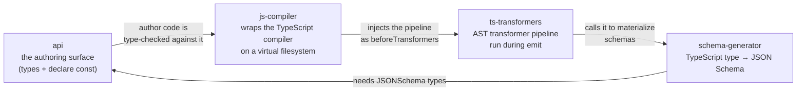
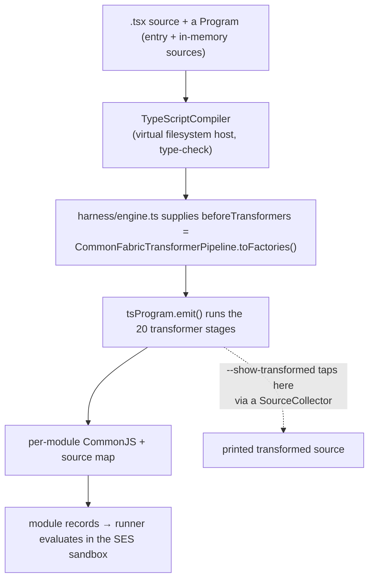
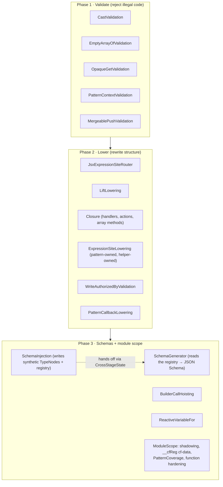
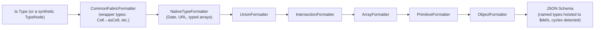

# The compile pipeline: `api`, `ts-transformers`, `js-compiler`, `schema-generator`

An author writes a pattern as ordinary-looking TypeScript with JSX. The runtime
cannot run that directly: reactive expressions have to be lowered into explicit
calls, closures have to be made explicit, and every reactive boundary has to
carry a JSON Schema derived from the author's TypeScript types. This pipeline
does that transformation. It is "System"-layer code, and it is large
(`ts-transformers` alone is 41k lines).

You can see its output for any file with:

```
deno task cf check <pattern-or-fixture>.tsx --show-transformed --no-run
```

---

## The four packages and their jobs



- **`api`** is what authors import as `commonfabric`, `commonfabric/cfc`, and
  `commonfabric/schema`. It is almost entirely TypeScript declarations and
  `declare const` values — the vocabulary (`pattern`, `lift`, `handler`,
  `computed`, `ifElse`, `Cell`, `Stream`, `Default`, `toSchema`) and the
  `JSONSchema` type. The real implementations live in `runner`; `api` is the
  shape author code is compiled against.
- **`js-compiler`** wraps `npm:typescript` and runs it entirely in memory (no
  disk, no network). It type-checks, runs a caller-supplied list of transformers
  during emit, and produces one CommonJS module body plus a source map per
  source file. It carries none of the Common Fabric transformer logic — that
  pipeline is injected by the caller (its only Common-Fabric-specific detail is
  the default JSX factory, `h` / `__cfHelpers.h.fragment`).
- **`ts-transformers`** is the TypeScript AST transformer pipeline. It rewrites
  natural reactive TypeScript into explicit, schema-annotated runtime form.
- **`schema-generator`** walks a TypeScript type into a JSON Schema object,
  hoisting named types into `$defs`, detecting cycles, and mapping the reactive
  wrapper types.

---

## The end-to-end flow

The bridge that wires the transformers into the compiler lives in `runner`'s
harness (`runner/src/harness/engine.ts`): it hands `js-compiler` a
`beforeTransformers` factory that builds the `CommonFabricTransformerPipeline`.



---

## The transformer pipeline: 20 stages in three phases

The pipeline is an ordered list (`cf-pipeline.ts`, `CFC_TRANSFORMER_STAGE_SPECS`).
The ordering matters: most validation runs first so illegal code is rejected
before anything is rewritten (one write-authorization check runs mid-pipeline,
because it inspects the lowered schema calls); structural lowering runs in the
middle; schema work runs late, because schema generation reads synthetic type
nodes that an earlier stage
injected.



The central coupling of the whole pipeline is the hand-off inside Phase 3:
**`SchemaInjection` writes synthetic type nodes and registry entries into a
shared `CrossStageState`, and `SchemaGenerator` (a later stage) reads them and
calls into the `schema-generator` package** to produce the actual schema
objects. If you only remember one thing about why the stages are ordered the way
they are, remember that.

---

## Call-kind detection: how the pipeline knows what it is looking at

Before it can lower a call, the pipeline has to classify it. `ast/call-kind.ts`
(`detectCallKind`) does provenance-first classification: it resolves the callee's
symbol, verifies it originates from Common Fabric declarations, follows stable
aliases, and recognizes the synthetic `__cfHelpers.*` calls the pipeline emits
itself.

```mermaid
flowchart TB
    call["a call expression"]
    resolve["resolve callee symbol"]
    origin{"originates from<br/>Common Fabric?"}
    alias["follow const aliases<br/>(const f = lift)"]
    synth["recognize __cfHelpers.* synthetic calls"]
    kind["CallKind union:<br/>ifElse / when / unless / builder(lift,handler,pattern,computed) /<br/>array-method / lift-applied / cell-factory / cell-for / wish / pattern-tool /<br/>generate-text / generate-object / runtime-call"]

    call --> resolve --> origin
    origin -->|yes| alias --> kind
    origin -->|"alias/synthetic"| synth --> kind
```

A representative lowering, from the `ts-transformers` README:
`items.map(item => item.price * discount)` becomes a module-scope
`__cfPattern_1 = __cfHelpers.pattern(...)` carrying input and result schemas,
used at the call site as
`items.mapWithPattern(__cfPattern_1, { params: { discount } })`, and registered
via `__cfReg({ __cfPattern_1 })`. The closure capture (`discount`) is made
explicit as a parameter with its own schema.

---

## Type to JSON Schema

`schema-generator` runs a TypeScript type through an ordered chain of
formatters. The order matters — for example arrays are handled before
primitives so an array does not get misrouted as `any`.



The wrapper-type vocabulary — the authored spellings (`Cell`, `Writable`,
`ReadonlyCell`, `Reactive`, `Stream`, …) and how each normalizes to a resolved
kind (`Writable` collapses to `Cell`; `Reactive` stays `Reactive`) — is
canonicalized once in
`schema-generator/src/typescript/wrapper-names.ts` and consumed by both
`schema-generator` and `ts-transformers`. There is an auto-detection fork: when
the resolved type is `any` but a concrete synthetic type node exists, the
generator walks the node instead of the type.

---

## Technical debt and sharp edges

- **The marker scan is unusually clean.** There are essentially no
  `TODO`/`FIXME`/`HACK` comments in `ts-transformers` or `js-compiler`. The open
  work lives in design documents instead: `ts-transformers/docs/`,
  `docs/specs/ts-transformer/`, and `ts-transformers/ISSUES_TO_FOLLOW_UP.md`.
  The README explicitly tells you to read the behavior spec rather than infer
  from the code. Believe it.
- **Behavior is pinned by golden files.** Both `ts-transformers` and
  `schema-generator` are golden-file driven — `ts-transformers` by hundreds of
  `*.input.tsx` / `*.expected.jsx` pairs, `schema-generator` by dozens of
  `*.input.ts` / `*.expected.json` pairs. Changing emit shape means regenerating
  goldens (`UPDATE_GOLDENS=1`) and reviewing large diffs. The fast-iteration path
  is `FIXTURE=<name>`.
- **`api` declarations must stay in sync by hand.** `api/index.ts` is
  `declare const` / ambient declarations that must match implementations
  elsewhere — the builder vocabulary against `runner/src/builder`, and (per an
  explicit sync note at the top of the file) the Fabric value types against
  `data-model`. Changing a signature means editing it in two places.
- **The biggest files are the densest part of the system.**
  `schema-injection.ts` (4123 lines) and `type-shrinking.ts` (3285) are the
  least approachable region; budget accordingly.
- **The `lift-applied` distinction is subtle.** `__cfHelpers.lift(cb)(input)` —
  a single application — is classified as `lift-applied` and is what `computed`
  lowers to. An unapplied `lift(cb)` or a multi-application chain is deliberately
  not. This gates whole dispatch branches.

---

## Public surfaces

- **`api`** — `.` (`index.ts`), `./cfc`, `./cfc-authoring`, `./cfc-atoms`,
  `./schema`. Authors reach it via the `commonfabric*` import aliases in the root
  `deno.jsonc`.
- **`ts-transformers`** — `src/mod.ts` exports
  `CommonFabricTransformerPipeline`, the base `Pipeline`/`Transformer`/
  `CrossStageState`, and the individual transformers.
- **`js-compiler`** — `mod.ts` exports `TypeScriptCompiler`, the three
  `ProgramResolver` implementations (in-memory, filesystem, HTTP), and
  source-map helpers.
- **`schema-generator`** — `src/index.ts` exports `SchemaGenerator` and
  `createSchemaTransformerV2`, plus the reusable type-classification helpers as
  subpaths (`./wrapper-names`, `./cell-brand`, `./type-traversal`).
