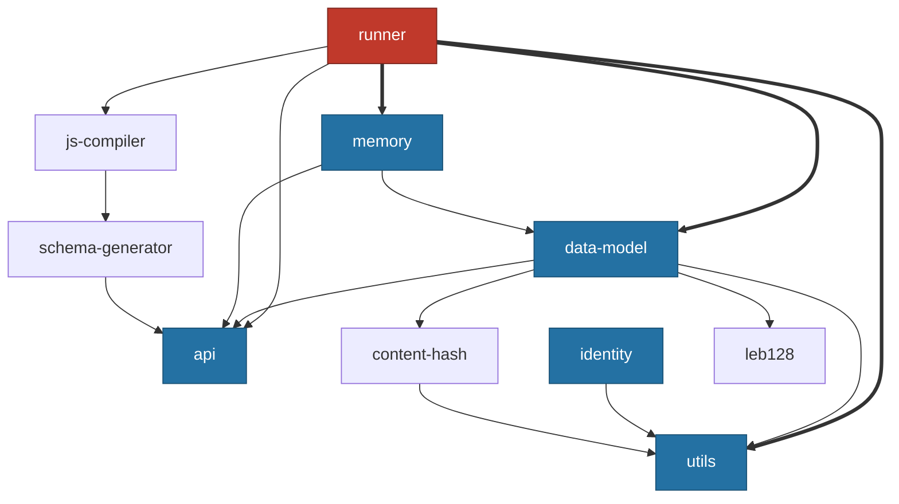
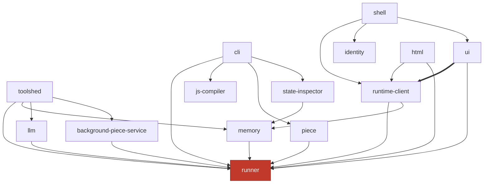
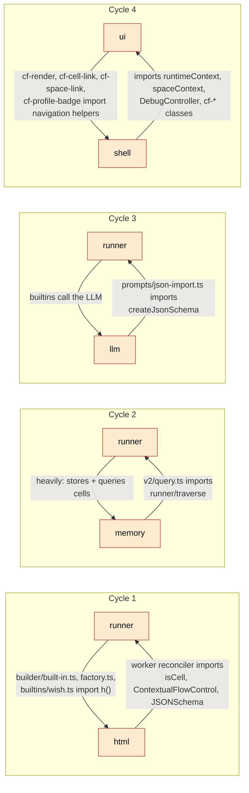

# The dependency graph (measured, not intended)

This page is the empirical import graph between workspace packages — which
package imports which, read from the source rather than from intentions. It is
built by scanning every package's `.ts` and `.tsx` source for `@commonfabric/*`
imports, over production files only (test, fixture, integration, and benchmark
paths excluded, since those don't reflect runtime layering). The shapes that
matter for orientation are structural: which package is the hub, which are the
floor, where the cycles are — not the exact reference counts, which drift with
every commit.

Some apparent edges were discarded after inspection because they were comments
or strings rather than real imports: `api → runner`, `api → memory`,
`api → utils`, `runner → piece`, `home-schemas → runner`, `html → ui`, and
`state-inspector → runner` are all mentions in comments, not import statements.
They are not drawn. (The `runner → piece` "edge" is in fact a comment that reads
"Avoid importing from `@commonfabric/piece` to prevent circular deps in tests" —
the absence is deliberate.)

---

## The spine: `runner` is the hub, a few small libraries are the floor

The graph is not a balanced tree. It is one very large hub (`runner`) sitting on
a small floor of foundation libraries (`utils`, `data-model`, `api`, `identity`,
`memory`), with everything else arranged around the hub. Of those, `utils`,
`api`, and `identity` are true leaves (no outgoing package edges); `data-model`
and `memory` are not — they sit on the leaves below them. The bold edges below
are `runner`'s heaviest dependencies.



Three things to take from this:

- **`utils` is the universal floor.** It is imported by nearly every file in the
  repo. Its own `index.ts` deliberately throws, to force callers to import the
  specific subpath they need (for example `@commonfabric/utils/defer`).
- **`runner` is the gravity well.** It leans hardest on `data-model`, `utils`,
  and `memory` — by a wide margin — so any change to `data-model` or `memory`
  ripples straight into the runtime.
- **`api` is mostly types, and a pure leaf.** It sits at the very floor because
  it is the authoring surface — almost entirely TypeScript declarations that
  author code is compiled against — and it has no outgoing package imports at all
  (its only `@commonfabric/utils` references are "duplicated from…" comments).

---

## The consumers: who sits on the hub

The other half of the graph is the packages that depend on `runner` (and on each
other). This is where the product, the client, and the tooling live.



`ui` leans on `runtime-client` far more than on anything else (the bold edge) —
the strongest single coupling in
the consumer half. `ui` does not talk to `runner` directly very much; it talks
to the worker-side runtime through `runtime-client`'s cell handles.

---

## The circular dependencies

There are four genuine import cycles in production code. Each was confirmed by
reading the actual import statement, not just counting a name. They are drawn in
red below, with the direction and the evidence.



| Cycle | Edge into the lower layer | The single seam to know about |
|---|---|---|
| `runner ↔ html` | `runner/src/builder` and `builtins/wish.ts` import `h()` to build UI nodes | The builder produces view nodes, so the UI primitive leaks into the foundation |
| `runner ↔ memory` | `memory/v2/query.ts` imports `@commonfabric/runner/traverse` | The one cycle-forming package edge; the same file also pulls runner's CFC, storage-transaction, and builder-type internals through relative paths. Memory needs the runtime's schema traversal and CFC to answer graph queries and evaluate per-row labels |
| `runner ↔ llm` | `llm/src/prompts/json-import.ts` imports `createJsonSchema` | One import. A prompt helper reaches up into the runtime |
| `ui ↔ shell` | `ui` imports `@commonfabric/shell/shared` in four `cf-*` components | Narrowed to URL/navigation helpers, but real |

The cycles all touch `runner` except the last. That is consistent with `runner`
being the hub: the cheapest place to introduce a cycle is against the package
everything already depends on.

---

## The layering violations (downward edges that are not cycles)

A cycle is two arrows. A layering violation is one arrow pointing the wrong way
through the layer stack — a lower layer reaching up into a higher one. The most
notable is the foundation runtime reaching into the end-user-program layer:

- **`runner → home-schemas`.** `runner/src/builtins/wish.ts` imports
  `favoriteListSchema` from `@commonfabric/home-schemas`. The `wish` builtin is
  specific to the "home" domain, yet it lives in the foundation runtime. A
  newcomer expects builtins to be generic; this one is not.

Separately, `home-schemas` exists *specifically to prevent* a different
violation: its module doc says it holds schemas so that both `runner` and
`piece` can import them without importing each other. It is a deliberate "shared
leaf to break a cycle" — which is good design, undercut by `runner` then
reaching into it for a non-generic schema.

---

## God-files: where the complexity concentrates

Cycles are one kind of debt; oversized single files are another. These are the
files a newcomer will be sent to and should expect to lose an afternoon in —
each several thousand lines, listed roughly biggest first:

| File | What it is |
|---|---|
| `runner/src/cfc/prepare.ts` | The Contextual-Flow-Control write-policy gate |
| `memory/v2/engine.ts` | The transactional SQLite core |
| `runner/src/runner.ts` | Instantiates a pattern's nodes into scheduler actions |
| `runner/src/traverse.ts` | Schema-driven traversal of the value/link graph |
| `ts-transformers/src/transformers/schema-injection.ts` | Attaches schemas to reactive boundaries |
| `html/src/worker/reconciler.ts` | The worker-thread VDOM reconciler |
| `runner/src/builtins/llm-dialog.ts` | The LLM dialog builtin |
| `runner/src/storage/v2.ts` | The storage manager, provider, and space replica |
| `runner/src/cell.ts` | The Cell and Stream abstractions |
| `ts-transformers/src/policy/capability-analysis.ts` | CFC capability analysis for the transformer |
| `runner/src/scheduler/facade.ts` | The scheduler's public facade (after scheduler-v2 split `scheduler.ts` into `scheduler/`) |

Most of these are in `runner`, and its single largest file is the CFC
write-policy gate — Contextual Flow Control has grown into the biggest piece of
the runtime. The complexity is real and concentrated. (A large *generated* JSX
type-declaration file, `html/src/jsx.d.ts`, is omitted here because it is
declarations, not code to read; so are the far larger data blobs —
`patterns/scrabble/scrabble-words.ts` and the vendored/generated files under
`vendor-astral/` and `static/assets/`.)

---

## Smaller sharp edges worth knowing on day one

These are individually minor but each will waste someone's time if undocumented.

A batch of stale references that this orientation originally flagged has since
been cleaned up and is recorded here only so the history is not confusing:
`AGENTS.md` no longer points at a non-existent top-level `deprecated-patterns`
folder (it now names the real `packages/patterns/deprecated`); the dangling
`"./integration"` export in `packages/utils/deno.jsonc` was removed upstream; and
the root `deno.jsonc` lint config no longer excludes a `patterns-saves-backup`
directory that never existed. The genuinely still-live ones:

- **Two storage vocabularies.** `memory` has a legacy "fact" model — the
  `assert`/`retract` constructors in `fact.ts` (their types in `interface.ts`),
  reached through the `@commonfabric/memory/fact` subpath that runner's storage
  layer still imports — and the current "v2" document/operation model (in `v2/`).
  New work is v2. The fact vocabulary is still exported and still confuses
  people. See the [storage page](storage-substrate.md).
- **`cf-harness` is misleadingly named.** It is not a test harness for the
  runtime. It is an experimental agent runtime — an LLM tool-calling loop with
  sandboxing and CFC awareness. See the [CLI/piece page](cli-piece-fuse.md).

---

## Full production dependency list

For completeness, which packages each package imports in production code (test,
fixture, integration, and benchmark files excluded). This is the adjacency — the
structure — without the reference counts, which are noise for orientation and go
stale immediately.

```
api               → utils (all references are comment-only; api is a pure leaf)
background-piece  → identity, piece, runner, utils
cf-harness        → api, llm, runner, utils
cli               → api, data-model, fuse, html, identity, js-compiler, llm,
                    memory, piece, runner, runtime-client, state-inspector,
                    static, test-support, ts-transformers, utils
content-hash      → utils
data-model        → api, content-hash, leb128, utils
fuse              → api, content-hash, data-model, piece, runner
home-schemas      → api, piece
html              → api, runner, runtime-client, utils
identity          → utils
iframe-sandbox    → runner, utils
integration       → identity, runner, shell, utils
js-compiler       → static, ts-transformers, utils
lib-shell         → api, data-model, identity, runner, runtime-client, utils
llm               → api, runner, utils
memory            → api, data-model, identity, runner, utils
piece             → api, data-model, home-schemas, identity, js-compiler, runner, utils
runner            → api, content-hash, data-model, home-schemas, html, identity,
                    js-compiler, llm, memory, static, ts-transformers, utils
runtime-client    → api, data-model, home-schemas, html, identity, js-compiler,
                    llm, piece, runner, utils
schema-generator  → api, data-model, utils
shell             → api, felt, home-schemas, html, identity, lib-shell, memory,
                    piece, runner, runtime-client, ui, utils
state-inspector   → api, data-model, identity, memory
static            → utils
toolshed          → api, background-piece, content-hash, data-model, identity,
                    llm, memory, runner, static, utils
ts-transformers   → api, schema-generator, utils
ui                → api, content-hash, html, identity, iframe-sandbox, runner,
                    runtime-client, shell
```
