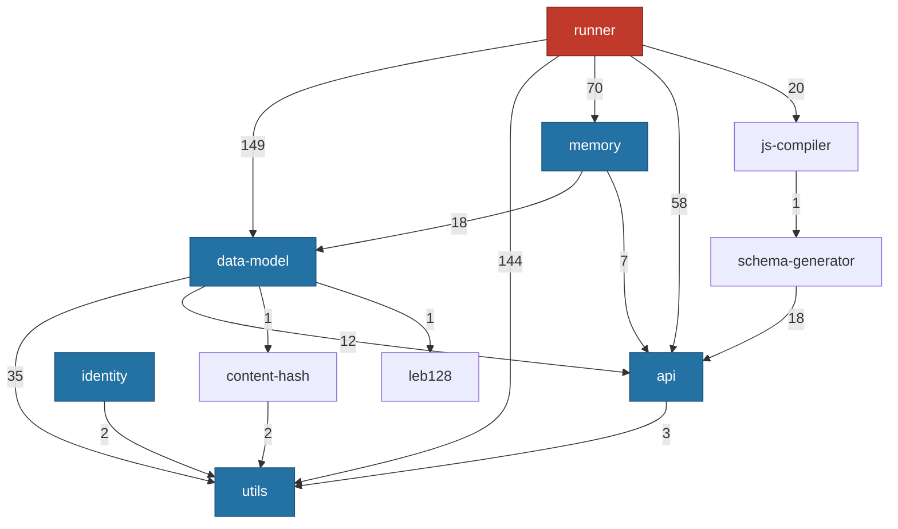
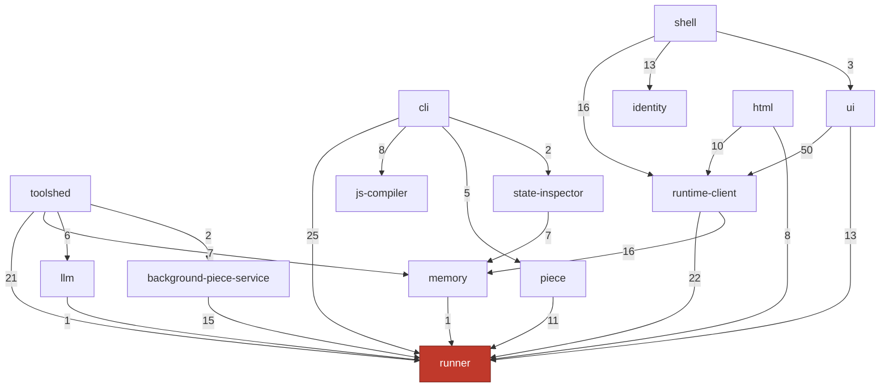

# The dependency graph (measured, not intended)

This page is the empirical import graph between workspace packages. It was built
by scanning every package's `.ts` and `.tsx` source for `@commonfabric/*`
imports and counting them. Two passes were taken: one over all files, and one
over production files only (excluding anything matching a test, fixture,
integration, or benchmark path). The production graph is the one that matters
for runtime layering, so it is the one drawn here. The difference between the
two passes is itself informative and is noted where it changes the story.

Some apparent edges were discarded after inspection because they were comments
or strings rather than real imports: `api → runner`, `api → memory`,
`runner → piece`, `home-schemas → runner`, `html → ui`, and
`state-inspector → runner` are all mentions in comments, not import statements.
They are not drawn. (The `runner → piece` "edge" is in fact a comment that reads
"Avoid importing from `@commonfabric/piece` to prevent circular deps in tests" —
the absence is deliberate.)

---

## The spine: `runner` is the hub, four leaves are the floor

The graph is not a balanced tree. It is one very large hub (`runner`) sitting on
a small floor of leaf libraries (`utils`, `data-model`, `api`, `identity`,
`memory`), with everything else arranged around the hub. Edge labels are the
number of importing references in production code, so they show where the heavy
coupling is.



Three things to take from this:

- **`utils` is the universal floor.** It is imported by 294 files across the
  repo. Its own `index.ts` deliberately throws, to force callers to import the
  specific subpath they need (for example `@commonfabric/utils/defer`).
- **`runner` is the gravity well.** It pulls in `data-model` 149 times,
  `utils` 144 times, and `memory` 70 times in production code alone. Any change
  to `data-model` or `memory` ripples straight into the runtime.
- **`api` is mostly types.** It sits near the floor because it is the authoring
  surface — almost entirely TypeScript declarations that author code is compiled
  against.

---

## The consumers: who sits on the hub

The other half of the graph is the packages that depend on `runner` (and on each
other). This is where the product, the client, and the tooling live.



`ui` leaning on `runtime-client` 50 times is the strongest single coupling in
the consumer half. `ui` does not talk to `runner` directly very much; it talks
to the worker-side runtime through `runtime-client`'s cell handles.

---

## The circular dependencies

There are four genuine import cycles in production code. Each was confirmed by
reading the actual import statement, not just counting a name. They are drawn in
red below, with the direction and the evidence.


| Cycle | Edge into the lower layer | The single seam to know about |
|---|---|---|
| `runner ↔ html` | `runner/src/builder` and `builtins/wish.ts` import `h()` to build UI nodes | The builder produces view nodes, so the UI primitive leaks into the foundation |
| `runner ↔ memory` | `memory/v2/query.ts` imports `@commonfabric/runner/traverse` | One import. Memory needs the runtime's schema traversal to answer graph queries and evaluate per-row CFC labels |
| `runner ↔ llm` | `llm/src/prompts/json-import.ts` imports `createJsonSchema` | One import. A prompt helper reaches up into the runtime |
| `ui ↔ shell` | `ui` imports `@commonfabric/shell/shared` in four `cf-*` components | Narrowed to URL/navigation helpers, but real |

The cycles all touch `runner` except the last. That is consistent with `runner`
being the hub: the cheapest place to introduce a cycle is against the package
everything already depends on.

---

## The layering violations (downward edges that are not cycles)

A cycle is two arrows. A layering violation is one arrow pointing the wrong way
through the layer stack — a lower layer reaching up into a higher one. The most
notable is the foundation runtime reaching into the end-user-program layer:

- **`runner → home-schemas`.** `runner/src/builtins/wish.ts` imports
  `favoriteListSchema` from `@commonfabric/home-schemas`. The `wish` builtin is
  specific to the "home" domain, yet it lives in the foundation runtime. A
  newcomer expects builtins to be generic; this one is not.

Separately, `home-schemas` exists *specifically to prevent* a different
violation: its module doc says it holds schemas so that both `runner` and
`piece` can import them without importing each other. It is a deliberate "shared
leaf to break a cycle" — which is good design, undercut by `runner` then
reaching into it for a non-generic schema.

---

## God-files: where the line count concentrates

Cycles are one kind of debt; oversized single files are another. These are the
files a newcomer will be sent to and should expect to lose an afternoon in. All
counts are lines.

| File | Lines | What it is |
|---|---|---|
| `runner/src/cfc/prepare.ts` | 5078 | The Contextual-Flow-Control write-policy gate |
| `runner/src/runner.ts` | 4528 | Instantiates a pattern's nodes into scheduler actions |
| `memory/v2/engine.ts` | 4406 | The transactional SQLite core |
| `runner/src/traverse.ts` | 4350 | Schema-driven traversal of the value/link graph |
| `ts-transformers/src/transformers/schema-injection.ts` | 4123 | Attaches schemas to reactive boundaries |
| `html/src/worker/reconciler.ts` | 3862 | The worker-thread VDOM reconciler |
| `runner/src/builtins/llm-dialog.ts` | 3804 | The LLM dialog builtin |
| `ts-transformers/src/policy/capability-analysis.ts` | 3446 | CFC capability analysis for the transformer |
| `runner/src/cell.ts` | 3432 | The Cell and Stream abstractions |
| `runner/src/storage/v2.ts` | 3018 | The storage manager, provider, and space replica |
| `runner/src/scheduler.ts` | 2638 | The reactive scheduler |

`runner` alone holds seven of the eleven, and its single largest file is now the
CFC write-policy gate — Contextual Flow Control has grown into the biggest piece
of the runtime. The complexity is real and concentrated. (A large generated JSX
type-declaration file, `html/src/jsx.d.ts` at ~5.5k lines, is omitted here
because it is generated declarations, not code to read. Bigger files still —
`patterns/scrabble/scrabble-words.ts` at ~179k lines and the vendored and
generated blobs under `vendor-astral/` and `static/assets/` — are data, not
code.)

---

## Smaller sharp edges worth knowing on day one

These are individually minor but each will waste someone's time if undocumented.

A batch of stale references that this orientation originally flagged has since
been cleaned up and is recorded here only so the history is not confusing:
`AGENTS.md` no longer points at a non-existent top-level `deprecated-patterns`
folder (it now names the real `packages/patterns/deprecated`); the dangling
`"./integration"` export in `packages/utils/deno.jsonc` was removed upstream; and
the root `deno.jsonc` lint config no longer excludes a `patterns-saves-backup`
directory that never existed. The genuinely still-live ones:

- **Two storage vocabularies.** `memory` has a legacy "fact" model
  (`assert`/`retract`, defined in `interface.ts` and `fact.ts` and re-exported by
  the `lib.ts` barrel) and the current "v2" document/operation model (in `v2/`).
  New work is v2. The fact vocabulary is still exported and still confuses
  people. See the [storage page](storage-substrate.md).
- **`cf-harness` is misleadingly named.** It is not a test harness for the
  runtime. It is an experimental agent runtime — an LLM tool-calling loop with
  sandboxing and CFC awareness. See the [CLI/piece page](cli-piece-fuse.md).

---

## Full production edge list

For completeness, every production import edge with its reference count. "Prod"
means test, fixture, integration, and benchmark files were excluded.

```
api               → memory(comment only), runner(comment only), utils(3)
background-piece  → identity(9), piece(2), runner(15), utils(3)
cf-harness        → api(18), llm(4), runner(28), utils(2)
cli               → api(5), data-model(3), fuse(1), html(1), identity(9),
                    js-compiler(8), llm(2), memory(3), piece(5), runner(25),
                    runtime-client(1), state-inspector(2), static(1),
                    test-support(1), ts-transformers(1), utils(9)
content-hash      → utils(2)
data-model        → api(12), content-hash(1), leb128(1), utils(35)
fuse              → api(3), content-hash(2), data-model(1), piece(3), runner(9)
home-schemas      → api(12), piece(1), runner(comment only)
html              → api(5), runner(8), runtime-client(10), ui(comment only), utils(6)
identity          → utils(2)
iframe-sandbox    → runner(1), utils(4)
integration       → identity(1), runner(1), shell(1), utils(3)
js-compiler       → static(1), ts-transformers(1), utils(4)
lib-shell         → api(1), data-model(1), identity(1), runner(2), runtime-client(2), utils(1)
llm               → api(1), runner(1), utils(1)
memory            → api(7), data-model(18), identity(2), runner(1), utils(6)
piece             → api(3), data-model(2), home-schemas(1), identity(2),
                    js-compiler(1), runner(11), utils(4)
runner            → api(58), content-hash(1), data-model(149), home-schemas(1),
                    html(3), identity(2), js-compiler(20), llm(2), memory(70),
                    piece(comment only), static(3), ts-transformers(6), utils(144)
runtime-client    → api(1), data-model(6), home-schemas(2), html(1), identity(6),
                    js-compiler(4), llm(1), piece(2), runner(22), utils(13)
schema-generator  → api(18), data-model(1), utils(9)
shell             → api(1), felt(1), home-schemas(1), html(1), identity(13),
                    lib-shell(3), memory(1), piece(1), runner(8),
                    runtime-client(16), ui(3), utils(4)
state-inspector   → api(2), data-model(5), identity(1), memory(7),
                    runner(comment only)
static            → utils(3)
toolshed          → api(4), background-piece(2), content-hash(2), data-model(8),
                    identity(2), llm(6), memory(7), runner(21), static(3), utils(11)
ts-transformers   → api(9), schema-generator(12), utils(5)
ui                → api(8), content-hash(1), html(2), identity(8),
                    iframe-sandbox(2), runner(13), runtime-client(50), shell(4)
```
