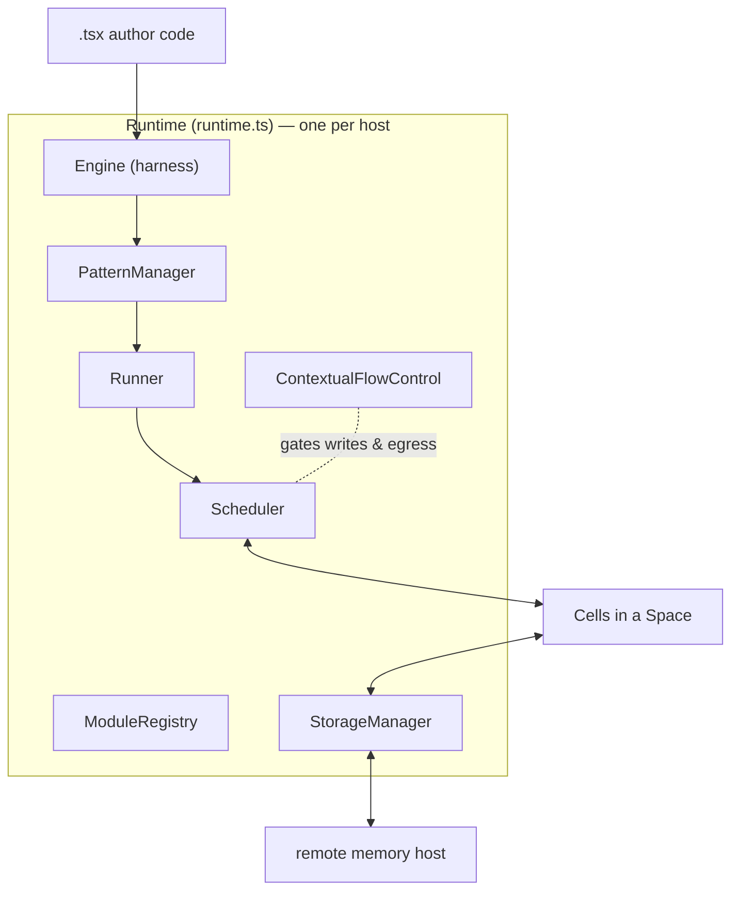
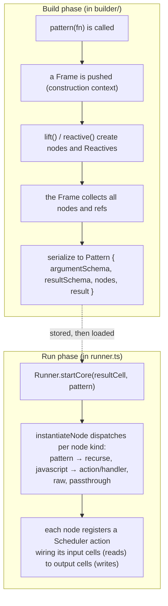
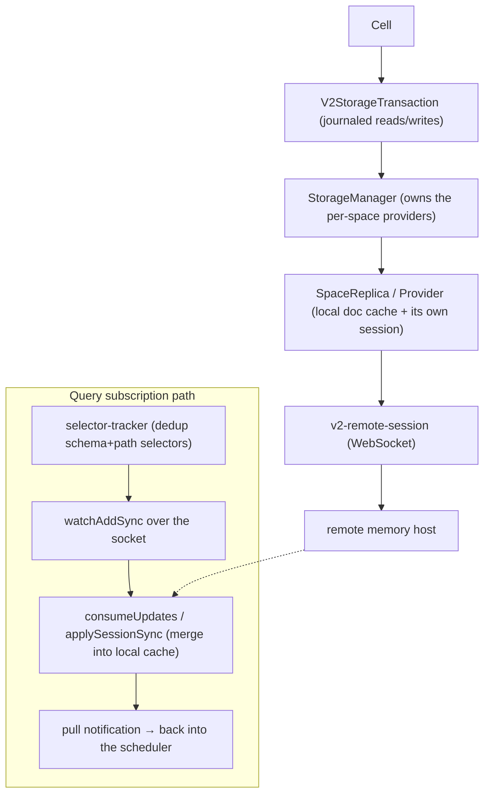

# The runtime core: `runner`

`runner` is the reactive engine. It is the package everything else is arranged
around, it is by far the largest hand-written package (roughly 100k non-test
lines — several times the next-biggest), and it holds most of the repo's largest
files. If you understand `runner`, the rest of the system is mostly plumbing
around it.

One terminology note specific to this package: it uses **"piece"**, not "charm".

---

## What lives in `runner/src`

The package is organized as a set of subsystem directories around a few very
large hub files at the top level.

| Path | Role |
|---|---|
| `runtime.ts` | The `Runtime` class — the composition root. One per host. Owns and wires every subsystem by dependency injection. Hands out transactions via `edit()` and `readTx()`. |
| `runner.ts` | The `Runner` class. Takes a pattern's serialized node graph and instantiates each node into live scheduler actions. |
| `cell.ts` | The `Cell` and `Stream` abstractions — typed reactive handles over a path in a document in a space. |
| `traverse.ts` | Schema-driven traversal of the value-and-link graph; resolves a (schema, path) query into concrete reads, following links. One of the largest files in the package. |
| `schema.ts` | Schema resolution, validate-and-transform, default-value handling. |
| `link-utils.ts`, `link-types.ts`, `sigil-types.ts` | The link system: the serialized `SigilLink`, the in-memory `NormalizedLink`, and the deprecated `LegacyAlias`. |
| `scheduler/` (a few dozen files) | The reactive engine (post `scheduler-v2` refactor; `scheduler.ts` is a one-line re-export of `scheduler/facade.ts`). `facade.ts` = the `Scheduler` class; `invalidation.ts` marks readers invalid on a commit; `trigger-index.ts` maps entities to the actions that read them; `dependency-graph.ts` holds the `dependents`/`reverseDependencies` edges and demand-reachability (`isLive`); `settle.ts` is the pull settle loop; `run.ts` runs one action (tx → run → commit → resubscribe); `topology.ts` orders the work set; `work-oracle.ts` answers "is there runnable pull work". |
| `storage/` | Layered persistence and remote sync: the storage manager, per-space replica, journaled transactions, and the WebSocket session to the memory host. |
| `builder/` | The authoring surface that turns pattern code into a serializable node graph (`pattern`, `lift`, `reactive`/`cell`, `createNodeFactory`). |
| `builtins/` | Built-in modules patterns can call: `map`/`filter`/`ifElse`/`when`, `llm`/`generateText`/`generateObject`, the fetch builtins (`fetchJson`/`fetchText`/`fetchProgram`/`streamData`), `navigateTo`, `wish`, and SQLite builtins. |
| `harness/` | The `Engine` that compiles TypeScript to a verified module-record graph and evaluates it in a secure sandbox. |
| `sandbox/` | The Secure-EcmaScript (SES) compartment machinery: bundle verification, parsing, module-record compilation, compartment globals, policy. |
| `cfc/` | Contextual Flow Control: data labeling, the write-policy gate (`prepare.ts`), and the egress gate. |

---

## The composition root: one `Runtime` owns everything

The mental model to start from is that a single `Runtime` object owns one
instance of every subsystem and injects them into each other. There are no
globals to hunt for; if you have the `Runtime`, you can reach everything.



`edit()` and `readTx()` on the `Runtime` are how the outside world gets a
transaction to read or write cells. Everything funnels through that.

---

## Building a pattern vs. running it (two distinct phases)

The most common source of confusion for newcomers is that "writing a pattern"
and "running a pattern" are two completely separate phases with two different
sets of types. At build time you manipulate `Reactive`s — placeholders for
values that do not exist yet. At run time those become real `Cell`s.



The key takeaway: a `Pattern` is just serializable data — schemas plus a list of
nodes. It is not a closure. The `Reactive` you used while writing it is gone by
the time it runs; the `Runner` rebuilds live `Cell` wiring from the node list.

---

## The reactive loop: how a write re-runs dependents

This is the diagram to memorize. The scheduler is **pull-based** (its only mode
is `"pull"`, `scheduler/invalidation.ts`): effects (such as rendering) are the
demand roots, and computations are lazy until something that is demanded needs
them. The work splits into two decoupled phases. An **invalidation phase** turns
a commit's changed addresses into invalid marks on the readers that actually
observed a changed value; it does no recomputation, it just queues an execute.
An **execute/settle phase** then drains the invalid-plus-demanded set to
quiescence.

Since the `scheduler-v2` refactor the engine lives in `runner/src/scheduler/`
(a few dozen files; `scheduler.ts` is now just a re-export of
`scheduler/facade.ts`, which holds the `Scheduler` class). The steps below give
the current file and function for each hop.

```mermaid
sequenceDiagram
    participant Code as cell.set(v)
    participant Tx as V2StorageTransaction
    participant Replica as SpaceReplica
    participant Inval as invalidation.ts
    participant Trig as trigger-index.ts
    participant Loop as settle.ts loop
    participant Run as run.ts

    Code->>Tx: write(address, v)
    Note over Tx: action finishes
    Tx->>Replica: commit()
    Replica-->>Inval: "commit" notification (changed addresses)
    Inval->>Trig: collectTriggeredActionsForChange
    Note over Trig: determineTriggeredActions (reactive-dependencies.ts)<br/>keeps only readers whose observed value actually changed
    Trig-->>Inval: reader actions
    Note over Inval: markInvalid(readers); queueExecution()
    Inval->>Loop: execute() → runPullSchedulerSettleLoop
    Loop->>Loop: buildPullIterationWorkSet (seeds + demanded closure)
    Loop->>Loop: topologicalSort (order by read→write edges)
    Loop->>Run: runSchedulerAction (new tx → run → commit → resubscribe)
    Note over Run: the commit's changed writes re-enter as a new notification
    Note over Loop: repeat up to a small fixed cap; non-settling subgraphs<br/>get exponential backoff, not a hard cycle-break
    Loop-->>Code: idle / settled
```

Three facts that trip people up:

- **A write that does not change the value does not re-run readers.** The
  value-equality gate lives at commit-notification time, in
  `scheduler/reactive-dependencies.ts` (`determineTriggeredActions`, using
  `valueEqual` for recursive reads and `shallowEqual` for non-recursive ones), so
  an unchanged write yields no triggered readers and no invalidation. There is no
  longer a separate "write-propagation" module.
- **The loop is bounded but has no cycle-breaker.** The settle loop runs at most
  a small fixed number of iterations (`MAX_ITERS` in `scheduler/constants.ts`),
  with a matching per-node run budget. A subgraph that will not settle is not
  force-broken; it is deferred with exponential backoff (`planBudgetBackoff`), and
  `idle()` is released after a few backoff passes so a reactive feedback loop
  degrades rather than hangs.
- **"Idle" and "settled" are observable.** `runtime.idle()` waits for reactive
  quiescence; `runtime.settled()` additionally drains pending commits and
  storage sync. Tests and the background service rely on both.

---

## Where durable state and reactivity meet: the storage layering

Reactivity is in-memory; durability is remote. The `storage/` subsystem is the
bridge. A `Cell` write goes through a journaled transaction into a per-space
local replica, which commits to a remote memory host over a WebSocket. Remote
changes come back the same way and re-enter the scheduler as if they were local
writes.



The query side is the subtle part: subscriptions are expressed as
schema-plus-path **selectors**, deduplicated, and turned into watch requests on
the socket. When the host pushes an update, it merges into the local cache and
fires a notification that re-enters the same scheduler loop shown above.

---

## Technical debt and sharp edges

The debt and rough edges touching these packages are collected, together with
the rest of the repo's, in [TECHNICAL_DEBT.md](../TECHNICAL_DEBT.md).

---

## Public surface

`src/index.ts` is a large barrel. The high-traffic exports: `Runtime`, `Cell`,
`Stream`, `effect`, the builder vocabulary (`createBuilder`, `reactive` exported
as `cell`, `lift`, `schema`, `Pattern`, `Reactive`, the symbols `UI`/`NAME`/
`TYPE`/`ID`), the link helpers (`parseLink`, `resolveLink`, `isLink`), scheduler
types (`Action`, `ReactivityLog`), the `Engine`, and `ContextualFlowControl`.

Sub-path exports matter here because other packages import them directly:
`@commonfabric/runner/traverse` (imported by `memory`),
`@commonfabric/runner/shared`, `/slugs`, `/schemas`, `/cfc`,
`/storage/inspector`, `/storage/telemetry`.
