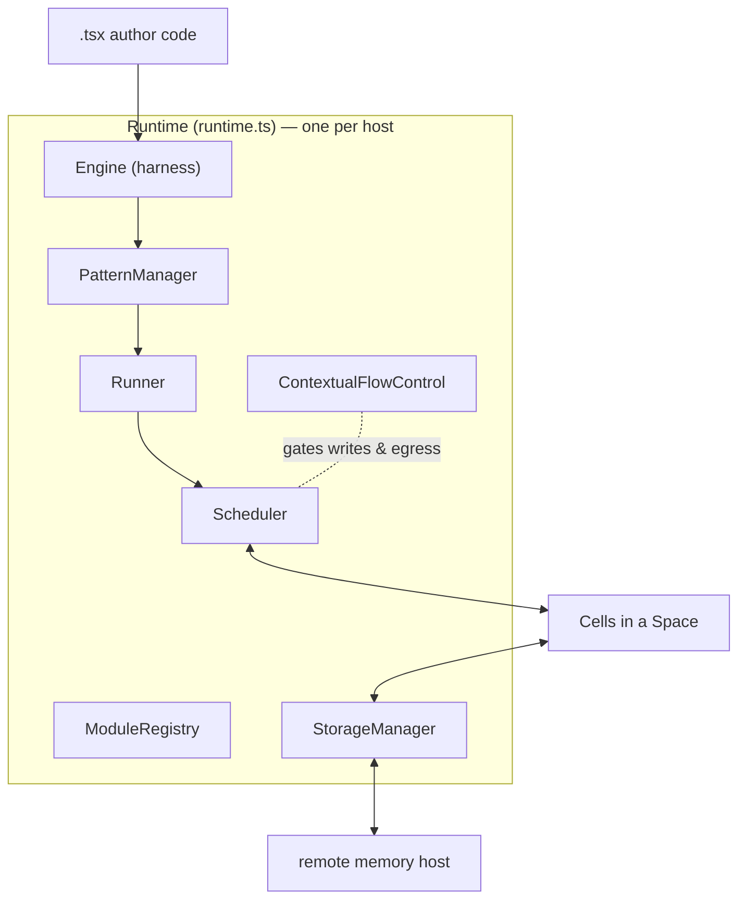
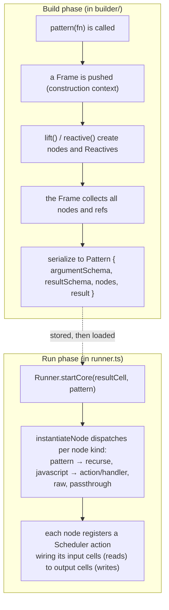
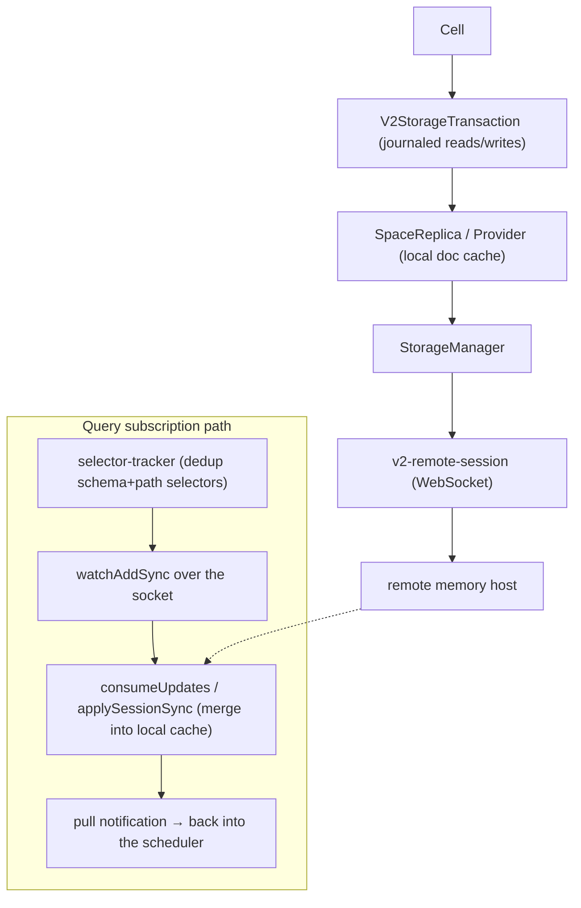

# The runtime core: `runner`

`runner` is the reactive engine. It is the package everything else is arranged
around, it is the largest hand-written package (95k non-test lines), and it
holds four of the eleven biggest files in the repo. If you understand `runner`,
the rest of the system is mostly plumbing around it.

One terminology note specific to this package: it uses **"piece"**, not "charm".

---

## What lives in `runner/src`

The package is organized as a set of subsystem directories around a few very
large hub files at the top level.

| Path | Role |
|---|---|
| `runtime.ts` | The `Runtime` class — the composition root. One per host. Owns and wires every subsystem by dependency injection. Hands out transactions via `edit()` and `readTx()`. |
| `runner.ts` | The `Runner` class. Takes a pattern's serialized node graph and instantiates each node into live scheduler actions. |
| `cell.ts` | The `Cell` and `Stream` abstractions — typed reactive handles over a path in a document in a space. |
| `traverse.ts` | Schema-driven traversal of the value-and-link graph; resolves a (schema, path) query into concrete reads, following links. One of the largest files in the package. |
| `schema.ts` | Schema resolution, validate-and-transform, default-value handling. |
| `link-utils.ts`, `link-types.ts`, `sigil-types.ts` | The link system: the serialized `SigilLink`, the in-memory `NormalizedLink`, and the deprecated `LegacyAlias`. |
| `scheduler/` + `scheduler.ts` | The reactive engine: dependency graph, trigger index, topological execution, and the pull-based settle loop. |
| `storage/` | Layered persistence and remote sync: the storage manager, per-space replica, journaled transactions, and the WebSocket session to the memory host. |
| `builder/` | The authoring surface that turns pattern code into a serializable node graph (`pattern`, `lift`, `reactive`/`cell`, `createNodeFactory`). |
| `builtins/` | Built-in modules patterns can call: `map`/`filter`/`ifElse`/`when`, `llm`/`generateText`/`generateObject`, the fetch builtins (`fetchJson`/`fetchText`/`fetchProgram`/`streamData`), `navigateTo`, `wish`, and SQLite builtins. |
| `harness/` | The `Engine` that compiles TypeScript to a verified module-record graph and evaluates it in a secure sandbox. |
| `sandbox/` | The Secure-EcmaScript (SES) compartment machinery: bundle verification, parsing, module-record compilation, compartment globals, policy. |
| `cfc/` | Contextual Flow Control: data labeling, the write-policy gate (`prepare.ts`), and the egress gate. |

---

## The composition root: one `Runtime` owns everything

The mental model to start from is that a single `Runtime` object owns one
instance of every subsystem and injects them into each other. There are no
globals to hunt for; if you have the `Runtime`, you can reach everything.



`edit()` and `readTx()` on the `Runtime` are how the outside world gets a
transaction to read or write cells. Everything funnels through that.

---

## Building a pattern vs. running it (two distinct phases)

The most common source of confusion for newcomers is that "writing a pattern"
and "running a pattern" are two completely separate phases with two different
sets of types. At build time you manipulate `Reactive`s — placeholders for
values that do not exist yet. At run time those become real `Cell`s.



The key takeaway: a `Pattern` is just serializable data — schemas plus a list of
nodes. It is not a closure. The `Reactive` you used while writing it is gone by
the time it runs; the `Runner` rebuilds live `Cell` wiring from the node list.

---

## The reactive loop: how a write re-runs dependents

This is the diagram to memorize. The scheduler is **pull-based**: effects (such
as rendering) are the demand roots, and computations are lazy until something
that is demanded needs them. A write does not eagerly recompute the world; it
marks readers dirty and lets the next settle pass pull only what is needed.

```mermaid
sequenceDiagram
    participant Code as cell.set(v)
    participant Tx as V2StorageTransaction
    participant Replica as SpaceReplica
    participant Sched as Scheduler
    participant Trig as TriggerIndex
    participant Loop as settle loop

    Code->>Tx: write(address, v)
    Note over Tx: action finishes
    Tx->>Replica: commit()
    Replica-->>Sched: "commit" notification (changed addresses)
    Sched->>Trig: which actions read these addresses?
    Trig-->>Sched: reader actions
    Note over Sched: effects → pending,<br/>computations → marked dirty
    Sched->>Loop: execute()
    Loop->>Loop: collectDirtyDependencies (pull stale upstream in)
    Loop->>Loop: topologicalSort (order by read→write edges)
    Loop->>Loop: runSchedulerAction (new tx, run, commit)
    Loop->>Loop: only value-changed writes re-dirty their readers
    Note over Loop: repeat until quiescent<br/>(max 10 iterations, then cycle-break)
    Loop-->>Code: idle / settled
```

Three facts that trip people up:

- A write that does not change the value does not re-run readers. The loop
  compares written values and only propagates real changes
  (`scheduler/write-propagation.ts`).
- The loop is bounded. After ten iterations without settling, a cycle-breaker
  steps in (`scheduler/pull-cycle-break.ts`). If you see that fire, you have a
  reactive feedback loop.
- "Idle" and "settled" are observable. `runtime.idle()` is how callers wait for
  the graph to quiesce; tests and the background service rely on it.

---

## Where durable state and reactivity meet: the storage layering

Reactivity is in-memory; durability is remote. The `storage/` subsystem is the
bridge. A `Cell` write goes through a journaled transaction into a per-space
local replica, which commits to a remote memory host over a WebSocket. Remote
changes come back the same way and re-enter the scheduler as if they were local
writes.



The query side is the subtle part: subscriptions are expressed as
schema-plus-path **selectors**, deduplicated, and turned into watch requests on
the socket. When the host pushes an update, it merges into the local cache and
fires a notification that re-enters the same scheduler loop shown above.

---

## Technical debt and sharp edges

- **`runner` is in three of the four import cycles** in the repo
  (`↔ html`, `↔ memory`, `↔ llm`). See the
  [dependency page](dependency-graph.md). The `memory` cycle is one import
  (`memory/v2/query.ts` needs `runner/traverse`); the `html` cycle is the
  builder needing `h()`; the `llm` cycle is a prompt helper needing
  `createJsonSchema`.
- **A layering violation lives in the builtins.** `builtins/wish.ts` imports a
  home-domain schema from `home-schemas`, so a foundation builtin is coupled to
  an end-user-program schema.
- **Three link representations coexist.** A serialized `SigilLink`, an in-memory
  `NormalizedLink`, and a deprecated `LegacyAlias` that is still in the
  `PrimitiveCellLink` union (`link-types.ts:89`). New readers meet all three.
- **The scheduler is pull-based**, which is counterintuitive if you expect a
  push/observer model. Budget time for this.
- **CFC silently gates commits.** The default enforcement mode can reject a
  write or replace blocked content. If a write "disappears," check CFC before
  the scheduler.
- **The `TODO(danfuzz)` cluster** recurring across `schema.ts`,
  `cfc/`, `traverse.ts`, and `cell.ts` marks an incomplete migration: several
  graph walks do not yet admit the newer `FabricValue` special objects on every
  path. It is a known, in-progress seam, not a set of isolated bugs.
- **A self-referential import** in `runtime.ts` pulls a value (the
  `RuntimeTelemetry` class) from the package's own `@commonfabric/runner` barrel
  — a load-order trap to be aware of when reordering exports.

---

## Public surface

`src/index.ts` is a large barrel. The high-traffic exports: `Runtime`, `Cell`,
`Stream`, `effect`, the builder vocabulary (`createBuilder`, `reactive` exported
as `cell`, `lift`, `schema`, `Pattern`, `Reactive`, the symbols `UI`/`NAME`/
`TYPE`/`ID`), the link helpers (`parseLink`, `resolveLink`, `isLink`), scheduler
types (`Action`, `ReactivityLog`), the `Engine`, and `ContextualFlowControl`.

Sub-path exports matter here because other packages import them directly:
`@commonfabric/runner/traverse` (imported by `memory`),
`@commonfabric/runner/shared`, `/slugs`, `/schemas`, `/cfc`,
`/storage/inspector`, `/storage/telemetry`.
