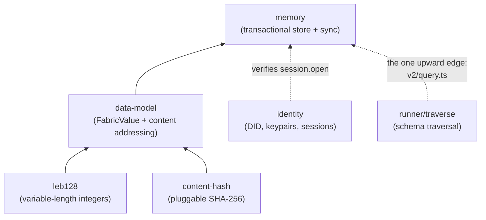
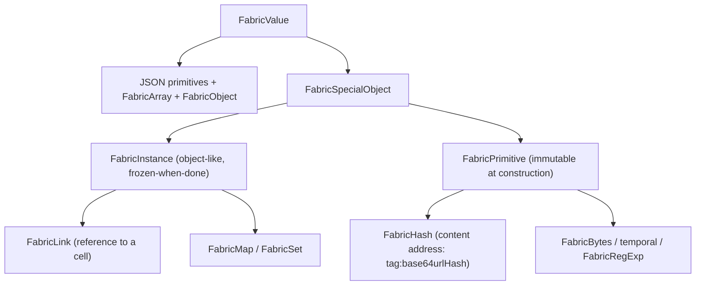
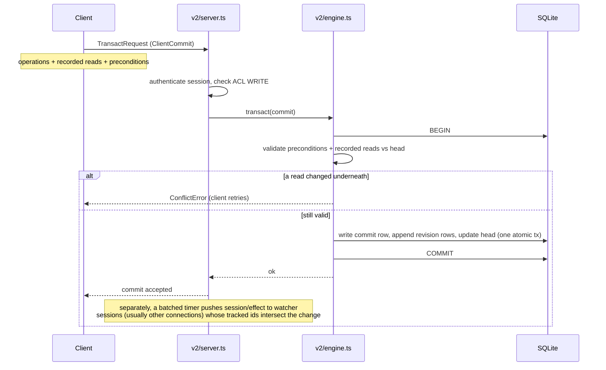
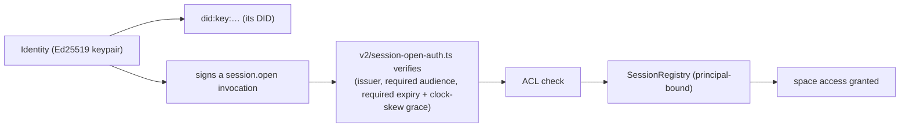

# The storage substrate: `memory`, `data-model`, `identity`

Underneath the runtime is a small stack of packages that answer three
questions: how is a value represented so it can be stored and hashed
(`data-model`, on top of `content-hash` and `leb128`); how is it stored durably
and queried reactively (`memory`); and who is allowed to touch a space
(`identity`). This page maps that stack.

---

## The dependency spine of the substrate

These five packages form a clean chain, leaves first. The only edge that points
"up" is the deliberate cycle where `memory` borrows the runtime's traversal code
to answer schema-aware queries.

`leb128` (170 lines, one file) and `content-hash` (a SHA-256 backend selector)
exist only to serve `data-model`'s deterministic hashing. You will rarely touch
them directly.

---

## `data-model`: the value model and content addressing

`data-model` defines **FabricValue**, the value model that crosses every storage
boundary. The reason it exists is that JSON cannot carry everything the runtime
needs: bigints, symbols, `undefined`, `Map`, `Set`, `Error`, `RegExp`, dates,
byte arrays, content hashes, and links. FabricValue wraps each of those so it
round-trips through storage and hashes deterministically.

Two pieces of `data-model` are worth knowing by name because they are where
future migrations will land:

- **Content addressing** (`value-hash.ts`, `schema-hash.ts`). `hashOf` feeds
  bytes into an incremental SHA-256 (from `content-hash`) using per-value type
  tags, `leb128` length prefixes, `TAG_END` terminators, and UTF-8-sorted object
  keys, so structurally different values cannot collide and structurally equal
  values hash identically. Schemas are interned and hash-cached.
- **The cell-representation bridge** (`cell-rep.ts`). This is the single file
  that decides how a reference to a cell is serialized — either a bare
  `FabricHash` (the "modern" representation) or a `{ "/": "tag:hash" }` envelope
  (the legacy representation), chosen by a module-level flag that `memory` reads.
  When the representation flips, it flips here.

`data-model` has **no root export**. You import named subpaths. This is
intentional, for fine-grained coupling.

---

## `memory`: the durable, reactive, content-addressed store

`memory` keeps one durable replica per space, reached over a WebSocket. It is
transactional (atomic commits with read-based preconditions, so it detects
conflicts optimistically), reactive (sessions watch query results and get
pushed effects when a commit touches them), and access-controlled at row grain
via CFC labels. On disk, each space is one SQLite file.

### The on-disk model

A document is not stored as a blob. It is stored as an append-only log of
per-operation patches (`revision`), indexed by a current-pointer table
(`head`), and periodically materialized into a `snapshot` so reads do not have
to replay from the beginning. This is the single most important thing to
understand about `memory`.

- A document's current value is the **fold of its `revision` rows**, fast-pathed
  by the nearest `snapshot`.
- `blob_store` is content-addressed binary, keyed by hash.
- `invocation` and `authorization` hold the signed request and its proof
  (a UCAN-style capability model), referenced from each `commit`.
- There is also a set of `scheduler_*` tables. These are how the runtime's
  scheduler durably records what each action read and wrote, so actions can be
  re-run. They are gated by a protocol flag (`persistentSchedulerState`).
- `scope_key` (space / user / session) lets one entity id resolve to different
  rows depending on who is asking — the storage side of a cell's scope.

### The write transaction path

Optimistic concurrency is the model: the client sends the reads it depended on,
and the engine rejects the commit if any of them moved. There are no locks held
across a round trip.

### Reading the store offline: `state-inspector`

Because the durable store is an append-only log, the on-disk SQLite file is also
a complete audit trail. The `state-inspector` package (`@commonfabric/state-inspector`)
is the lens over it: it opens a space's SQLite file read-only, reconstructs the
value of any entity at any `(branch, seq)`, and answers who/what/when questions
— time-travel, conflict inspection, and cross-space queries — with no live
runtime and no capture step. It depends only on `memory` (7 imports),
`data-model`, `identity`, and `api`, so it is a clean leaf consumer of the
storage layer. It is wired into the `cf` CLI as `cf inspect` (the package also
exposes a local `deno task inspect`), and has a matching `state-inspector` agent
skill. This is the tool to reach for when debugging what
a space actually recorded.

---

## `identity`: who can touch a space

An `Identity` is an Ed25519 keypair whose `did()` is a `did:key:` DID. It signs
payloads and produces a verifier. The package can generate keys, derive them
deterministically (from a parent identity and a name, from a passphrase, from a
mnemonic, from a PKCS8 key, or from a WebAuthn passkey), store them in
IndexedDB, and serialize them.

A subtlety worth flagging: a space's DID can itself be a derived keypair.
`createSession` can derive the space's own identity reproducibly as
`Identity.fromPassphrase("common user").derive(spaceName)`, and that derived
DID *is* the space. So "the space" and "an identity" are not always different
kinds of thing.

---

## Technical debt and sharp edges

- **Two vocabularies in one package.** `memory/interface.ts` and `fact.ts`
  define an older UCAN-flavored "fact" model (`assert`/`retract`/`unclaimed`,
  content-hash keyed). The current v2 wire protocol in `v2.ts` uses a different
  document/operation vocabulary (`EntityDocument`, `Operation`, `ClientCommit`,
  `GraphQuery`). New work is v2; the fact model persists and confuses newcomers.
  `lib.ts` is the legacy entry point.
- **The `memory ↔ runner` cycle is narrow but deeper than the counts suggest.**
  `v2/query.ts` forms the cycle with one package-alias import
  (`@commonfabric/runner/traverse`), but the same file also reaches into runner's
  internals through three relative-path imports (`ContextualFlowControl`, the
  extended storage transaction, and the builder `JSONSchema` type). Answering a
  schema-aware graph query and evaluating per-row CFC labels needs the runtime's
  traversal and CFC logic. This is the seam to know if you ever try to extract
  `memory` as a standalone library.
- **The SQL guard is intentionally conservative** (`v2/sqlite/guard.ts`). It
  rejects some valid statements (single-statement only, no PRAGMA/ATTACH, no
  references to core engine tables) to keep the attack surface small.
- **CFC row labels fail closed.** `v2/sqlite/row-label.ts` accepts well-formed
  disjunctive confidentiality clauses but rejects the unsound cases — an `any()`
  alternative that is itself a conjunction or nested disjunction, disjunctive
  *integrity* (which "does not exist"), ambiguous multi-op nodes, and
  ReDoS-shaped regexes — rather than risk an unsound read label.
- **The modern cell representation is behind a default-off flag.**
  `data-model/cell-rep.ts` fully implements both the modern (bare `FabricHash` /
  `FabricLink`) and the legacy (`{ "/": "tag:hash" }` envelope) forms; which one
  is used is chosen by the module-level `modernCellRepEnabled` flag, which
  defaults off. When the representation flips, it flips here.

---

## Public surfaces

- **`data-model`** — no root export; import subpaths (`fabric-value`,
  `value-hash`, `cell-rep`, the codecs).
- **`memory`** — `.` (the legacy interface), `./v2`, `./v2/engine`,
  `./v2/server`, `./v2/client`, `./sqlite` and subpaths,
  `./v2/session-open-auth`, `./v2/standalone` (an in-process test server).
- **`identity`** — `.` exports `Identity`, `VerifierIdentity`, `PassKey`,
  `KeyStore`, `createSession`/`Session`.
- **`content-hash`** — `sha256`, `createHasher`. **`leb128`** — the four
  encode/decode functions.
