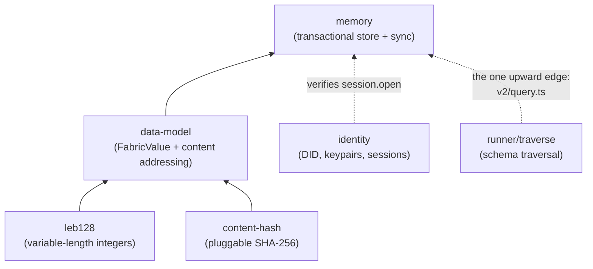
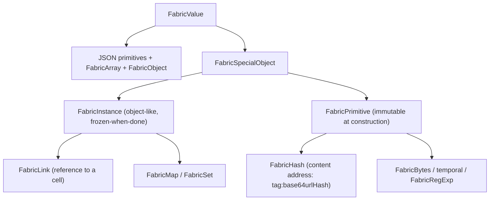
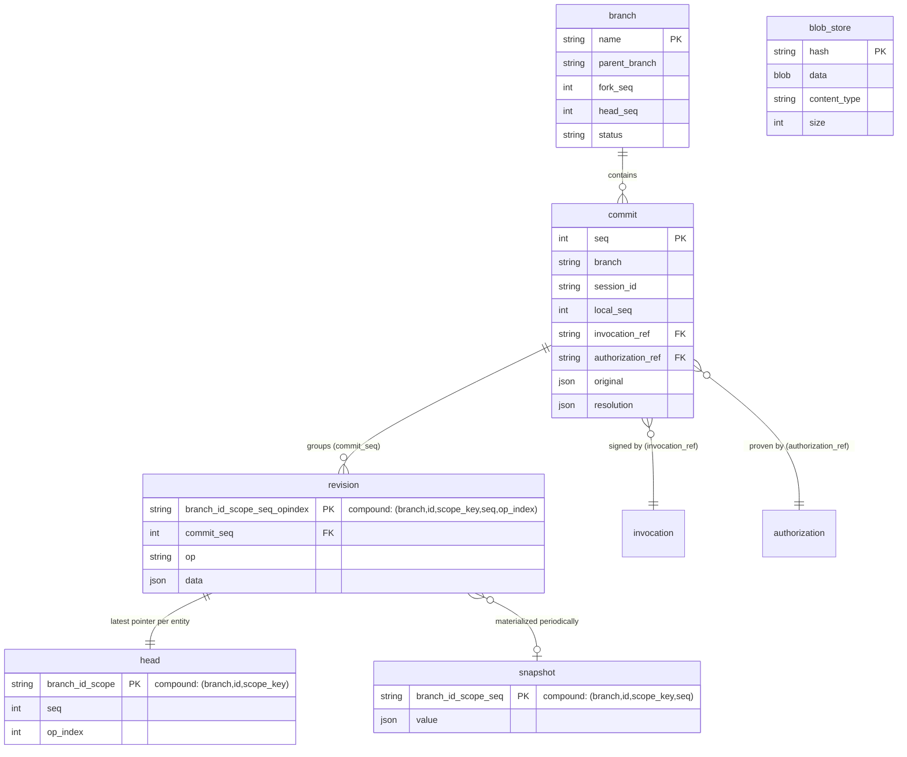
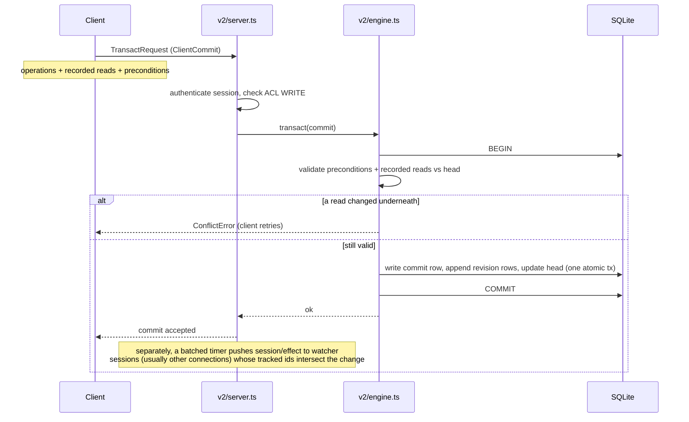
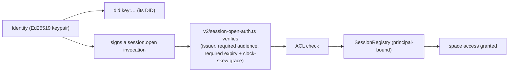

# The storage substrate: `memory`, `data-model`, `identity`

Underneath the runtime is a small stack of packages that answer three
questions: how is a value represented so it can be stored and hashed
(`data-model`, on top of `content-hash` and `leb128`); how is it stored durably
and queried reactively (`memory`); and who is allowed to touch a space
(`identity`). This page maps that stack.

---

## The dependency spine of the substrate

These five packages form a clean chain, leaves first. The only edge that points
"up" is the deliberate cycle where `memory` borrows the runtime's traversal code
to answer schema-aware queries.

`leb128` (a single small file) and `content-hash` (a SHA-256 backend selector)
exist only to serve `data-model`'s deterministic hashing. You will rarely touch
them directly.

---

## `data-model`: the value model and content addressing

`data-model` defines **FabricValue**, the value model that crosses every storage
boundary. The reason it exists is that JSON cannot carry everything the runtime
needs: bigints, symbols, `undefined`, `Map`, `Set`, `Error`, `RegExp`, dates,
byte arrays, content hashes, and links. FabricValue wraps each of those so it
round-trips through storage and hashes deterministically.

Two pieces of `data-model` are worth knowing by name because they are where
future migrations will land:

- **Content addressing** (`value-hash.ts`, `schema-hash.ts`). `hashOf` feeds
  bytes into an incremental SHA-256 (from `content-hash`) using per-value type
  tags, `leb128` length prefixes, `TAG_END` terminators, and UTF-8-sorted object
  keys, so structurally different values cannot collide and structurally equal
  values hash identically. Schemas are interned and hash-cached.
- **The cell-representation bridge** (`cell-rep.ts`). This is the single file
  that decides how a reference to a cell is serialized — either a bare
  `FabricHash` (the "modern" representation) or a `{ "/": "tag:hash" }` envelope
  (the legacy representation), chosen by a module-level flag that `memory` reads.
  When the representation flips, it flips here.

- **The codec / wire format** (`codec-common/`, `codec-json/`). A non-JSON value
  serializes as a single-key object `{ "/<Type>@<Version>": <state> }`; the
  canonical tag set is `BigInt@1`, `Bytes@1`, `Hash@1`, `Link@1`, `Map@1`,
  `Set@1`, `RegExp@1`, `Error@1`, `Symbol@1`, `Undefined@1`, the temporal tags,
  and meta-tags for quoting/array-holes. Tags are versioned so a future migration
  can add `Map@2`. Decoding takes a `ReconstructionContext` (an
  `EmptyReconstructionContext` at boundaries with no cells); in **lenient mode**
  (default off) a value that fails to reconstruct comes back as a
  `ProblematicValue` instead of throwing.

`data-model` has **no root export**. You import named subpaths. This is
intentional, for fine-grained coupling.

---

## `memory`: the durable, reactive, content-addressed store

`memory` keeps one durable replica per space, reached over a WebSocket. It is
transactional (atomic commits with read-based preconditions, so it detects
conflicts optimistically), reactive (sessions watch query results and get
pushed effects when a commit touches them), and access-controlled at row grain
via CFC labels. On disk, each space is one SQLite file.

### The on-disk model

A document is not stored as a blob. It is stored as an append-only log of
per-operation patches (`revision`), indexed by a current-pointer table
(`head`), and periodically materialized into a `snapshot` so reads do not have
to replay from the beginning. This is the single most important thing to
understand about `memory`.

- A document's current value is the **fold of its `revision` rows**, fast-pathed
  by the nearest `snapshot`.
- `blob_store` is content-addressed binary, keyed by hash.
- `invocation` and `authorization` hold the signed request and its proof
  (a UCAN-style capability model), referenced from each `commit`.
- There is also a set of `scheduler_*` tables. These are how the runtime's
  scheduler durably records what each action read and wrote, so actions can be
  re-run. They are gated by a protocol flag (`persistentSchedulerState`).
- `scope_key` (space / user / session) lets one entity id resolve to different
  rows depending on who is asking — the storage side of a cell's scope.

### The write transaction path

Optimistic concurrency is the model: the client sends the reads it depended on,
and the engine rejects the commit if any of them moved. There are no locks held
across a round trip. Three finer points worth knowing:

- **Operations come in four kinds** (`v2.ts`): `set`, `patch`, `delete`, and
  `sqlite`. The `sqlite` op is folded into the same atomic transaction as cell
  ops but is *not* an entity revision — it never enters the revision/head/snapshot
  machinery.
- **Some patch ops are merge-friendly.** Beyond position-based
  `replace`/`add`/`remove`/`move`/`splice`, the `PatchOp` family includes
  `append` (tail-relative, carries no index), `add-unique` (idempotent set-add by
  stored value), `remove-by-value`, and `increment` — these resolve against
  durable state so concurrent writers merge instead of clobbering.
- **Preconditions are how a commit pins state it did not read as a full value.**
  Three kinds: `origin-committed` (a prior commit from this session must be
  durable), `entity-absent` (an id must have no value), and `entity-value-hash`
  (an id pinned to an exact `valueHash`, where `null` pins "absent/deleted").
- **A snapshot is materialized every so many patches** for an entity
  (`DEFAULT_SNAPSHOT_INTERVAL`), so a read replays only a handful of patch rows on
  top of the nearest snapshot; setting the interval to `0` disables snapshotting.
- **Branches are first-class.** A `branch` table holds `parent_branch`,
  `fork_seq`, `head_seq`, and `status`; the default root branch is the empty
  string `''`, and every table's key begins with `branch`. A `ClientCommit` can
  carry a `branch` and a `merge { sourceBranch, sourceSeq, baseBranch, baseSeq }`.

### The SQLite and CFC-label layer (`v2/sqlite/`)

Patterns can run SQL against per-space tables, so `memory` wraps SQLite in a set
of guards. `guard.ts` is a conservative tokenizer (single statement, no
PRAGMA/ATTACH, and a `CORE_TABLE_NAMES` denylist — `commit`, `revision`, `head`,
`snapshot`, `branch`, `blob_store`, `invocation`, `authorization`,
`scheduler_*` — that a pattern statement may never reference). `column-origin.ts`
uses an FFI build of SQLite with `SQLITE_ENABLE_COLUMN_METADATA` to read each
result column's *true* `(table, column)` origin, so an `AS`-alias cannot spoof a
CFC read label (it fails closed to a null origin on expressions). `row-label.ts`
holds the per-row CFC label rules; `commit-eval.ts` re-derives row labels
server-side at commit time and rolls back on a violation; `write-targets.ts` maps
each positional `?` to its target column for the write-ceiling check (fail-closed
for shapes it can't attribute). `read-pool.ts` is an LRU of read-only connections
so reads never attach to the engine connection, and `disk-source.ts`
lets an external on-disk SQLite file be attached read-only by handle.

Note that space-level ACL (`Record<DID|"*", "READ"|"WRITE"|"OWNER">`, `acl.ts`)
and these per-row CFC labels are two distinct layers: the ACL gates who may touch
a space at all; the CFC labels gate individual rows within it.

### Reading the store offline: `state-inspector`

Because the durable store is an append-only log, the on-disk SQLite file is also
a complete audit trail. The `state-inspector` package (`@commonfabric/state-inspector`)
is the lens over it: it opens a space's SQLite file read-only, reconstructs the
value of any entity at any `(branch, seq)`, and answers who/what/when questions
— time-travel, conflict inspection, and cross-space queries — with no live
runtime and no capture step. It depends only on `memory`, `data-model`,
`identity`, and `api`, so it is a clean leaf consumer of the storage layer. It is wired into the `cf` CLI as `cf inspect` (the package also
exposes a local `deno task inspect`), and has a matching `state-inspector` agent
skill. This is the tool to reach for when debugging what
a space actually recorded.

Its modules each answer a distinct question: `reconstruct.ts` replays the
revision log to the value at any `(branch, seq)` (reusing the server's
`applyPatch` for fidelity); `timetravel.ts` does structural diffs between two
seqs and per-entity timelines; `conflicts.ts` finds write-write contention and
anomalous stale reads (a hit signals corruption, not normal history); `graph.ts`
builds the entity graph (pieces/modules/streams/schemas/cells with
`pattern`/`argument`/`owns`/`link` edges); and `multispace.ts` clusters
cross-space convergence to tell real drift from independent same-pattern
instances.

---

## `identity`: who can touch a space

An `Identity` is an Ed25519 keypair whose `did()` is a `did:key:` DID. It signs
payloads and produces a verifier. The derivations are concrete: `derive(name)`
signs the UTF-8 bytes of `name` and SHA-256-hashes the (deterministic) signature
into the child's raw key; `fromPassphrase(p)` uses `SHA-256(utf8(p))` directly (so
`"common user"` maps to a fixed keypair — the seed for derived space DIDs);
mnemonics are BIP-39 (24 words / 256-bit); PKCS8/PEM import works only under the
noble backend. A `PassKey` uses the WebAuthn `prf` extension with a fixed salt and
feeds its 32-byte output straight in as key material (PRF is only available from
`credentials.get()`, not `create()`). WebCrypto native ed25519 is preferred over
`@noble/ed25519` when the platform supports it. Keys can be stored in IndexedDB
and serialized.

A subtlety worth flagging: a space's DID can itself be a derived keypair.
`createSession` can derive the space's own identity reproducibly as
`Identity.fromPassphrase("common user").derive(spaceName)`, and that derived
DID *is* the space. So "the space" and "an identity" are not always different
kinds of thing.

---

## Technical debt and sharp edges

The debt and rough edges touching these packages are collected, together with
the rest of the repo's, in [TECHNICAL_DEBT.md](../TECHNICAL_DEBT.md).

---

## Public surfaces

- **`data-model`** — no root export; import subpaths (`fabric-value`,
  `value-hash`, `cell-rep`, the codecs).
- **`memory`** — `.` (the legacy interface), `./v2`, `./v2/engine`,
  `./v2/server`, `./v2/client`, `./sqlite` and subpaths,
  `./v2/session-open-auth`, `./v2/standalone` (an in-process test server).
- **`identity`** — `.` exports `Identity`, `VerifierIdentity`, `PassKey`,
  `KeyStore`, `createSession`/`Session`.
- **`content-hash`** — `sha256`, `createHasher`. **`leb128`** — the four
  encode/decode functions.
