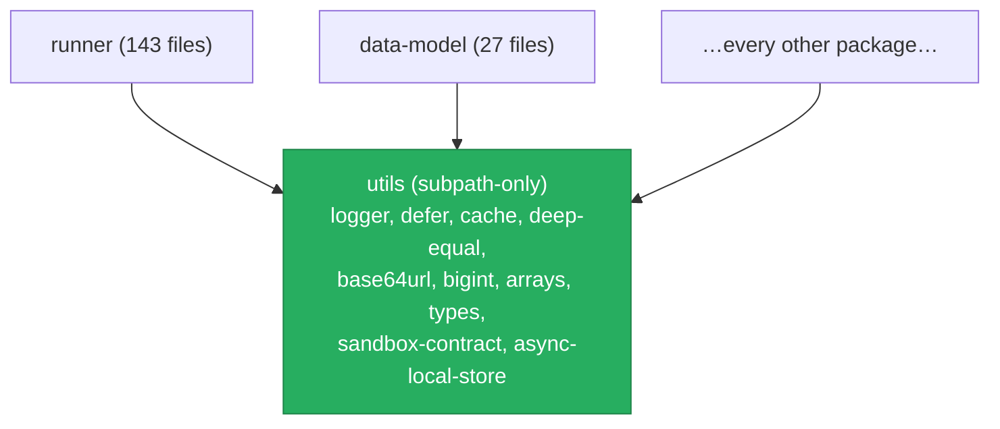
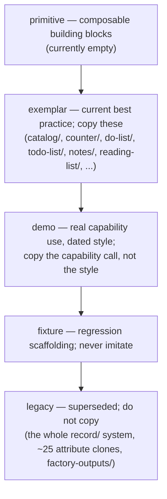
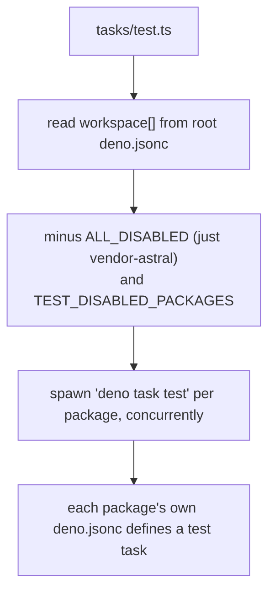
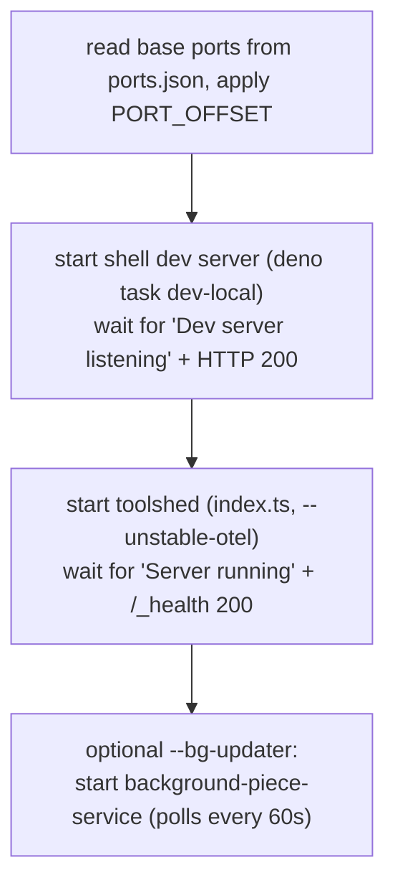
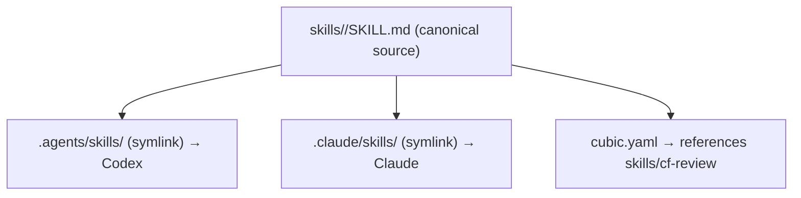

# Examples, support libraries, and repo tooling

This page covers the layers that are not the product itself: the example
programs (`patterns`), the universal leaf library (`utils`), the bundled assets
(`static`), the test-support packages, the integration browser harness, and the
repository's own tooling — the dev-server scripts, the test runner, the CI, and
the skills system.

---

## `utils` is the universal leaf

Everything depends on `utils`. It is imported by 294 files across the repo. Its
own `src/index.ts` deliberately **throws**, to force callers to import the
specific subpath they need rather than the whole barrel.

The single largest module inside it is `logger.ts` (1502 lines), a from-scratch
logging library that works in both Deno and the browser. (Until recently
`deno.jsonc` declared a `"./integration"` export pointing at a file that no
longer existed; that dangling export has since been removed.)

---

## `patterns`: example programs of unequal authority

`patterns` is by far the largest directory (327k lines), but it is example code,
not engine code. The most important thing a newcomer must learn here is that
**the patterns do not carry equal authority.** Copying the wrong one teaches you
a deprecated idiom. The authority ladder is tracked in
`packages/patterns/index.md` under "Status tiers."

The authoritative, type-checked component catalog is
`packages/patterns/catalog/catalog.tsx`, with a story file per `cf-*` component
under `catalog/stories/`. The defunct examples are in
`packages/patterns/deprecated/`, which `AGENTS.md` tells you to ignore. (An
earlier `AGENTS.md` called this a top-level `deprecated-patterns` folder, a path
that never existed; it now names the real one.)

---

## The test runner fan-out

`deno task test` runs `tasks/test.ts`, which reads the workspace member list
from the root `deno.jsonc` and spawns `deno task test` in each package
concurrently, each with its own working directory and coverage directory.

This is why `AGENTS.md` insists every workspace package's `deno.jsonc` define a
`test` task, even if it is just a stub. If a package has no `test` task, Deno
falls back to the root workspace task, which re-runs the entire suite — and
because that happens inside each package, the process count explodes
exponentially and CI times out.

---

## Local dev startup

`scripts/start-local-dev.sh` brings up the stack. It reads base ports from
`ports.json`, applies a port offset, and starts the servers in the background,
waiting for each to report ready before moving on.

The critical correctness note (documented in `LOCAL_DEV_SERVERS.md`): the shell
must run `dev-local`, not `dev`. `dev` points the frontend at the production
backend; `dev-local` points it at your local `toolshed`.

---

## The skills system and its mirrors

The repository ships its own agent "skills" (procedures and references for AI
coding assistants). `skills/` is the one canonical source. `.agents/skills/` and
`.claude/skills/` are directories of **symlinks** back into `skills/`, so that
both Codex (which reads `.agents/`) and Claude (which reads `.claude/`) discover
the same single copy. `cubic.yaml`, the AI code-reviewer config, also points
back at `skills/cf-review/`.

The skill directories include `pattern-dev`, `pattern-test`, `pattern-deploy`,
`pattern-debug`, `pattern-critic`, `pattern-ui`, `pattern-schema`,
`pattern-implement`, `cf`, `cf-review`, `lit-component`, `fuse-workflow`,
`fuse-agent`, `knowledge-base`, `isolated-test-processes`, `task-management`,
and a few more.

---

## The remaining support packages

| Package | Role |
|---|---|
| `static` | Lazy-loaded static assets, shared across Deno (read from disk) and browser (served by `toolshed`). Holds the bundled type declarations shipped to the in-browser TypeScript compiler — `es2023.d.ts` (459 KB, generated), `dom.d.ts`, and symlinks to the live `api` and `html` sources. Most of the package's size is that one generated file. |
| `test-support` | Golden-fixture suite runner (`defineFixtureSuite`, unified-diff helpers) and isolated-Deno-subprocess helpers that run `deno check` in a temporary config so tests do not dirty the repo lockfile. |
| `deno-web-test` | Runs `Deno.test`-style tests inside a real browser, for code that must work in both Deno and the browser. Driven by `vendor-astral`. |
| `vendor-astral` | A vendored copy of Astral, a Deno-native browser-automation library over the Chrome DevTools Protocol. Excluded from lint, format, and the test runner. Do not edit it as if it were first-party. |
| `integration` | The browser-driving test harness: a `Browser`/`Page` wrapper over the Chrome DevTools Protocol, an `env` module of test knobs (target URL, headless toggle, per-run space name), and shell login helpers. Its own `test` task is a stub; the tests that use it live in other packages. |
| `home-schemas` | Schemas for the "home" space. Exists specifically so that `runner` and `piece` can share schemas without importing each other — a deliberate shared leaf to break a cycle. |
| `generated-patterns` | 296 machine-generated test patterns plus the harness that generates them (`ralph/`). |

---

## The repository task and CI surface

- `tasks/check.sh` (`deno task check`) is the type-check gate. It pins Deno to
  `>=2.8.0 <2.9.0` and type-checks an explicit set of directories with an 8 GB
  V8 heap. `mise.toml` pins Deno to `2.8.1`; a wrong local Deno fails the gate
  immediately.
- `tasks/test.ts`, `tasks/integration.ts`, and `tasks/cfcheck.ts` are the test,
  integration, and pattern-check runners, all of which shard in CI.
- `.github/workflows/deno.yml` is the main CI: format check, lint,
  `deno task check`, the workspace test fan-out (on a self-hosted runner that
  installs FUSE and disables AppArmor for browser tests), and a four-way-sharded
  `cfcheck`. Coverage, benchmarks, perf-regression, and deploy have their own
  workflows.
- `.githooks/pre-commit` runs `deno fmt` and `deno lint`, and refuses to commit
  if there are unstaged tracked changes. Install it with
  `deno task install-hooks`.

---

## Sharp edges collected on one page

- Pattern authority is non-uniform; always check `index.md` Status tiers before
  copying a pattern. Only `exemplar`-tier patterns are style references.
- Deno is narrowly version-pinned; mismatches fail `deno task check` before any
  real work runs.
- The root `deno.jsonc` lint config still excludes one real, quarantined pattern
  directory (`packages/patterns/record/`); the `fmt` config likewise excludes a
  handful of `cf-chart`/`cf-toggle`/`cf-checkbox`/`cf-select` component files.
  Those are intentional, not stale.

A set of genuinely stale references this page used to list has since been
cleaned up: the dangling `utils` `./integration` export was removed, `AGENTS.md`
no longer points at a non-existent `deprecated-patterns` folder, and the
`deno.jsonc` lint config no longer names a `patterns-saves-backup` directory or
three deleted pattern files that were never present.
