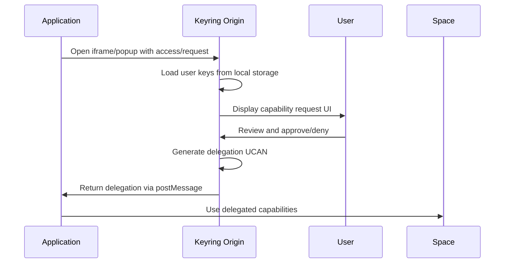
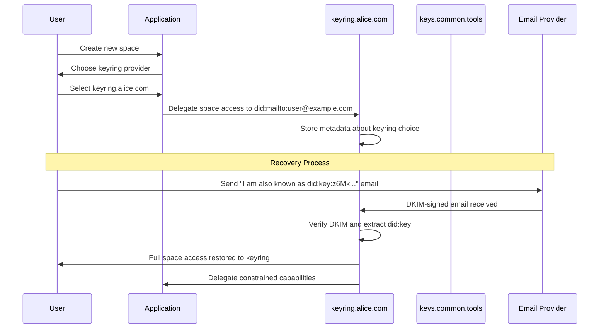

# Keyring Architecture

## Overview

The keyring architecture provides a secure, user-controlled system for managing UCAN delegations across multiple applications and domains. Unlike traditional OAuth flows where a central authority manages permissions, keyrings act as user-controlled authorization brokers that store cryptographic keys locally and issue capability delegations to requesting applications.

This approach builds upon the patterns established in [web3.storage specifications](https://github.com/storacha/specs) while extending them to support cross-origin authorization flows through iframe-based or popup-based interfaces.

## Core Concepts

### Keyring Origins

A **keyring origin** is a web application (typically served from a specific domain) that:

- Stores cryptographic keys locally in the browser (IndexedDB, localStorage, or Web Crypto API)
- Manages UCAN delegations for user-controlled spaces
- Provides a web interface for authorization requests
- Never exposes private keys to other origins

The keyring acts as a trusted broker between users and applications, similar to how browser password managers broker authentication credentials.

### Authorization Flow

Applications request capabilities through a standardized flow that respects the Same Origin Policy while enabling secure cross-origin delegation:



## Architecture Components

### 1. Keyring Web Interface

The keyring provides a web-based interface that handles:

**Authorization Requests**: Display requested capabilities in human-readable form
- Capability types (store/add, store/list, etc.)
- Resource constraints (space identifiers, size limits)
- Temporal constraints (expiration time, not-before)
- Requesting application identity

**User Controls**: Allow users to:
- Approve or deny requests
- Modify requested capabilities (reduce scope, shorten TTL)
- Set default policies for trusted applications
- Review active delegations and revoke them

**Key Management**: Secure handling of cryptographic material
- Generate and store space keys locally
- Derive delegation signing keys
- Backup and recovery interfaces
- Cross-device synchronization options

### 2. Cross-Origin Communication

Keyrings support multiple integration patterns:

#### Iframe Integration
```javascript
// Application opens keyring in iframe
const iframe = document.createElement('iframe');
iframe.src = 'https://keyring.example.com/authorize?' +
  new URLSearchParams({
    capabilities: JSON.stringify([{
      can: 'store/add',
      with: 'did:key:z6MkExample...'
    }]),
    audience: 'did:key:z6MkApplication...',
    facts: JSON.stringify({
      origin: window.location.origin
    })
  });

// Listen for delegation response
window.addEventListener('message', (event) => {
  if (event.origin !== 'https://keyring.example.com') return;
  const { delegation } = event.data;
  // Use delegation for subsequent operations
});
```

#### Popup Integration
```javascript
// Application opens keyring in popup
const popup = window.open('https://keyring.example.com/authorize?...');

// Handle popup responses
const handleMessage = (event) => {
  if (event.origin !== 'https://keyring.example.com') return;
  const { delegation } = event.data;
  popup.close();
  window.removeEventListener('message', handleMessage);
  // Use delegation
};
window.addEventListener('message', handleMessage);
```

#### OAuth-like Redirect
```javascript
// Redirect to keyring with return URL
window.location.href = 'https://keyring.example.com/authorize?' +
  new URLSearchParams({
    capabilities: '...',
    return_to: window.location.href + '#auth-complete'
  });

// Handle return with delegation in URL fragment
if (location.hash.includes('auth-complete')) {
  const params = new URLSearchParams(location.hash.substring(1));
  const delegation = params.get('delegation');
  // Use delegation
}
```

### 3. Capability Request Format

Requests follow the UCAN capability format with extensions for UI presentation:

```json
{
  "capabilities": [
    {
      "can": "store/add",
      "with": "did:key:z6MkSpace123...",
      "nb": {
        "size": 1048576
      }
    }
  ],
  "audience": "did:key:z6MkApp456...",
  "facts": {
    "origin": "https://myapp.example.com",
    "name": "My Photo App",
    "description": "Upload and manage your photos"
  },
  "expiration": 1234567890,
  "notBefore": 1234560000
}
```

## Recovery Integration

### Email-Based Recovery with Keyring Selection

Building on the [did:mailto recovery method](./access-recovery.md#email-based-recovery-flow), the keyring architecture enables user choice in recovery providers:



### Keyring Metadata in Delegations

When a delegation to `did:mailto` is created, it can include metadata specifying the preferred keyring:

```json
{
  "iss": "did:key:z6MkSpace123...",
  "aud": "did:mailto:user@example.com",
  "att": [
    {
      "can": "*",
      "with": "did:key:z6MkSpace123..."
    }
  ],
  "fct": {
    "keyring": {
      "origin": "https://keyring.alice.com",
      "did": "did:web:keyring.alice.com",
      "name": "Alice's Personal Keyring"
    }
  }
}
```

### Recovery Verification Chain

The recovery process creates a verifiable chain of trust:

1. **Root Delegation**: Space → `did:mailto:user@example.com` (contains keyring metadata)
2. **Recovery Claim**: `did:mailto` → `did:key` (via DKIM-verified email)
3. **Keyring Attestation**: Keyring verifies the recovery claim and issues full access
4. **Application Delegation**: Keyring → Application (constrained capabilities)

Anyone verifying the final delegation can trace back to the root delegation and confirm that the specified keyring was authorized to perform the recovery.

## Decentralized Keyring Ecosystem

### Multiple Keyring Providers

Users can choose from various keyring providers based on their needs:

**Personal Keyrings**:
- Self-hosted solutions for maximum control
- Browser extension keyrings for convenience
- Hardware wallet integration for high security

**Managed Keyrings**:
- Provider-hosted with professional security
- Enterprise solutions with compliance features
- Specialized keyrings for specific use cases

**Hybrid Solutions**:
- Multi-keyring setups for redundancy
- Threshold schemes across multiple keyrings
- Gradual migration between keyring providers

### Keyring Discovery and Selection

Applications can support keyring discovery through multiple mechanisms:

#### User-Specified Keyrings
```javascript
// User provides their preferred keyring
const keyringOrigin = await promptForKeyring();
// Use specified keyring for authorization
```

#### Keyring Directory Services
```javascript
// Query registry of available keyrings
const keyrings = await fetch('https://keyring-directory.w3.org/providers')
  .then(r => r.json());

// Present options to user
const selected = await selectKeyring(keyrings);
```

#### Browser Integration
```javascript
// Proposed browser API for keyring selection
const keyring = await navigator.credentials.get({
  keyring: {
    capabilities: ['store/add'],
    timeout: 30000
  }
});
```

## Security Considerations

### Origin Isolation

Keyrings maintain strict origin isolation:
- Private keys never leave the keyring origin
- All communication uses postMessage with origin verification
- Delegation tokens are the only shared artifacts
- Applications cannot access keyring storage directly

### Capability Constraints

Keyrings enforce conservative delegation practices:

**Temporal Constraints**:
- Default short TTL (1 hour to 24 hours)
- User can extend for trusted applications
- Automatic revocation on expiration

**Scope Constraints**:
- Principle of least privilege by default
- User approval required for broad capabilities
- Resource-specific limitations where possible

**Audience Constraints**:
- Delegations bound to specific application identities
- Cross-application sharing requires explicit user consent

### Phishing Resistance

The keyring interface provides anti-phishing protections:
- Display verified application identity
- Show requesting origin prominently
- Warn about unusual capability requests
- Maintain audit logs of all authorizations

## Implementation Patterns

### Keyring Provider Interface

```typescript
interface KeyringProvider {
  // Request capabilities from user
  requestAccess(req: AccessRequest): Promise<Delegation[]>;

  // Check if capabilities are already delegated
  checkAccess(capabilities: Capability[]): Promise<Delegation[]>;

  // Revoke existing delegations
  revokeAccess(delegations: Delegation[]): Promise<void>;

  // List active delegations
  listDelegations(): Promise<Delegation[]>;

  // Import/export for backup
  exportKeyring(): Promise<KeyringBackup>;
  importKeyring(backup: KeyringBackup): Promise<void>;
}
```

### Application Integration

```typescript
interface KeyringClient {
  // Connect to user's preferred keyring
  connect(keyringOrigin?: string): Promise<void>;

  // Request specific capabilities
  request(capabilities: Capability[]): Promise<Delegation[]>;

  // Use delegated capabilities for operations
  invoke(invocation: Invocation): Promise<Result>;

  // Handle capability expiration
  onExpired(callback: (expired: Delegation[]) => void): void;
}
```

## Future Extensions

### Advanced Authorization Patterns

**Conditional Delegations**: Capabilities that depend on runtime conditions
```json
{
  "can": "store/add",
  "with": "did:key:z6MkSpace123...",
  "if": {
    "time": { "before": "2024-12-31T23:59:59Z" },
    "origin": "https://trustedapp.com"
  }
}
```

**Progressive Authorization**: Capabilities that expand based on usage history
```json
{
  "can": "store/add",
  "with": "did:key:z6MkSpace123...",
  "nb": {
    "size": 1048576,
    "rateLimit": "10/hour",
    "expandAfter": { "uses": 100, "timeframe": "30d" }
  }
}
```

### Cross-Chain Integration

**Blockchain Anchoring**: Root delegations anchored to blockchain for auditability
**Smart Contract Recovery**: On-chain recovery logic for Web3 applications
**Cross-Chain Capability Transfer**: Move capabilities between different blockchain networks

### Privacy Enhancements

**Anonymous Credentials**: Zero-knowledge proofs for capability verification
**Selective Disclosure**: Share only necessary capability information
**Unlinkable Delegations**: Prevent correlation across different applications

## Comparison with Prior Art

| System | Authority Model | Key Storage | Cross-Origin | Recovery Method |
|--------|-----------------|-------------|--------------|-----------------|
| OAuth 2.0 | Centralized AS | Server-side | Redirect flows | Provider reset |
| Web3.storage | User-controlled | Client-side | Email/UCAN | did:mailto |
| **Keyring** | User-controlled | Browser local | Iframe/popup | Multiple methods |
| Browser Extensions | Browser-mediated | Extension storage | Content scripts | Extension backup |
| Hardware Wallets | Hardware-secured | Secure element | USB/Bluetooth | Seed phrases |

The keyring architecture uniquely combines user control, browser security, and flexible recovery while maintaining compatibility with existing web security models.

## References

- [W3 Access Protocol](https://github.com/storacha/specs/blob/main/w3-access.md) - UCAN-based access control
- [W3 Session Protocol](https://github.com/storacha/specs/blob/main/w3-session.md) - Authorization sessions
- [W3 Account Protocol](https://github.com/storacha/specs/blob/main/w3-account.md) - Account management
- [DID:Mailto Specification](https://github.com/storacha/specs/blob/main/did-mailto.md) - Email-based DIDs
- [Access Recovery Methods](./access-recovery.md) - Comprehensive recovery strategies
- [UCAN Specification](https://github.com/ucan-wg/spec) - User Controlled Authorization Networks
- [Same-Origin Policy](https://developer.mozilla.org/en-US/docs/Web/Security/Same-origin_policy) - Web security foundation
- [postMessage API](https://developer.mozilla.org/en-US/docs/Web/API/Window/postMessage) - Cross-origin communication
