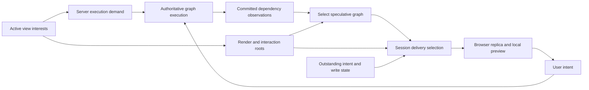

# View-scoped client replication and speculative execution

Status: experimental core implemented behind an off-by-default flag; wider
rollout remains gated on workload correctness and performance. The
implementation includes session-owned view interests, observed read selection,
shared component schemas, and guarded stored-graph registration. Successful
partial graph bindings retain their scheduler state across coverage updates and
plan generations for the same source. The
[server-currency startup proposal](view-replication-server-currency.md) sizes
the separate optimization of adopting settled server results as initial local
state; it is not implemented.
[The feature document](../features/view-scoped-client-replication.md) describes
the implemented protocol and its conservative preview limits. The rollout,
recovery, and adversarial verification work below remains part of this plan. The
existing server-execution specs retain authority over durable commits, events,
effects, and speculation overlays.

Rollout requires a complete passing integration campaign and measured workload
comparisons. Preserve bounded view-plan traversal, verify complete 100-topic
rendering on the rollout build, reduce the remaining navigation overhead, and
resolve consequence completion for 10-voter, 10-option lunch bursts before
enabling deployments. The
[validation and benchmark snapshot](../history/benchmarks/view-scoped-replication-2026-09-10.md)
records the integration corrections, enabled and disabled comparisons, CPU
attribution, and remaining measurement limits. The
[performance investigation](../history/development/performance/2026-09-10-view-scoped-replication-performance.md)
records graph selection, detached-session planning, delivery, and certificate
costs and the measured effects of their corrections.

The browser should subscribe to what it renders and receive the additional data
needed to respond locally to interactions with that content. The server already
discovers dependencies while executing. Use those dependencies to select the
browser's replication and execution work, instead of having the browser
rediscover the entire pattern's graph through its own reads.

The resulting client has three responsibilities: render authoritative output,
commit user intent, and preview the consequences of that intent when the
necessary code and data are resident. The server remains responsible for
authoritative execution, including work whose inputs the browser never holds.

## 1. Design decisions

1. Make each active render mount an explicit, session-owned view interest. Start
   from its `$UI` and `$NAME`, rendered component data, event streams, and
   writable bindings. Several mounts in one session contribute a union.
2. Separate **execution demand** from **delivery selection**. A server input can
   be necessary to keep a view current without being sent to that viewer.
3. Compute a **speculative slice**: runnable nodes connecting visible
   interactions to visible output, with the supporting inputs of those nodes.
   Cut execution at server-only operations and consume their committed output.
   First test installing the complete available pattern graph with guarded local
   execution; physical installation of only the slice is an optional refinement.
4. Treat recorded reads as observations of executed branches, not a complete
   prediction of future reads. Missing speculative inputs suspend the local
   attempt; the authoritative event proceeds.
5. Share component read contracts between the component and a DOM-free render
   traversal. Preserve the effective schema of each binding, including schemas
   supplied by patterns. Keep explicit subscriptions for dynamic reads until
   they have a complete contract.
6. Ship document selection first. Path-level replication is a distinct phase
   because the current wire delivers complete selected documents and the
   speculation overlay seals whole-document values.
7. Maintain a separate minimum set for outstanding intents, pending writes,
   reconciliation, and session effects. Unmounting must not interrupt them.
8. Gate the new behavior from its first implementation behind a separate global
   default, initially off, with optional overrides per client class, such as the
   web client. Negotiate support per session and retain complete existing-client
   fallback. Clients using either mode can share one space and server. Add
   optional navigation prefetch only after the minimum set works.

These decisions target a useful minimum for the current view and current
execution graph. They do not promise the globally smallest set for every
possible future event. Arbitrary handler control flow and dynamic graph
construction make that promise impossible from past read sets alone.

## 2. Existing mechanisms and the boundaries they impose

The following implementation seams inform the work. Recheck them before their
implementation stage; diagnostic APIs are not production protocol contracts.

| Concern                 | Existing mechanism                                                                                                                                                                                                                                                                                    | Consequence for this plan                                                                                                                          |
| ----------------------- | ----------------------------------------------------------------------------------------------------------------------------------------------------------------------------------------------------------------------------------------------------------------------------------------------------- | -------------------------------------------------------------------------------------------------------------------------------------------------- |
| Render root             | `RuntimeProcessor.handleVDomMount` in [runtime-processor.ts](../../packages/runtime-client/src/backends/runtime-processor.ts) applies `rendererVDOMSchema`, creates a `WorkerReconciler`, and owns mount teardown.                                                                                    | There is a concrete lifecycle for view interests within each web tab and its dedicated worker.                                                     |
| Render traversal        | [schemas.ts](../../packages/runner/src/schemas.ts) makes props and children separately addressable; [reconciler.ts](../../packages/html/src/worker/reconciler.ts) subscribes to them and resolves event and binding targets.                                                                          | The UI tip is a linked graph, not necessarily one result document. A root-only watch must still cover rendered descendants.                        |
| Piece open              | [pieces-controller.ts](../../packages/piece/src/ops/pieces-controller.ts) can synchronize and start a piece; `startPiece` starts and pulls its result.                                                                                                                                                | Narrowing the renderer alone will not eliminate startup reads and eager graph registration. Audit the complete shell-to-worker open path.          |
| Execution demand        | `MemoryServer.demandedInstancesForSpace` in [server.ts](../../packages/memory/v2/server.ts) exposes client graph-watch closures, including missing targets; [space-server.ts](../../packages/runner/src/executor/space-server.ts) maintains standing demand on their writers.                         | Downloaded closure and server liveness are coupled. Narrow delivery needs a separate way to preserve execution demand.                             |
| Observed dependencies   | [types.ts](../../packages/runner/src/scheduler/types.ts) records reads, shallow reads, and writes; [fan-out.ts](../../packages/runner/src/scheduler/fan-out.ts) retains logs per scope instance.                                                                                                      | Select dependencies for this principal and session, rather than exporting the union across all instances.                                          |
| Scheduling topology     | [facade.ts](../../packages/runner/src/scheduler/facade.ts) exposes dependency diagnostics and possible writes; [node-record.ts](../../packages/runner/src/scheduler/node-record.ts) owns node liveness and children.                                                                                  | Reuse scheduler indexes and registration events. A visualization snapshot is insufficient for executable graph shipping.                           |
| Recovery basis          | [scheduler-basis.ts](../../packages/memory/v2/scheduler-basis.ts) and [serving-loop.md](../specs/server-side-execution/serving-loop.md) define a compact recovery index.                                                                                                                              | Do not turn it into a persistent per-run read-set history or a per-client evidence log.                                                            |
| Replication granularity | `entitiesFromTracker` / `snapshotForDocKey` in [query.ts](../../packages/memory/v2/query.ts) select documents; `EntitySnapshot` / `SessionSyncUpsert` in [v2.ts](../../packages/memory/v2.ts) carry documents.                                                                                        | A narrow selector limits traversal to other documents; it does not project fields out of each delivered document.                                  |
| Component bindings      | `CellController.bind` in [cell-controller.ts](../../packages/ui/src/v2/core/cell-controller.ts) applies its schema only when the incoming handle has none.                                                                                                                                            | A registry that always substitutes the component schema changes semantics. Schema precedence belongs in the shared contract.                       |
| Extra component reads   | [mention-controller.ts](../../packages/ui/src/v2/core/mention-controller.ts), [cf-render.ts](../../packages/ui/src/v2/components/cf-render/cf-render.ts), and [cell-bridge.ts](../../packages/ui/src/v2/components/cf-iframe/cell-bridge.ts) follow additional references or accept runtime requests. | A fixed tag-to-schema table covers only part of the read surface.                                                                                  |
| Speculation             | [overlay-destination.ts](../../packages/runner/src/speculation/overlay-destination.ts) and [speculation.md](../specs/server-side-execution/speculation.md) own process-local layers, intent retirement, and authoritative-arrival checks.                                                             | Smaller replication must preserve their evidence and must not export speculative values or treat a watermark as data arrival.                      |
| Effect boundary         | [builtins.md](../specs/server-side-execution/builtins.md) defines server-only effects; [fetch.ts](../../packages/runner/src/builtins/fetch.ts) still computes request state from input snapshots.                                                                                                     | Preventing external execution does not by itself remove input reads or request hashing. True cut points need an output-only client representation. |

The server does **not** currently keep every stored pattern current merely
because it is stale. It observes the space's accepted commits, but demand
controls materialization; undemanded derivations may remain dirty. Events and
explicit warm demand also enter the serving lifecycle. This plan preserves those
obligations and does not introduce execution of every pattern in a space.

Likewise, the server's read set is not literally the browser's read set. The
server includes effects, authoritative handler branches, other viewers, and
different scope instances. The browser additionally reads component state and
can follow a speculative branch the server has not executed yet. The useful
relationship is that server execution supplies most of the dependency
information from which a particular browser's needs can be selected.

## 3. Model the view explicitly

### View interest

A view interest identifies a render mount, its root link, and requested mode:
render only or render with speculation. The authenticated session supplies the
principal and session identity. The client does not choose arbitrary instance
keys or inherit the serving runtime's read authority.

The root link retains its complete address: space, branch where applicable,
document, path, scope, and schema. Resolving a slot to a canonical piece must
not erase the path or schema the caller selected. `$NAME` is an independent
sink: listing a piece's name does not imply interest in its UI or handlers.

Initially, “on-screen” means content in an active render mount. It does not mean
a geometric viewport intersection. The shell must explicitly suspend inactive
panels and tabs if they remain mounted. CSS-hidden content cannot be identified
reliably by a server walking VDOM. Later, a component can declare which child
range or active branch it renders; virtualization and prefetch need separate,
explicit ranges.

Nested `cf-render` mounts join the parent view's lifecycle while retaining their
own root. Portals, menus, dialogs, and multiple independently mounted pieces all
contribute visible roots. Pointer targets or navigation links alone do not
activate the destination's full UI.

DOM-local state remains local unless an interaction needs to communicate it.
Capture event-time selection, viewport information, and other ephemeral inputs
through the existing binding/event payload contract. Server dependency
observations cannot recover those values. Shared user/session cells keep their
ordinary authored-write path; local component state does not acquire a durable
server instance merely because a view plan exists.

### Three sets, with different owners

For view `v`, maintain:

- **Render set R(v):** UI structure, rendered values and labels, name, resolved
  links, component data, and the descriptors needed to dispatch visible events
  and write visible bindings.
- **Speculation set S(v):** the selected runnable graph, its code and wiring,
  and all data required to execute that graph locally. This includes supporting
  reads that do not themselves change in response to an interaction.
- **Protocol set P(session):** outstanding event status watches, authoritative
  arrival evidence required by retained overlays, pending authored-write bases,
  session effects and acknowledgments, and necessary connection metadata.

The requested delivery is the authorized union of R and S across active views,
plus P and any explicit dynamic component reads. Schema and label metadata
needed to interpret those values are part of that union, not optional extras.

Execution demand is larger where necessary. To keep an effect's displayed result
current, the server needs its request inputs and producers even though the
browser receives only the result. The server must also satisfy other sessions'
demand and accepted events. Neither the delivery union nor its complement
decides whether an accepted event runs.



The server may share immutable topology and module data between viewers.
Instance selection, permissions, delivery residency, and outstanding intents
remain per session. An identical piece ID does not make two viewers' plans
interchangeable.

## 4. Select the useful speculative graph

### Graph vocabulary

Represent the relevant graph as addressable values and executable nodes.
Value-to-node edges are reads, including structural and negative reads;
node-to-value edges are writes or declared possible writes. Retain edge kind,
scope instance, and path overlap semantics. Parent-child construction edges
describe which registrations or factories are required to reconstruct a node.

The planner needs a supported, incremental scheduler interface. It must include
the last committed instance log, the conservative possible write surface when
available, executable identity, input/output bindings, and lifecycle changes. Do
not run `getGraphSnapshot()` on every commit or treat its formatted debug
addresses and action IDs as a stable network format.

The primary dependency evidence is the latest committed **observed read set**
for each node and scope instance. Declared schemas supply component contracts
and conservative coverage where execution evidence is incomplete; they do not
replace observed reads. Replace a node's observations when its committed branch
changes, while retaining dependencies still owned by another live consumer. Do
not accumulate every historical read into an ever-growing delivery set.

The persisted basis index helps warm recovery but is not this graph. It does not
establish complete handler coverage, unexecuted branches, or all metadata needed
to instantiate a selected node. Build the planner over the live graph; rebuild
its cache after restart through ordinary demand and materialization.

### Roots and algorithm

Let O be rendered outputs, including component reads and `$NAME`. Let H be
streams reachable from active UI event props. Let B be writable bindings and
other component operations that can introduce authored changes locally.

1. Resolve O, H, and B by walking the current render graph under the viewer's
   identity and effective schemas. Keep indirection and container reads so
   replacing a link, changing a child list, or creating a missing target
   invalidates the selection.
2. Walk forward from the possible writes of H and B through locally executable
   nodes. Stop traversal through server-only operations. Include handler
   cascades where their local execution contract permits them.
3. Walk backward from O through the same graph, also stopping at server-only
   operations. The intersection identifies pure computations whose rerunning can
   connect an interaction to visible output.
4. Include the executable handlers needed for those paths, then add **all
   supporting reads** of every selected execution unit. A supporting value can
   be replicated as an authoritative boundary value without running its own
   producers locally when no selected interaction can change it.
5. Add the code, schemas, cause information, bindings, and construction
   dependencies required to register those units. Resolve links and schema
   references through the existing machinery. Repeat locally when newly
   discovered structure changes reachability; retain cycle detection.
6. Union with R and P. Produce a delta against the last committed selection,
   partitioned by space, branch, instance, and authorization context.

This is graph selection, not statement-level slicing of JavaScript. If a handler
updates both a visible counter and an unrelated record, invoking that handler
still executes its complete body. Its other reads can be required even though
the corresponding writes do not lead to O. Never execute only selected
statements, discard a required transaction check, or silently turn a partial
handler run into a successful preview. If the full unit cannot run from resident
data, omit its preview and send the event normally.

A handler whose only consequence is an effect can still be dispatched through
its stream link without downloading its body. A direct `$value` write can
preview the bound control without running a pattern handler. Treat bindings as
interaction roots in their own right; handler discovery alone misses them.

Make dispatch independent of local handler registration. The render set must
carry the stream address, event schema, payload capture requirements, and
trusted-renderer provenance needed by the ordinary event append path. Reuse that
path and its event IDs, admission, and status tracking; omit only the optional
local scheduler echo. Prove this with a cold-view event test whose client has no
handler body installed. Do not load the body merely to silence an expected
missing-local-handler diagnostic.

### Worked example

Consider a product search with an input, a request, and a selected-item preview:

```text
search input -> request formatting -> fetch -> search results -> result list
selected item + search results + display preference -> item preview
save action -> saved items -> saved count
```

The browser receives the input binding, rendered list, selected item, display
preference, saved count, and the local code needed for selection and any useful
save preview. If the selection computation reads the result array, it also needs
that array even if the UI tip already contains rendered rows. It can re-render a
selection immediately without rerunning the request formatting or fetch. The
server still runs those request ancestors when the search changes.

An unrelated background summary contributes nothing unless a visible result
actually depends on it. If a displayed computation needs the summary's value,
deliver that value; the producer can remain server-side. “Off-screen” excludes
unrelated content, not data necessary to compute what is on screen.

### Unobserved branches and first interactions

Past execution cannot reveal every read of an arbitrary event payload. A handler
may never have fired; a different selected item may follow new links; a
speculative branch may instantiate new nodes. Empty observed reads must never be
interpreted as proof that a handler needs no inputs.

Use known input bindings, schemas, and possible writes as conservative selection
information where useful. Label incomplete coverage explicitly. Do not invoke
handlers with invented events to discover reads, and do not add static source
analysis as an authority over runtime semantics.

For a local attempt that reaches unreplicated data:

- Preserve the distinction between “not replicated,” “known absent,” and a
  legitimate undefined value. An incomplete read does not apply schema defaults
  as if absence had been confirmed.
- Dispose of the affected speculative execution unit as locally unavailable:
  discard its writes/effects and preserve the confirmed output. The existing
  unresolved-input path writes an undefined result, so reusing it unchanged is
  unsafe here. Section 9 defines the required distinction and re-trigger.
- Never block the event append on a dependency fetch. The speculative run itself
  does not issue network reads, as required by the speculation spec.
- Let the authoritative event run and publish its result. Committed graph
  discovery updates the plan and can improve the next interaction's preview.
- Let explicit view changes and registered dynamic component reads request new
  interest outside the speculative execution path.

For a selected-ID lookup, conservatively keeping an index or currently usable
item set can improve first-click coverage. Make that a measured selection
policy, with an explicit size cost. It is not evidence that all future
navigation requires that set. Exact unseen-branch prediction is a non-goal.

## 5. Make server-only operations real cut points

External fetch, LLM, and SQL execution is already suppressed in client
speculation under server execution. The additional change here removes the local
request-input processing and its replication dependencies as well.

Suppressing the external request while retaining the builtin's normal client
action leaves request materialization, hashing, registrations, and input
subscriptions in place. Replace that client action in the selected graph with an
**output boundary**: ordinary Cell links to its committed result and the
pending/error/status fields the UI uses. The implementation must not construct
or synchronize the request graph merely to create those links.

Share an explicit execution classification with the builtin registration path:
pure and locally executable; server-only with an output boundary; reversible
client effect with its own reconciliation contract; or unsupported for selected
execution. Unknown kinds default to authoritative rendering without a preview.
The existing replayability classification is related but has a different job:
whether writes can be reproduced is not identical to whether an operation can
execute in a browser. Do not reuse it as an unverified allowlist.

There is a real behavior choice here. The current speculation contract computes
whether request inputs differ from the stored memo key and then shows pending. A
browser without the inputs cannot perform that comparison. A hash sent by the
server does not let it hash inputs it does not possess.

The initial behavior is to show the last authoritative effect result and its
authoritative pending/error state. Echo the input control immediately. If a
selected local write is known to invalidate an effect boundary, an explicitly
local pending indication may be possible, but an approximate reachability test
must not clear the stored result or claim that a request started. Defer this
indication until its reconciliation behavior is designed and measured.

Consequently, immediate pending after every request-changing input is not
guaranteed in the first minimal-replication mode. Amend the relevant portion of
[speculation.md](../specs/server-side-execution/speculation.md) when adopting
this behavior. The initial mode does not retain request inputs solely to
reproduce immediate memo comparison. An opt-out view can use the complete
existing path if it needs that behavior. There is no design that removes those
inputs and still computes the same arbitrary request locally.

Keep `navigate-to` on its existing optimistic enactment and nonce path.
Compilation, SQL queries, network requests, and LLM calls remain server-side. Do
not speculate through an effect using a stale result as if it were the result
for a newly changed request. A dependent local computation may use the last
committed result only under the output boundary's explicit state.

## 6. Share component read contracts

### Contract contents

A component contract describes the Fabric data the component consumes, not its
DOM implementation. For each data-bearing property, record:

- Prop name and whether it is a value, readable handle, writable binding,
  stream, or nested render root.
- Read schema and its precedence relative to an incoming handle schema.
- Whether the component observes the reference, its shape, or its contents.
- Additional link-following rules and whether they are unconditional or
  activated by component state.
- Authored write/operation behavior needed to identify interaction roots.
- Child rendering behavior where the component selects only part of its
  children, plus any lifecycle-dependent reads it cannot declare statically.

The component and planner consume the same descriptor and schema objects.
`CellController.bind` becomes one consumer of the shared schema-selection
helper. Components that explicitly apply their own schema can describe that
policy; the helper must preserve their existing behavior. A table copied from
each component is not sufficient because it can drift immediately.

Use the canonical schema interning, hashing, link normalization, and Fabric
serialization helpers. Carry the closure of referenced schema documents and
label metadata. Do not flatten a handle to an ID or reconstruct its schema from
a TypeScript type name.

### Placement and dependency direction

Put the generic descriptor types, effective-schema resolver, and traversal
interface beside the data-only renderer schemas in `runner`, with imports
restricted to the same or lower layers. Supply a registry to each Runtime; do
not use a mutable process-global registry.

Keep component-specific declarations with `ui`, in a DOM-free entry point.
Generate a versioned data manifest from those declarations as part of the UI
build and load it into the server through deployment composition. The server
does not import Lit, register custom elements, or add a `runner`/`memory` import
of `ui`. Pure shared schemas already suitable for `runner/schemas` remain there.
The manifest contains schemas and a small declarative vocabulary, not arbitrary
executable functions supplied by a browser.

The browser advertises the contract-manifest version it actually runs. The
server must possess and recognize that version before replacing explicit
component subscriptions. A mixed deployment or unknown custom element uses the
existing explicit read path for that component. A client assertion about its
registry never grants permission to read another instance or bypass CFC.

### Coverage categories

| Category             | Examples and treatment                                                                                                                                           |
| -------------------- | ---------------------------------------------------------------------------------------------------------------------------------------------------------------- |
| Simple bindings      | Input/checkbox primitive schemas: first shared-contract migrations.                                                                                              |
| Structured props     | Select options, lists, editor data: declare the actual nested schema and incoming-schema precedence.                                                             |
| Secondary references | Names through `cf-cell-link`, mention targets, nested renders: declare link traversal and its activation.                                                        |
| Open-ended readers   | Iframe guest subscriptions, imperative editor operations, arbitrary supplied handles: keep a view-owned explicit read API, with per-request schema and teardown. |
| Operational UI       | Piece menus, source inspection, CFC metadata views: activate their reads while the relevant UI is open; do not load them merely because the component exists.    |

A server VDOM walk cannot infer arbitrary iframe requests or private Lit state.
Those reads remain explicit inputs to the same delivery planner, even after the
static registry is complete. This is a bounded extension point, not a second,
independent replication system.

Instrument the binding and subscription entry points in tests to compare actual
component reads with declared coverage. Fail on an undeclared read for a
component marked complete. Unknown components remain functional, and their extra
reads are counted. Check descriptor equality through the real effective schema
path rather than a test that merely compares duplicated constants.

## 7. Delivery, activation, and retention

### Reuse the Memory session transport

The server planner should add a server-owned selection to the authenticated
Memory session. Keep existing explicit watches during migration. Reuse query
evaluation, schema closure, scoped delivery, batching, removal, and resume
machinery; do not build a second WebSocket, value cache, or commit stream.

Use separate provenance for view execution roots, selected delivery roots,
dynamic reads, and protocol retention. A document delivered as support must not
automatically promote its whole pattern to a visible view, and removing a
delivery selector must not remove independent execution demand. Adapt
`demandedInstancesForSpace` and the serving demand registry together.

The planner exports selected addresses and necessary executable descriptors, not
the server's full read-set log. The existing rule that scheduler basis and
observation history stay server-local continues to apply. If any new descriptor
exposes observed dependency information, specify that narrow exception
explicitly in the protocol and authorize it as data disclosure.

### A global default and overrides per client class

Use the proposed name `viewScopedReplication` for the effective mode covering
view-based demand, server-selected delivery, selected local execution,
output-only effect boundaries, and component-contract substitution. Configure it
with a global default, initially false, and optional overrides for each client
class, starting with the web client. These are planned controls. Introduce them
and their entries in
[EXPERIMENTAL_OPTIONS.md](../development/EXPERIMENTAL_OPTIONS.md) in Stage 1,
before any production behavior can enter the new path.

Resolve the requested mode as `classOverride ?? globalDefault`. An unset class
override inherits the default; an explicit false overrides a true default.

| Global default | Web override | Web client    | Other classes without overrides |
| -------------- | ------------ | ------------- | ------------------------------- |
| Off            | Unset        | Existing mode | Existing mode                   |
| Off            | On           | New mode      | Existing mode                   |
| On             | Unset        | New mode      | New mode where supported        |
| On             | Off          | Existing mode | New mode where supported        |

Publish the global default through the deployment configuration path so every
client class has the same fallback. Keep class-specific overrides explicit in
the configuration resolved by that class. Centralize precedence in the runtime
preset/configuration machinery; a later application of the global default must
not overwrite an explicit class choice. A client that does not implement this
view protocol continues its existing read path regardless of the default. This
plan initially implements the web class; it does not invent render interests for
CLI, FUSE, or other consumers that use explicit reads.

The effective mode is active only when server execution is on, the resolved
class configuration requests the mode, and the server accepts the required
view-protocol capability/version for this session. Missing or incompatible
capabilities produce complete existing-client fallback with an observable
reason. The new flag never turns server execution on by itself.

Configuration is by client class; capability negotiation and delivery remain per
session. An enabled web client and an ordinary client can edit the same piece
through one serving runtime. Keep both on the same durable event and
authored-write protocol. Their difference is replication and local preview,
never authoritative event execution. No space migration or separate copy of user
data is required for document selection.

Negotiate this as an optional capability, with backward-compatible absence,
rather than adding a strict process-wide protocol-flag equality requirement.
Existing sessions keep their ordinary watch-derived demand; enabled sessions add
explicit view demand. The server unions both, with their original identities,
and does not create a second authoritative execution lane.

Resolve the web client's class setting at initialization and pass that effective
value explicitly to its worker; check host/worker agreement. Each web tab has
its own worker, which receives the class-level configuration at startup.

Initially, configuration changes apply at controlled runtime/session
initialization or replacement. Do not hot-switch scheduler semantics during a
handler. Finish or safely preserve pending authored work before replacement. A
replacement session reestablishes view interests and freshness rather than
inheriting an obsolete activation generation. Hot application of configuration
changes can follow as a separate operational refinement.

Keep emergency server capability withdrawal separate from the global default.
The default is a fallback and deliberately does not override a class explicitly
set to true. Capability withdrawal can stop all accepted sessions using the new
mode. A client falling back suspends selected speculation, retains outstanding
intent/write consumers, restores the existing watches and graph, and enables
that graph only after its inputs are ready. Merely changing a boolean while its
replica is still narrow is unsafe. Ordinary clients retain their behavior.

All new behavioral paths, including server planning for a view, require the
accepted mode or an explicit isolated test/shadow invocation. Shared schema
extraction and additive protocol parsing can be unconditional only when their
off-path behavior is unchanged. Do not charge ordinary clients for continuously
running a shadow planner. Optional field projection, if pursued later, needs its
own negotiated version and gate before it can alter the storage contract.

### Proposed session-level messages

The exact wire shape is a Stage 0 deliverable. It needs these semantics:

| Direction            | Meaning                                                                                                                                |
| -------------------- | -------------------------------------------------------------------------------------------------------------------------------------- |
| Client to server     | Add, update, or release a view interest; include a mount token, root, mode, and component-contract version.                            |
| Server to client     | Declare a new view-plan generation, the code/wiring additions required for its selected execution, removals, and its activation state. |
| Existing sync stream | Deliver selected document values, schema closure, ordinary updates/removals, and existing sequence metadata.                           |
| Client to server     | Acknowledge plan installation when transport delivery alone does not establish that the client installed the executable graph.         |

A generation orders membership and executable topology for one view. It is
**not** a second execution watermark. Continue using the one space watermark for
authoritative completion and document arrival evidence for reconciliation.
Associate activation with the existing session sequence barrier and completion
of the generation's required deliveries. Do not infer readiness from a large
space sequence alone: fresh demand can require work after that sequence.

### Opening and changing a view

1. Admit the interest under the session's identity. Establish execution demand
   before waiting for UI output, so a cold view can materialize.
2. Deliver the render closure as soon as it is usable. The browser can render
   and dispatch events before speculative code is ready.
3. Run the server's ordinary discovery as needed; plan the slice from committed
   graph state. Do not publish dependencies from an aborted wave as a ready
   authoritative plan.
4. Install additions, values, schemas, and code. Enable each selected local
   execution unit only after all of its required inputs are known available
   under the plan's coverage. An incomplete unit remains pending.
5. On topology changes, stage the next generation. Do not combine new wiring
   with a value snapshot from an incompatible graph generation. Suspend affected
   local units while additions hydrate; rendering can continue from
   authoritative data.
6. Remove old memberships after installation and retention checks. Late frames
   and late module loads for an obsolete generation cannot reactivate it.

Growth and shrink are normal for conditional branches, lists, scope narrowing,
pattern updates, and nested pieces. Use scheduler registration/dependency
changes and Memory notifications as triggers. Value changes with unchanged
topology should use existing indexes and revision/schema memoization, not a full
VDOM or whole-space graph walk per commit.

### Unmount and outstanding work

Reference-count residency across views, dynamic reads, overlays, authored
pending writes, and protocol consumers. Unmount releases that view's ownership;
it does not cancel an accepted event, lose its status, or delete another mount's
data. A handler retired from a render batch follows the existing renderer
acknowledgment lifetime; an already dispatched event retains its target
independently of subsequent view changes.

Retain the particular documents required by overlay arrival checks and pending
write repair until those consumers settle, even when their UI has disappeared.
Stop the old view's speculative recomputation when it loses interest. Do not
keep the entire hidden graph live merely to receive one event's terminal status.
A support document can leave active replication once no retained consumer needs
it; keeping cached bytes alone does not establish freshness.

The first implementation can preserve the existing sidecar watch granularity. It
must not describe a whole stream document as an entry-only payload: the current
intent listener selects entries locally. Entry-level status delivery would be a
separate transport refinement.

### Resume, failure, and authorization

On true session resume, restore the negotiated interests and generation state
only if the server can establish their continuity. On replacement, restart view
activation and mark cached support data unavailable for speculation until it is
refreshed. Preserve the existing ordering of unsolicited sync effects before the
initial watch response and the schema-document closure. Per-frame retransmission
of all immutable schema data is not a recovery strategy.

After executor restart or lease transfer, rebuild the selection from execution
demand and committed state. Rendering may use the last delivered authoritative
values while speculation is suspended. Do not replay old handler events to
reconstruct read sets.

Every selected value, module descriptor, and dependency address crosses the
viewer's ordinary read boundary. The server's ability to compute a cleared
result does not authorize shipping its private inputs. When a local preview
would require inaccessible data, retain an authoritative output boundary and
omit that preview. Preserve applicable scope filtering, CFC metadata, trusted
rendering boundaries, and authorization changes on existing watches.

Cross-space dependencies use their own admitted sessions/hosts and sequence
domains. A view can aggregate their readiness, but a watermark in space A cannot
acknowledge data arrival or an event in space B. Do not widen a serving
credential into a browser credential.

## 8. Granularity: documents first, then fields

### Document selection

Compute dependency selection at path precision where the logs permit it, then
round residency outward to the current document transport unit. Delivering a
document does not require following every link inside it: traversal roots and
selectors still decide which target documents join the set.

This can eliminate unrelated pieces, request ancestors, unused derived
documents, and unnecessary program startup. It cannot eliminate a large unneeded
field stored beside a needed field in the same document. Measure that remaining
overfetch explicitly. Do not claim that selecting `$UI` alone hides other fields
in its containing document or strengthens field confidentiality.

### Path-level replication

Only start this phase if document co-location materially limits the measured
win. It requires a real projection contract throughout the replica:

- Coverage records distinguish present values, confirmed absence, unknown
  fields, and removed subscription coverage.
- Structural reads preserve array length/order, key enumeration, negative reads,
  alias/link probes, and schema defaults without fetching whole values.
- Projection unions across consumers compose without one selector's removal
  deleting fields another owns. Re-subscribing to a cached projection requires
  fresh coverage before speculative execution.
- Deletes and scope redirects are distinguishable from dropping interest; sparse
  updates cannot pretend to replace a full document.
- Pending authored patches, collaborative operation streams, CAS/read
  preconditions, and rejection repair work over a partially resident base.
- Whole-document speculative seals cannot materialize unknown siblings as
  missing. Either retain complete bases for those execution units or design
  coverage-aware overlay writes and reconciliation first.
- Content-addressed data remains hash-verifiable; do not label a partial
  document with the original content hash. Preserve necessary CFC/schema closure
  and the current trust model.

This phase needs its own Memory and speculation spec amendments and must not be
slipped into query serialization as a small optimization.

## 9. Whole-graph installation, guarded execution, and freshness

### Install broadly before introducing a new executable format

The first approach to test is installing the complete available graph of the
opened pattern using existing module and binding machinery, while replicating
only the selected data and permitting only eligible local execution. Installing
a node does not establish that its inputs are available or that its output needs
recomputing. This keeps graph selection useful for data delivery without
requiring a new format for shipping individual runnable nodes.

Installation must be separable from eager input synchronization and initial
execution. The ordinary resume path in
[runner.ts](../../packages/runner/src/runner.ts) calls
`#syncCellsForRunningPattern` and holds initial runs until synchronization;
calling that path unchanged would defeat narrow replication. Test reusing the
existing graph wiring with those loading/activation policies replaced. Keep
effect nodes on their output-only representation so installing them does not
read their request inputs.

“Complete available graph” includes registrations reconstructible from the
loaded pattern and its available structural metadata. Dynamic children that
require missing data to construct are not magically reconstructible. Leave them
uninstalled until their metadata arrives or an eligible local computation can
construct them. Do not execute a handler to discover its children.

Code and registration memory may remain large in this first approach. Measure
them separately from state replication and executed work. Install only selected
nodes later if broad registration materially limits the win or cannot avoid
eager reads. At that point, establish the smallest descriptor needed for module
identity, input/output bindings, cause/parent, scope, and handler association.
Do not make that format a prerequisite without evidence. The related
[serializable factories](first-class-serializable-factories.md) and
[codeless graph rebuild](codeless-graph-rebuild-seed.md) plans describe relevant
machinery; their proposed work is not assumed to exist.

### Missing local data produces no output write

The current lift path is important: an invalid argument or recorded schema
refusal reaches `#writeJavaScriptActionResult` with undefined. The existing
[unresolved-input specification](../specs/server-side-execution/speculation.md)
deliberately describes that result. Under server execution the client writes
into its overlay, so this can mask a correct confirmed value without changing
the durable server value. An unchanged whole-graph start is therefore unsafe
with intentionally omitted data.

Give the new mode a distinct local evaluation outcome for unavailable replica
data. It is not the Fabric value undefined, and it is not the authoritative
schema-mismatch behavior. For this outcome:

1. Discard the attempt's complete transaction contribution, including earlier
   writes, effect intents, and attempt-owned child registrations. Do not call
   the normal result writer with undefined and do not seal an overlay entry.
2. Leave the confirmed output intact. A successful run that legitimately returns
   undefined or deletes a value still produces its ordinary output; never
   suppress writes merely because their value is undefined.
3. Retain the reads needed to wake the suspended local unit, including the
   unavailable address and structural reads taken before it. Keep this attempt's
   wake dependencies separate from the server's committed read set.
4. Reconsider the unit on a real availability, input, or plan change. Do not
   mark it successfully recomputed, and do not immediately retry it against
   unchanged coverage or fetch from inside the speculative attempt.
5. Record unavailability on the transaction as well as signaling it to the
   reader, so a pattern catching the signal cannot seal a fabricated result.

The availability check must precede defaults, optional-property handling, and
schema-less reads as well as required schema reads. An omitted user/session row
is unknown until its coverage establishes presence or absence. A locally created
cell can still have a known empty initial state. Do not infer either from the
fact that no bytes currently exist in the replica. Document-level delivery
already needs this distinction; field projection will extend its granularity.

### Keep authoritative state and local eligibility separate

An output can be the correct authoritative value for the received baseline while
its producer is impossible to evaluate on this client. Conversely, a producer
can have all its bytes resident but need to wait for an upstream local
computation invalidated by the current interaction. One clean/dirty bit cannot
represent both questions.

Use separate notions of authoritative baseline, local invalidation, and local
availability. Initially installed nodes with received authoritative outputs do
not need to overwrite those outputs just to mark themselves initialized. A local
input/handler write, or a newer input change not covered by that baseline, can
create work; an eligible run must have valid coverage for every read it actually
performs. Resident cached bytes outside current coverage are insufficient.

If a locally invalidated producer cannot run, its old authoritative output may
remain displayed, but a downstream speculative run must not treat it as the
producer's result for the new local input. Propagate local unavailability
through that dependency chain. The same rule applies to an older preview left
visible while a newer interaction cannot be previewed. Displaying a retained
snapshot does not make it a current input to another local computation.

For example, `price -> subtotal -> total`: an edit invalidates subtotal, but
subtotal needs an unreplicated discount. Keep the confirmed total visible and
let the server process the edit. Do not manufacture an undefined subtotal, and
do not compute a new total using the old subtotal as if the edit had propagated.
Independent eligible branches may still preview.

### What a server freshness indication would mean

A compact scheduler baseline may be useful to seed dependency indexes and skip
unnecessary initial runs. Evaluate it after the unavailable-read rule is pinned;
it is not a replacement for that rule. A branch can discover a new missing read
after the scheduler's initial eligibility check.

Distinguish three facts: the revision that last changed the output, the input
basis through which the server has established that output as current, and the
data/coverage actually delivered to this client. An output last changed at 80
can be validated through 100 without another output write. The space's current
sequence alone proves none of that for a newly demanded node. A local intent can
also be newer than the received baseline without having a server sequence yet,
so comparing two sequence numbers cannot replace local intent lineage.

If needed, send a bounded current baseline tied to the node's stable identity,
scope instance, graph/plan generation, and delivered output revisions, with the
dependency/basis information required for its claimed coverage. Accept it only
after its corresponding data delivery barrier. Treat it as a baseline rather
than a permanent write prohibition: newer uncovered inputs and local intent can
invalidate it. Stale generations cannot mark a replacement node clean. Share
only admitted dependencies; server-only/private support does not become client
data merely because a baseline names it internally.

Do not replicate queues, running promises, timers, or transient server scheduler
state. Do not introduce per-node execution watermarks casually: the live
protocol has one space watermark. The spike must determine whether existing
delivery generations, observed dependencies, and that watermark can express the
needed baseline. Any stronger per-node validation certificate requires an
explicit protocol/spec design and cost measurement.

Before sealing a successful speculative attempt, revalidate its consumed basis,
local invalidation generation, graph generation, and terminal-intent state. A
new authoritative baseline arriving during the attempt must not be obscured by a
result from an incompatible earlier basis. Restart only on a concrete change,
and retain the existing origin/arrival reconciliation rules; do not replace them
with last-writer-wins sequence comparison.

Support result-as-pattern children only under the existing overlay cause and
lifetime rules. Failed or unavailable attempts must not leave child writes or
registrations behind. These rules apply whether graph installation is broad or
selective, and remain behind the new client-class mode.

## 10. Work sequence and gates

Implement each stage as a reviewable change after its design questions are
resolved. Add a failing behavioral test before changing each runtime contract.
Run package tests for every touched package and the required repository gates
before preparing an implementation branch for review. Use the repository's
waiting primitives; success waits are event-driven.

### Stage 0 — Characterization and bounded spikes

- [ ] Trace a complete shell open, render, interaction, unmount, and reconnect
      through runtime-client, piece, runner, and Memory. Attribute all watches
      and reads to a consumer; distinguish setup from steady state.
- [ ] On isolated synthetic data, compare current client replication with the
      candidate R/S/P sets without changing delivery. Include a simple form, an
      effect-heavy search, a large list, and nested/conditional content.
- [ ] Expose a temporary read-only candidate selector over live scoped logs and
      possible writes. Determine handler coverage before first fire and whether
      action identity survives reconstruction. Do not execute invented handler
      events or create durable trace logs.
- [ ] Install an opened pattern's whole available graph using existing module
      addresses and bindings without broad dependency sync or automatic initial
      writes. Exercise one dynamic child and one unavailable construction path.
- [ ] Start with a confirmed output and omit a required client input. Pin a
      distinct unavailable outcome that writes nothing, then a successful run
      returning undefined that still clears its output. Include schema defaults,
      schema-less reads, user/session absence, and a caught unavailability
      signal.
- [ ] Pin propagation through an invalidated producer that cannot run, and an
      authoritative push arriving during a local attempt. Determine the minimum
      scheduler baseline needed to avoid initial and stale-basis recomputation.
- [ ] Replace a synthetic effect with committed output links and verify that the
      client performs no request-input read or hash, while downstream local
      selection still previews correctly.
- [ ] Extract shared contracts for an input, checkbox, structured prop, and
      secondary-reference reader. Compare effective schemas and observed reads
      through the real component path.
- [ ] Specify the minimal negotiated protocol and the execution-demand split.
      Reproduce opening a cold view with only the new explicit view demand.

**Gate:** Produce measured candidate sizes, a precise coverage/miss account, and
a concrete node-installation and wire proposal. No percentage reduction is
claimed before this evidence. Spikes use isolated data and remain separate from
enabled production behavior. Attempt broad graph registration with guarded
execution before requiring selective executable shipping. Introduce a new node
descriptor or freshness certificate only if the spike demonstrates why the
existing graph and delivery metadata cannot satisfy the contract.

### Stage 1 — Explicit views and independent execution demand

- [x] Add the global default, initially off, and optional client-class
      overrides, per-session capability negotiation, and host/worker agreement;
      register the controls and removal criteria in
      [EXPERIMENTAL_OPTIONS.md](../development/EXPERIMENTAL_OPTIONS.md).
- [ ] Test class-override precedence, configuration application at
      initialization, and session replacement that preserves outstanding work.
      Implement capability rollback and complete fallback before activating new
      delivery behavior.
- [x] Add view interest ownership to the mount lifecycle and negotiate support.
- [x] Separate client delivery provenance from server execution roots; retain
      ordinary explicit watches and accepted-event demand.
- [ ] Make a render-only view correct from `$UI`/`$NAME` plus current component
      subscriptions, without relying on full client pattern execution to make
      the server discover its work.
- [ ] Handle multi-mount union, hidden panel suspension, cold starts, source
      changes, cross-space admission, and reconnect.
- [ ] Shadow the selected delivery set while existing delivery remains active.

**Gate:** Authoritative UI stays current under remote edits with client
derivation disabled for the test view; narrowing client delivery cannot strand
server demand. Old and new sessions can coexist against one space.

### Stage 2 — Shared render and component contracts

- [x] Add data-only registry interfaces and the versioned UI manifest path.
- [x] Share schema precedence and traversal semantics with the actual renderer
      and component binding paths.
- [ ] Migrate simple bindings, structured props, secondary references, and
      nested render roots in that order.
- [ ] Carry dynamic reads through a view-owned API. Keep incomplete/unknown
      components on measured explicit subscriptions.
- [ ] Add contract coverage checks and mixed-version behavior.

**Gate:** Mark a component complete only when real reads are covered, including
rebinding and teardown. Server planning imports no DOM implementation or new
upward package dependency.

### Stage 3 — Incremental slice and selected execution

- [x] Add the supported scoped dependency/lifecycle interface to the scheduler.
- [x] Compute the interaction-to-output slice and supporting inputs, with
      conservative handling of missing handler/branch information.
- [x] Add output-only representations for server-only nodes and specify their
      pending semantics in the live server-execution specs.
- [ ] Separate whole-graph registration from input loading and initial
      execution; guard local eligibility and support available construction
      parents. Pursue selective installation only if the measured broad approach
      requires it.
- [x] Add the distinct unavailable-read disposition, wake dependencies, and
      downstream local-unavailability propagation without writing undefined or
      changing authoritative/OFF-arm mismatch semantics.
- [x] Adopt the minimum verified scheduler baseline and seal-time basis checks;
      do not delay authored intent or initiate speculative network reads.

**Gate:** Selected interactions preview before a deliberately held server
response, effects execute only on the server, and unseen branches converge
correctly without an incorrect partial preview. Holding a test response uses an
explicit test gate, not a sleep.

### Stage 4 — Activate document delivery selection

- [x] Add server-owned selection to existing session delivery, with generation
      activation, additions-before-use, and reference-counted removals.
- [ ] Retain outstanding intent, overlay-arrival, and pending-write consumers
      across unmount and plan changes.
- [ ] Exercise initial sync, true resume, replacement, lease transfer, schema
      closure, authorization changes, and interleaved transport deliveries.
- [ ] Enable per-view fallback before enabling this mode for a wider audience. A
      failed plan must render authoritatively or restore a complete existing
      path; it must never claim missing data is an empty value.

**Gate:** Correctness matrix below passes and isolated/representative workloads
show a net reduction in state bytes and browser work without an unacceptable
server planning or first-render cost. Agree numeric budgets from Stage 0
baselines before rollout, not after observing the final results.

### Stage 5 — Decide field projections from measurements

- [ ] Quantify document co-location overfetch and compare it with the cost of
      code, planning, and explicit dynamic reads.
- [ ] If worthwhile, design coverage-aware projections, transaction bases,
      overlays, and operation streams as described in Section 8.
- [ ] Ship only after the projection-specific correctness suite passes.

**Gate:** This is optional for document selection's success. Its remaining cost
and semantics are reported explicitly if it is deferred.

### Stage 6 — Rollout, cleanup, and optional prefetch

- [ ] Keep the global/class controls and server capability rollback from Stage 1
      until mixed-mode adoption and rollback have passed their soak criteria;
      update [EXPERIMENTAL_OPTIONS.md](../development/EXPERIMENTAL_OPTIONS.md)
      as the default and removal status change.
- [ ] Roll out from supported synthetic fixtures to opt-in views, mixed
      sessions, and ordinary use. Preserve an observable fallback reason.
- [ ] Remove redundant client pulls and startup paths only after attribution
      proves no remaining consumer needs them. Remove shadow work and temporary
      instrumentation from hot paths.
- [ ] Add opt-in prefetch as separate lower-priority view interests with an
      explicit bound, lifecycle, and measured benefit. A prefetched view does
      not run handlers, and it must not delay the active view.
- [ ] Update governing specs and feature documentation throughout, and archive
      this plan when executed or abandoned under the documentation lifecycle.

Prefetch modes can eventually distinguish render data, speculative readiness,
and server warming. They should not share one “warm” bit: downloading a tab's
data, installing its code, and asking the server to compute it have different
costs and lifecycle obligations.

## 11. Correctness and performance evidence

### Required behavioral cases

| Case                                          | Required result                                                                                                                                           |
| --------------------------------------------- | --------------------------------------------------------------------------------------------------------------------------------------------------------- |
| Cold mount, no client graph                   | Server demand produces the UI; event dispatch is usable before speculation is ready.                                                                      |
| Simple visible handler                        | A complete local echo precedes the held server response, then converges once.                                                                             |
| Direct binding                                | Local control edits and their pure visible consequences work without a synthetic handler.                                                                 |
| Handler with unrelated reads/writes           | The complete unit previews safely or does not preview; no partial execution is treated as success.                                                        |
| Server-only chain                             | Request ancestors and credentials stay out of selected replication unless another visible path requires them. No client network/LLM/SQL execution occurs. |
| Supporting input                              | A display preference or second input remains fresh even though it is outside the forward interaction path.                                                |
| Never-fired handler or new branch             | No false claim of complete coverage; intent runs authoritatively, and missing local data stays pending.                                                   |
| Link replacement, absent target, list reorder | Structural/negative reads update membership and stable item identity correctly.                                                                           |
| Hidden tab and unrelated pattern              | They contribute no active-view replication; their independent server obligations still work.                                                              |
| Two views share one document                  | Closing one view does not retract the other's values or code.                                                                                             |
| Two users, two sessions                       | Each gets applicable instances only; server dependency unions cannot leak another instance.                                                               |
| Component schema precedence                   | Incoming schema, component override policy, defaults, and writes remain coherent after rebinding.                                                         |
| Iframe/dynamic reader                         | Explicit read registration adds only admitted demand and retires on its real lifecycle.                                                                   |
| Pattern/module update                         | New nodes activate with compatible wiring and data; late loads cannot resurrect old nodes.                                                                |
| Navigate during pending event                 | The accepted event finishes, overlay/status evidence arrives, and old UI subscriptions retire.                                                            |
| Refusal, drop, or terminal event error        | Echo retirement and user-visible terminal state work even with the originating view gone.                                                                 |
| Initial push before watch result              | Wire order and schema availability are preserved.                                                                                                         |
| Resume/replacement/restart                    | No false freshness from cached data or obsolete plan state; no handler replay for discovery.                                                              |
| Permission or scope change                    | Selected data and executable descriptors follow the same admission and retraction rules as ordinary reads.                                                |
| Cross-space event and read                    | Each space's authority, sequence, and retirement evidence are respected.                                                                                  |
| Projection phase                              | Unknown versus absent, overlapping selectors, deletes, partial bases, whole-document seals, and collaborative operations remain correct.                  |

Keep the existing ON/OFF behavior gates: the OFF path remains ordinary client
execution, and an unsupported peer does not partially enter the new protocol.
Use deterministic transport gates to exercise values arriving before/after plan
installation and event verdicts arriving before/after terminal state.

For guarded whole-graph installation, pin a received nonempty output with an
intentionally omitted input: no speculative undefined layer, no setup overwrite,
no broad pull, and no busy rerun. Follow with legitimate undefined, confirmed
absence/default, and local-input changes. Include a failed attempt that already
staged writes or children, an invalidated upstream whose old result is resident,
and a new authoritative baseline delivered during execution. An unchanged output
validated by the server at a later input basis must not require a fake value
write to establish coverage. A new local intent after that baseline must remain
eligible for a complete preview.

Test global-default/class-override precedence in every combination, including
explicit false over true and unsupported classes inheriting true. Test mixed
client classes on one space with web enabled and another class unchanged. For
two render-capable clients, test both ordinary, both enabled, and one of each
using separately configured client builds or test runtimes. Include two tabs of
one user with separate workers, different users, an old client against a new
server, a new client against an unsupported server, and capability withdrawal
while an intent is pending. Assert equivalent authoritative state and one
durable event consequence, alongside the expected difference in replicated data
and local work. Ordinary clients must not acquire view-plan messages or planner
work merely because a neighbor uses the new mode.

### Measurements

Measure cold open, warm open, first interaction, repeated interaction, tab
switch, remote edit, and unmount with outstanding work. Report at least:

- Documents and bytes delivered, separated into render, speculation support,
  schemas/labels, code, protocol retention, and explicit component reads.
- Chosen path footprint versus rounded document footprint, so document
  co-location does not disguise overfetch.
- Browser startup CPU, registered/running nodes, peak and settled replica/graph
  memory, and input-to-visible-preview latency.
- First authoritative render latency and authoritative convergence latency.
- Speculative attempts, successful useful previews, unknown-input misses,
  unsupported units, and fallback reasons, separated by interaction type.
- Server planning CPU and memory per view, graph visits, selector churn, bytes
  of plan deltas, and ordinary execution cost. Record both cold planning and
  unchanged-topology update cost.
- Retained data after unmount, after all outstanding work settles, and across
  many open/close cycles. Growth must follow live consumers, not session age.

Vary total space size while holding the active view fixed; vary visible item
count while holding the space fixed; vary viewers, scope instances, and handler
input size independently. Whole-space replication or full-graph scans must not
reappear as the number of unrelated pieces grows. Compare identical workloads
and separate warm caches from cold ones. The instrumentation must not preload
candidate data or execute extra graph nodes in the measured arm.

The existing demand wake includes time-based coalescing; this plan adds no new
sleep or retry mechanism to wait for readiness. A separate follow-up agent can
evaluate removing existing time-based waits against
[waiting-in-tests.md](../development/waiting-in-tests.md), without conflating
that cleanup with replication correctness or changing its timing during the
comparison.

## 12. Spec changes, unresolved choices, and recommended first milestone

Amend [serving-loop.md](../specs/server-side-execution/serving-loop.md) for
explicit execution demand and selected delivery;
[protocol.md](../specs/server-side-execution/protocol.md) for negotiated view
interests, activation, and any narrow dependency-descriptor disclosure;
[speculation.md](../specs/server-side-execution/speculation.md) for selected
execution, output boundaries, and missing-input behavior; and
[builtins.md](../specs/server-side-execution/builtins.md) for shared execution
classification. Clarify the optional-echo dispatch path in
[events.md](../specs/server-side-execution/events.md) while preserving payload
capture and durable delivery. Scope rules remain those in
[scopes.md](../specs/server-side-execution/scopes.md). Extend Memory specs
before introducing field projections. Document component contracts and their
coverage rules beside the component development guidance.

Two choices are fixed for the initial mode: actual observed read sets drive
selection, and client effect nodes consume authoritative outputs without
retaining request inputs for local memo comparison. The global default and
client-class override controls are required from the first implementation. The
visible trade-off is that input controls still echo immediately, while an
effect's pending indicator can wait for the server to report it.

The design work still needs evidence or a deliberate product choice for:

1. **First-interaction coverage.** Determine how much complete-handler support
   can be selected from current bindings without loading a large unused input
   graph. Recommend correctness with an omitted preview over broad automatic
   prefetch to satisfy an unmeasured first-click target.
2. **Whole-graph registration and scheduler baseline.** First test existing
   graph installation with narrow replication and guarded execution. Determine
   whether it can avoid eager reads, and how much authoritative baseline
   information is needed to seed dependencies and avoid redundant runs.
   Selective executable shipping is a refinement if that approach fails its cost
   or behavior gates.
3. **Visibility contract.** Recommend active mounts with explicit hidden-panel
   suspension first; component-selected child ranges can follow.
4. **Projection value.** Decide from measured document co-location, separately
   from the decision to select documents and executable nodes.
5. **Registry distribution.** Validate the generated manifest's build,
   deployment, and version negotiation path before retiring component watches.

The recommended first milestone is one complete view using explicit demand,
shared contracts for its controls, output boundaries for its effects, and a
small selected speculative graph. It must open cold, respond locally where
covered, handle one unseen branch, converge under remote changes, and release
its data after unmount. That milestone tests the architecture before extending
it across every component or changing the storage unit of replication.
