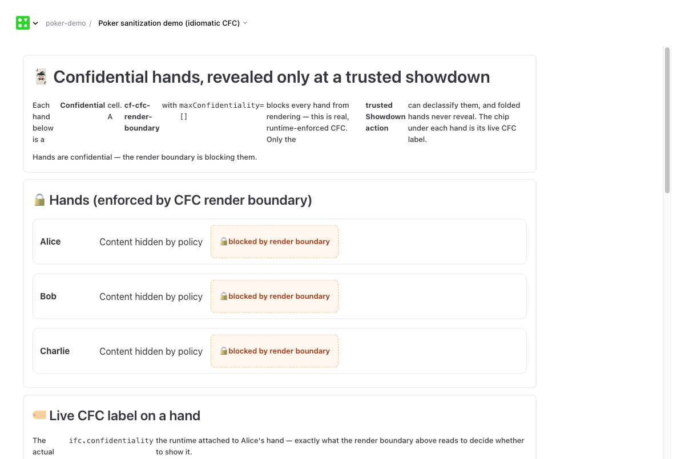
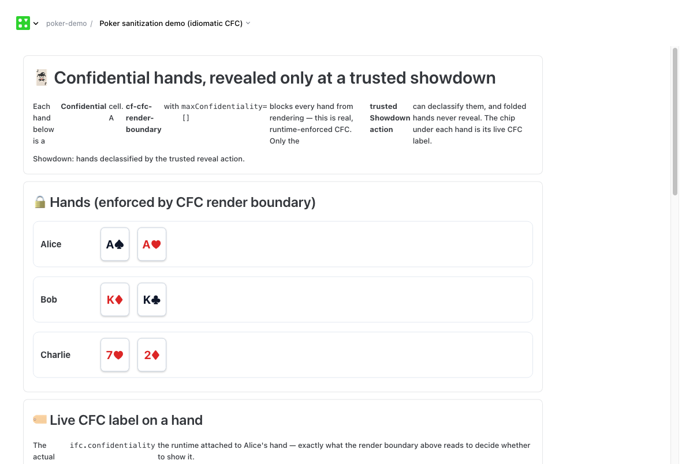

# Modeling hidden-information games with CFC — graded reveal is reducers + relabel policies, and the real gap is per-recipient materialization

**Status:** Design exploration / motivating sketch (non-normative)
**For:** CFC designers (`../specs/cfc`) and anyone weighing what belongs on the CFC roadmap
**Companion:** working demo pattern at `packages/patterns/poker-sanitization-demo/main.tsx` (type-checks; click-through)

---

## What this is, and the decision it informs

This memo uses a board game as a **forcing function** for hidden-information modeling in CFC, and
arrives at a sharper conclusion than it set out with: the per-viewer "graded reveal" a card game
needs is **already expressible** in CFC as *trusted reducers + integrity-guarded relabel policies*,
with **no new label primitive**. What's actually missing is an *enforcement* layer
(per-recipient materialization), not a label-model feature.

It is **not** a proposal to ship a poker game. The decision this memo informs is:

> CFC's label model already covers graded per-reader reveal (via reducers + relabel policies). The
> roadmap question is therefore narrower: **build a per-recipient materialization layer** (run the
> right reducer per reader, route outputs server-side) and a **canned-reducer library** — or keep
> steering people to scope-partitioning (`PerUser`)? And separately, is *unlinkability* (shuffles)
> worth research, given it's the one behaviour with no CFC home?

**Central claim, in one sentence.** CFC access is binary per `(value, principal)` with gradation on
the label lattice; "Bob sees the count, not the cards" is a *trusted reducer* (`count = length`,
inheriting the cards' confidentiality and minting a resolution-reduction integrity atom) whose
output a *policy relabels* to a lower audience — so the only genuine gaps are **per-recipient
materialization** (architecture, not labels) and **unlinkability** (an open research property),
with **recombination** (§14.3.2) bounding how many reducers you can safely publish at once.

---

## Why this matters beyond games

A hidden-information game is the purest instance of a pattern that recurs across collaboration
and privacy features: **the same stored value must appear in different, *partially* redacted forms
to different people, and the redaction is graded, not all-or-nothing.**

The "reveal only the count / only that it exists / only the order" moves a card game needs are
exactly:

- a shared document where a collaborator may see **that a field exists** but not its value;
- a per-recipient **summary** that reveals aggregate facts (how many items, what categories)
  without the items;
- a roster where teammates see **names** and outsiders see only a **headcount**;
- an audit view that proves **a record was touched** without disclosing the record.

CFC today reaches for **scopes** (`PerUser` / `PerSpace`) for all of these — which forces a
binary partition (you're in the scope or you're not) and turns every change in visibility into a
data migration. The game makes vivid what scopes can't express: a *graded* reveal that *changes
over time* (deal → hidden, showdown → visible, fold → "existed") on a *single* canonical value.

If CFC can express the game cleanly, it can express all of the above with one mechanism.

---

## The model we're emulating: `github.com/jkomoros/boardgame`

`boardgame` is a mature Go framework for turn-based board/card games. Among its subsystems is a
small, unusually sharp **state-sanitization model**, and that subsystem — not the game engine —
is what we want to learn from.

### The core idea in one screen

The server holds **one** true game state. When it sends state to a particular client, it emits a
**redacted projection tailored to that viewer**. The true state is never mutated; each player
simply receives a different lossy view of the same thing.

Consider a hand of two cards that Alice holds. One declaration governs every viewer:

```go
// In Alice's player-state struct. "len" applies to the "other" group by default.
Hand boardgame.Stack `sanitize:"len"`
```

From that single tag, the framework computes, *per recipient*:

| Viewer | What they receive for `Alice.Hand` |
|---|---|
| **Alice herself** (`self`) | `[A♠, K♥]` — the real cards |
| **Bob / any other player** (`other`) | two face-down placeholders — *"Alice holds 2 cards"*, no faces |
| **A spectator** (`other`) | same as Bob — count only |
| **Admin / game log** | full true state |

That is the whole "aha": **one policy declaration → a correct, per-viewer, partially-redacted
projection, for free.** No hand-written "build Bob's view" code; no separate count cell to keep in
sync. (Source: `state.SanitizedForPlayer` at `sanitization.go:170`; tag parsing in
`struct_inflater.go`; `Game.JSONForPlayer` is the egress boundary, `game.go:212`.)

### The reveal lattice

The redaction is **graded**. Each field is assigned one policy from an ordered lattice (for
collections; scalars collapse to visible-or-hidden):

| Policy | A non-privileged viewer learns… | Rank |
|---|---|---|
| `PolicyVisible` | everything | 0 (most revealing) |
| `PolicyOrder` | positions/order, **values replaced** by placeholders | 1 |
| `PolicyLen` | **count only**, order destroyed | 2 |
| `PolicyNonEmpty` | **one bit**: empty or not | 3 |
| `PolicyHidden` | nothing; field looks absent | 4 (most restrictive) |

### Groups and resolution

A policy binds to a *(field, group)* pair. Built-in groups are `self` (the viewer owns this
substate), `other` (everyone else), and `all`; games can define custom enum groups and computed
`same-TEAM` / `different-TEAM` groups. When a viewer is in several groups, the
**least-restrictive matching policy wins** (`base/game_delegate.go:325`).

### The clever part: identity that survives moves but not shuffles

Each card carries an unguessable id, `sha1(gameID + secretSalt + deck + index + secretMoveCount)`
(`component.go:319`); the salt is never sent to clients, so an unobserved id is uncomputable. Two
properties make this powerful:

- **Stable across public moves**: a card keeps its id as it slides between visible piles, so a UI
  can animate "the *same* card" moving — without anyone needing to know its face.
- **Scrambled on shuffles and secret moves**: `Shuffle()` bumps `secretMoveCount`, changing every
  id, and records old↔new ids in `IDsLastSeen` (`stack.go:1272`). A viewer learns "these N cards
  became those N cards" (so the shuffle still animates) but **cannot recover which became which**
  — exactly the unlinkability a shuffle should create. A *public* shuffle reorders *without*
  scrambling, so cards remain trackable; the framework distinguishes the two on purpose.

So a card's identity carries two policy-relevant facts: a **stable animation token** and a
**linkability relation that can be deliberately severed.**

---

## What CFC already expresses

Reading `../specs/cfc`, the *group/labeling* half of this maps onto existing machinery with no
new mechanism:

| Boardgame | CFC today | Reference |
|---|---|---|
| Groups `self`/`other`/`all`/`team` | **Spaces + roles**; "any reader can view" emerges from role membership, not DNF labels | `03-core-concepts.md` §3.6 |
| "least-restrictive policy wins" | CNF access check: satisfy ≥1 alternative per clause | §3.1.4 |
| Faceless placeholder + opaque id | **Opaque inputs / opaque handles** — a reference you can pass but not read | `08-13-opaque-inputs.md`; `14.2.2.7` |
| `PolicyOrder` / `PolicyLen` as *structural facts* | **Collection constraints** `permutationOf` / `lengthPreserved`, and the **membership-vs-member confidentiality split** | `08-05-collection-transitions.md` §8.5.3–8.5.6 |
| "order/selection leaks info" | **Selection-decision integrity** | §8.5.7 |

The most encouraging single find: **§8.5.6.1 already separates *membership confidentiality*
(which / how-many items) from *member confidentiality* (each item's value).** That is precisely
the axis `len`/`order` live on. CFC has the right *seam*; it lacks a graded, reader-relative
*projection* across it.

### Being precise about what CFC *does* have (and why it's not enough)

CFC is not purely all-or-nothing — it has three adjacent partial-declassification mechanisms, and
it's worth saying exactly why each falls short, because the gap is narrower and sharper than
"CFC is binary":

- **`maxConfidentiality` ceilings** (`08-08`, render-boundary): bound how sensitive a value may
  be to pass a boundary. This is a *threshold on a whole value*, not a transform that emits a
  reduced shape.
- **Error declassification** (`05-policy-architecture.md` §5.4): reduces an error to
  `sanitizedFields` at a target confidentiality. This *is* a value-reducing declassifier — but it
  is **not reader-relative** (same sanitized error for everyone) and **not an ordered lattice**
  (it's a hand-written field list per rule).
- **`cf-cfc-render-boundary`** (`packages/patterns/cfc-render-policy-demo/main.tsx`): shows/hides a
  subtree in a *trusted host*. It is a **UI gate**, not a transform of the data, and it does not
  stop a reader's runtime from reading the underlying bytes.

So the precise gaps are three, and all three must hold simultaneously for the game:

1. **Graded** — a value reduces to one of several *ordered* shapes, not just pass/block.
2. **Reader-relative** — the shape is a function of *who is reading*, evaluated per reader.
3. **Read-time projection of one stored cell** — the same canonical cell yields many shapes;
   notably, the spec has **no** mention of per-reader / per-viewer / per-recipient projection, and
   the runner deliberately dropped its legacy query-time redaction. Boardgame's
   `SanitizedForPlayer` is exactly this, and CFC has no analogue.

### The obvious objection: "why not just scopes?"

Anyone who knows the runtime will say: put each player's hand in a `PerUser` scope, the table in
`PerSpace`, done. That works for *binary* hidden-vs-visible, and the skeleton pattern uses it. But
it cannot express what the game actually needs:

- **No graded reveal.** Scopes give "in or out." "Bob sees the *count* of Alice's hand" requires a
  separate, manually-maintained count cell — the exact hand-sync code boardgame's one tag avoids.
- **Reveal transitions become data migrations.** Deal (→ hidden), showdown (→ visible), muck
  (→ "existed") are, with scopes, *moves of data between scopes* triggered by handlers. As policy,
  they're a label change on a value that never moves. The latter is auditable and reversible; the
  former scatters the same logical card across scopes over its lifetime.
- **No unlinkability / animation identity.** Scopes have no story for "you may animate the shuffle
  but not trace a card through it," nor for a stable token that survives public moves.
- **Structure leaks.** The *existence* of a per-user cell is itself observable; `existence`-level
  reveal ("a hand was folded, contents never knowable") isn't naturally expressible.

Scopes are the right tool for *coarse* sharing boundaries. The game needs *fine, graded,
time-varying* reveal on values that stay put. That's the new capability.

---

## How CFC already models this: trusted reducers + relabel policies

> **Correction.** An earlier draft of this memo proposed a *new ordered "reveal" label dimension*
> (`hidden ≺ existence ≺ cardinality ≺ order ≺ values`). That was a modeling error. CFC access is
> **binary** per `(value, principal)` — you satisfy a value's label and read the whole thing, or
> you don't (§3.1.4; projecting a field *inherits*, never reduces, confidentiality — §8.3.1).
> "Gradation" lives on the **label lattice** (more CNF clauses = more restrictive; join =
> concatenation), not on a graded read of one value; even classic MLS levels are *modeled as
> policy*, not a built-in axis (§4.7.2). So a graded reveal is **already expressible** with two
> things CFC has, and needs no new label dimension.

The idiom is a **reducer + a relabel policy**:

1. **A reducer is an ordinary transform** that takes the secret and emits a less-informative
   value: `count(hand) = hand.length`, `exists(hand) = hand.length > 0`,
   `orderSkeleton(hand) = hand.map(_ => BLANK)`, … By the transition rules the reducer's output
   **inherits the input's confidentiality** (the count starts out as secret as the cards — §8.7,
   §8.1 table) and gains **new integrity *from the reducer itself*** — specifically a
   *semantic-correctness / resolution-reduction* integrity atom, which the spec names explicitly
   (§3.3, class 2: "unit conversions, **resolution reduction**"). Call it
   `ReducedBy{ reducer: CodeHash, kind: "count" }`.

2. **A policy trusts that reducer to relabel its output.** An integrity-guarded exchange rule
   (§5.3.2) fires when the value carries `ReducedBy{reducer: H}` and **relaxes the
   confidentiality**: `removeMatchedClauses` drops `[Alice]`, `addAlternatives` adds the lower
   audience (e.g. `[table]`). In the spec author's words: *"I trust the count-reducer (hash H);
   when its output is so labelled, that output may carry `[table]`."* This is **robust
   declassification** (§10 inv. 7): the relabel is gated on integrity that **only the trusted
   reducer's code identity can mint** (§3.3: integrity facts are minted only by trusted code and
   are non-malleable), so untrusted pattern code cannot forge "this is now public." The GPS
   **"round to city"** declassifier (§3.1.5) is the same shape; §8.5.6.1's membership-vs-member
   split is exactly why `count` is separable from the cards in the first place.

```ts
// 1. Reducer (a normal trusted transform). Output inherits the card's confidentiality and gains
//    a resolution-reduction integrity atom naming this reducer.
const countReducer = trustedTransform("poker.count", (hand: Card[]) => hand.length);
//    → output value: number,  integrity: [ReducedBy{ reducer: <hash>, kind: "count" }]

// 2. Relabel policy (an exchange rule keyed to the reducer's identity).
const releaseCountToTable = {
  integrityPre: [{ type: ".../ReducedBy", reducer: countReducerHash }],
  confidentialityPre: [HoleCards(player)],     // matches the hand's secret clause
  removeMatchedClauses: true,                  // drop the player-only secrecy
  addAlternatives: [TableReader(table)],       // ... and release to the table
};
```

So **"reveal level" = which reducer you run; "audience" = the new label its policy grants.** Both
are ordinary CFC. The boardgame ladder is just a *family of canned reducers*: `exists` (≈
PolicyNonEmpty), `count` (≈ PolicyLen), `orderSkeleton` (≈ PolicyOrder), identity (≈ PolicyVisible).
No new primitive.

## What is genuinely missing

Given the above, only one thing is a real **gap**, one is **ergonomics**, and two are **out of
scope**:

### The real gap — per-recipient materialization (enforcement/architecture)

CFC specifies the *check* (`canAccess`) and the *relabel* (exchange rules), but **not an
orchestration that, per reader, runs the right reducer and routes each reader to the projection
they can satisfy.** Boardgame's `SanitizedForPlayer` is exactly that: a server-authoritative,
per-recipient materialization that runs before bytes leave the trusted boundary. The CFC spec
describes no per-recipient projection/materialization layer (the closest, error declassification
§5.4.2 and multi-party consent §3.9.5, each produce *one* shared output, not per-reader variants).
A sketch of the missing piece — the read-time dual of the sink gate (§5.2):

```ts
// Trusted boundary: for THIS reader, run the most-revealing reducer whose relabelled output the
// reader can satisfy, and emit only that. Nothing below it ever sees the raw cell.
function materializeForReader(cell: CellRef, reader: Principal): { value: unknown; label: Label };
```

Today the runtime has no such layer (the legacy query-time redaction was removed; the
`cf-cfc-render-boundary` is a *trusted-host UI gate*, not server-side projection). **This — not a
label primitive — is the thing to put on the roadmap, and it's the fork worth Berni's call:** a
trusted materializer participants delegate to, vs. partitioning each player's secret into a scope
peers can't read (`PerUser`, the cooperative-demo answer; not a hard boundary — §3.6 / multi-user
docs).

### Ergonomics — a canned reducer/projection library

Authors must hand-write one reducer + one relabel rule per level. A small standard library
(`exists`/`count`/`orderSkeleton`) plus an authoring affordance ("for audience X serve reduction
R") would make the common cases declarative. This is sugar over the model above, not new
semantics.

### Out of scope — recombination and unlinkability

- **Recombination.** Exposing several reducers' outputs at once can leak more than any one
  intended — the spec's own city+grid example is *literally two reducers composing* (§14.3.2,
  explicitly unsolved; §14.4.1). A poker table with many simultaneous partial reveals lands here.
  This bounds how many reducers you can safely publish for one secret.
- **Unlinkability** (boardgame's shuffle/`scrambleIds`: "you may see a card move, but not that it
  is the same card"). This is a *relational* property — not who-may-read-a-value but
  whether-two-values-correlate — which CFC's lattice does not model and the spec does not address
  (nearest acknowledgement: the composition/contamination problems, §14.3.2/§14.4.2). It is the
  one boardgame behaviour with **no** CFC home today; treat it as an open research question, not a
  primitive to bolt on.

---

## Worked example: Texas Hold'em

Each hand is `Confidential<Card[], [HoleCards(player)]>`. "Reveal level" = which trusted reducer's
output a policy releases to the table; "audience" = the label it's released to. (M) marks the one
step that needs the missing **materialization** layer; (R) the open **recombination** caveat; (U)
the open **unlinkability** problem.

| Field | Label | How others learn anything | Mechanism |
|---|---|---|---|
| `holeCards[p]` | `[HoleCards(p)]` | table gets `count` only | `countReducer` + relabel `[HoleCards(p)]→[table]` |
| `board` (flop/turn/river) | `[HoleCards(deck)] → [table]` | everyone, once dealt | identity reducer relabelled by a trusted "deal community" action |
| `pot`, `bets`, `toAct` | `[table]` | everyone | public; no reducer |
| `muck` (folded hand) | `[HoleCards(p)]` | table learns a hand exists | `existsReducer` + relabel to `[table]` |

1. **Deal** → `holeCards[p]` is `[HoleCards(p)]`-secret. A `countReducer` emits `length` (inherits
   the secret, mints `ReducedBy{count}`); `releaseCountToTable` relabels *that derived value* to
   `[table]`. Alice (who satisfies `HoleCards(Alice)`) sees her cards; the table sees `{count: 2}`.
   **(M)** the runtime must actually run the reducer per-reader and serve Alice the cards but Bob
   the count — that routing is the missing materialization layer.
2. **Flop/Turn/River** → community cards start `[HoleCards(deck)]`-secret; a trusted "deal
   community card" action (§3.8/§6) authorizes an identity-reducer relabel to `[table]`. A normal
   declassification event.
3. **Showdown** → the *same* `holeCards[p]` are relabelled `[HoleCards(p)] → [table]` by the
   trusted Showdown action — the identity reducer this time (full cards). Folded hands simply don't
   get this relabel, so they stay secret. **(R)** publishing both `count` (step 1) and full cards
   (here) over a session is multiple reducers on one secret — fine sequentially, but a caution if
   many partial reveals coexist.
4. **Muck (fold without showing)** → `existsReducer` releases one bit (`[table]`); the cards' full
   label is never relaxed, so contents stay secret forever. **(U)** "you can't tell *which* cards
   were folded even after the deck is shown" is the unlinkability property CFC has no home for.

Every mechanic except unlinkability is `{trusted reducer} + {relabel policy}` over the binary
lattice; the only new machinery anyone has to *build* is the per-reader materialization in step 1.

---

## Expressible today vs needs adding

| Capability | CFC today | Verdict |
|---|---|---|
| Per-player hidden vs visible hands | `Confidential` label + binary access | ✅ already |
| "Any table member sees the board" | spaces + roles | ✅ already |
| "Opponent has N cards" (count, not cards) | `countReducer` + integrity-guarded relabel (§8.7, §3.3, §5.3.2) | ✅ already expressible (label model) |
| "Positions visible, faces hidden" (order) | `orderSkeletonReducer` + relabel | ✅ already expressible (label model) |
| Reveal that changes over time (deal→showdown) | trusted action fires the relabel exchange rule | ✅ already (a relabel, not a data move) |
| **One cell, the right reduced view served to each reader** | — | ❌ **missing: per-recipient materialization** (architecture) |
| Canned `count`/`order`/`exists` reducers + declarative authoring | hand-write reducer + rule each | ⚠️ ergonomic gap (library) |
| Publish several partial reveals of one secret safely | — | ⚠️ recombination, open (§14.3.2) |
| Can't trace a card through a shuffle (unlinkability) | — | ❌ out of scope / open research |

---

## Open questions for CFC designers

1. **Is "graded reveal" settled as reducers + relabel policies?** This memo now argues yes — no new
   label dimension. Sanity-check that against the spec's intent (esp. §3.3 resolution-reduction
   integrity + §5.3.2 exchange rules). If agreed, the earlier "ordered dimension" idea should be
   formally retired.
2. **Per-recipient materialization — build it, or stay scope-only?** The real fork. Is a trusted
   server-side materializer (run reducer per reader, route outputs) on the roadmap, or is the
   intended answer always `PerUser` scope-partitioning (with its "addressing, not authorization"
   caveat)?
3. **A standard reducer library + authoring affordance.** Worth a `count`/`order`/`exists` library
   and sugar like *"for audience X, serve reduction R"* lowering to a reducer + exchange rule?
4. **Recombination budget.** When one secret has several reducers (count *and* later full cards,
   etc.), how is the composition hazard (§14.3.2) bounded — per-secret reducer allow-lists,
   linkage tracking, a DP-style budget?
5. **Unlinkability — research or out of scope?** Boardgame's scramble has no CFC analogue (it's a
   relational, not who-may-read, property). Is it worth a research track, or explicitly declared
   out of scope?

---

## The companion pattern

`packages/patterns/poker-sanitization-demo/main.tsx` makes the memo concrete, and is deliberately
split into **what CFC enforces today** vs **what this memo proposes** — so it demonstrates real CFC
idiomatically rather than faking the extension.

**Enforced (idiomatic, real CFC):**

- Each hand is a real `Confidential<Card[], readonly [PokerHoleCards]>` cell, created the idiomatic
  way (`lift` → `Cell.for(id).set(...)`), so it carries a genuine `ifc.confidentiality` label.
- A `cf-cfc-render-boundary` with `maxConfidentiality={[]}` **actually blocks every hand from
  rendering** — this is the one CFC mechanism the runtime enforces today.
- The **showdown is a real integrity-gated declassification**: a trusted-action surface
  (`data-ui-surface` / `data-ui-event-integrity` / `data-ui-action` + a `TrustedActionWrite` output)
  flips the cell that drives `declassifyConfidentiality`. Only that trusted gesture reveals the
  hands; **folded hands are never declassified.**
- `cf-cfc-label` shows a hand's live label (the real `ifc.confidentiality`).

**Proposed (clearly labelled "simulated — not enforced"):** the graded reveal lattice
(`existence`/`cardinality`/`order`) and per-reader projection — shown only as an illustration of the
target shapes, with an explicit note that CFC today is binary (blocked or fully declassified).

The pattern also carries an **honest-limitation panel**: the render boundary hides labelled content
in a *trusted host*; it does not encrypt the cell, so real secrecy between mutually-distrusting
players still needs the per-reader materialization of §4.4.

It **type-checks, deploys, and runs** (`deno task cf check … --no-run`, exit 0; deployed to a local
toolshed and driven in-browser, 0 console errors).

### Live demo (screenshots)

The same hands, before and after the trusted showdown (`docs/proposals/images/`):

- **Blocked** (`poker-v3-01-blocked.png`): every hand shows *"Content hidden by policy"* — the
  render boundary refusing to render the labelled cell — plus a `🔒 blocked by render boundary`
  note. Status: *"Hands are confidential — the render boundary is blocking them."*
- **Revealed** (`poker-v3-02-revealed.png`): after the **trusted Showdown** action declassifies the
  `PokerHoleCards` atom, the same boundaries now permit the cards (`Alice A♠A♥`, `Bob K♦K♣`,
  `Charlie 7♥2♦`). Nothing else in the pattern can flip that cell.



