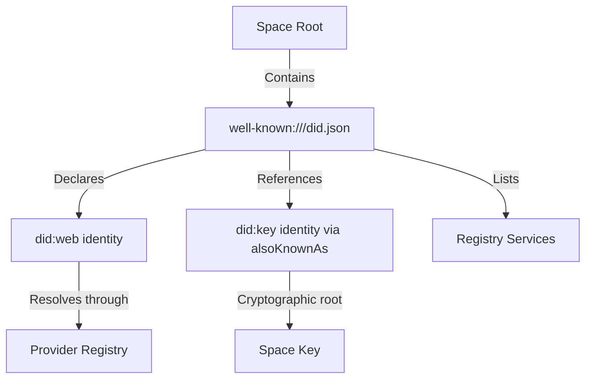
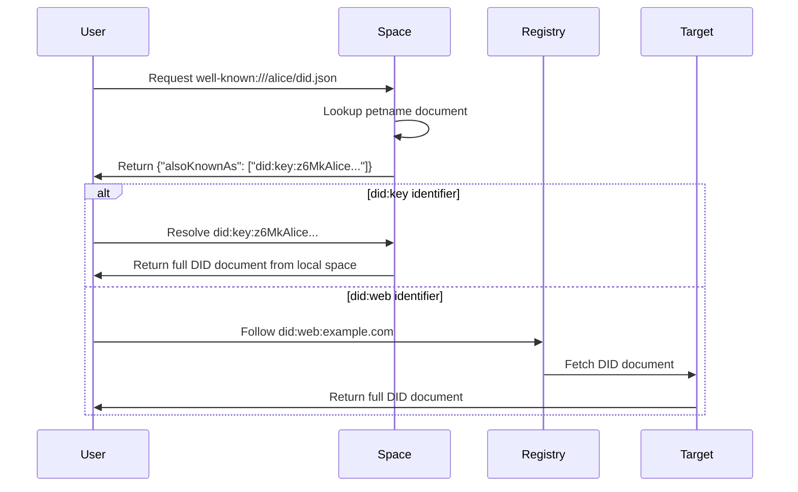
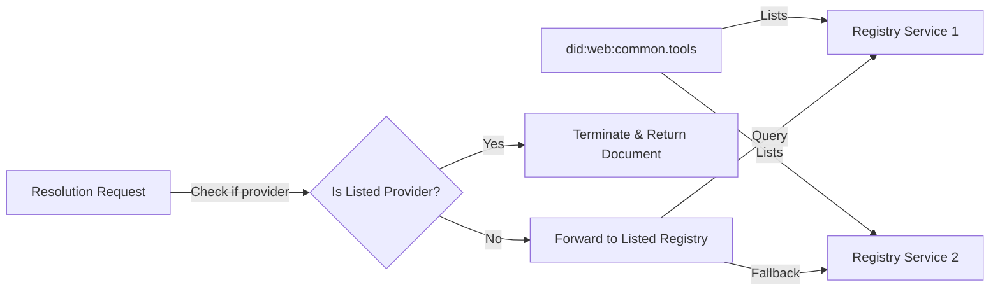

# Space Petnames

## Overview

The Space Petnames enable Spaces to function as decentralized identity registries and name resolution systems. By virtualizing `did:web` documents and implementing petname-style addressing, spaces can serve as both identity providers and human-friendly naming systems. This approach aligns with the decentralized web principles while maintaining compatibility with existing DID standards.

## Core Concepts

### Virtual DID Documents

A space can expose a virtual DID document that conforms to the [did:web method specification](https://w3c-ccg.github.io/did-method-web/). This document is accessible through a well-known path within the space:

```
Document ID: well-known:///did.json
MIME Type: application/json
```

Virtual DID documents support two formats:

#### Format 1: Local Space Management

When the space manages the identity locally:

```json
{
  "@context": "https://www.w3.org/ns/did/v1",
  "id": "did:web:common.tools",
  "alsoKnownAs": ["did:key:z6MkSpace123..."]
}
```

The `alsoKnownAs` field contains a single `did:key` identifier, indicating this identity is managed by the local space replica.

#### Format 2: Redirect to External Provider

When the identity is managed by another provider:

```json
{
  "@context": "https://www.w3.org/ns/did/v1",
  "id": "did:web:common.tools:alice",
  "alsoKnownAs": ["did:web:uncommon.tools:user:alice"]
}
```

The `alsoKnownAs` field contains a single `did:web` identifier, indicating the provider should redirect to the corresponding naming service.

### Petname Registry

Spaces implement a hierarchical petname system for human-friendly DID resolution:

```
Path: well-known:///{petname}/did.json
MIME Type: application/json
Content: Minimal DID document with alsoKnownAs field
```

Petname documents follow the same two-format structure as root documents.

### Nested DID Resolution

The `did:web` method supports nested identifiers for hierarchical namespace resolution:

```
did:web:uncommon.tools:user:alice:cookbook
```

Resolution process:

1. Provider queries `uncommon.tools` for `user`
2. Through `user`, resolves `alice`
3. Through `alice`, resolves `cookbook`

Each layer in the hierarchy:

- Can utilize caching to optimize resolution
- Adds latency to the resolution process
- Deep hierarchies are not recommended for performance reasons

## Architecture Components

### 1. Root DID Document

The root document at `well-known:///did.json` serves as the primary identity declaration for a space:



#### Required Fields

**alsoKnownAs** (REQUIRED): MUST contain exactly one identifier:

- **Single `did:key`**: Identity managed by local space

```json
"alsoKnownAs": ["did:key:z6MkSpace123..."]
```

- **Single `did:web`**: Identity managed by external provider

```json
"alsoKnownAs": ["did:web:provider.example:namespace:identifier"]
```

No other fields are included in virtual DID documents to maintain simplicity and clear delegation semantics.

### 2. Petname System

The petname system provides human-readable aliases for DIDs within a space's namespace:



#### Petname Constraints

1. **Flat Hierarchy**: Deep paths are not allowed to avoid complex routing
   -  Valid: `well-known:///messenger/did.json`
   - L Invalid: `well-known:///friends/alice/did.json`

2. **Content Format**: Petname documents MUST have `application/json` MIME type
   - Minimal DID document structure with only required fields
   - Single identifier in `alsoKnownAs` array
   - No additional metadata or service endpoints

3. **Namespace Organization**: Use subspaces for hierarchical organization
   - Instead of deep paths, create dedicated subspaces
   - Each subspace maintains its own flat petname registry

### 3. Provider Registry Integration

The registry system supports provider switching and decentralized resolution:



#### Resolution Algorithm

1. **Self-Resolution**: If the resolving provider is listed in the service endpoints, it terminates resolution and returns the document directly

2. **Delegated Resolution**: If the provider is not listed, it forwards the request to one of the listed registry services

3. **Fallback Chain**: Multiple registry services provide redundancy and enable provider migration

#### Registry Service Query Protocol

Registry services MUST support HTTP-based DID resolution:

```bash
curl "$PROVIDER_ENDPOINT/did:web:petname" | jq
```

If the requested space lists a different provider in its service endpoints, the registry MUST respond with HTTP 301 (Moved Permanently) and redirect to the correct provider:

```bash
# Request to incorrect provider
curl -i "https://old-provider.com/did:web:old-provider.com:meal-planner"

# Response
HTTP/1.1 301 Moved Permanently
Location: https://new-provider.com/did:web:new-provider.com:food-planner
```

## Implementation Patterns

### Space as Identity Provider

Spaces can function as identity providers for applications and users:

A Space Registry implementation would typically provide the following functionality:

- **Register a petname mapping**: Associate a human-readable name with a DID
- **Resolve a petname to DID**: Look up the DID associated with a given petname
- **Update root DID document**: Modify the space's primary DID document
- **List all petnames in registry**: Retrieve all registered name-to-DID mappings

### Fabric URL Structure Integration

This registry design aligns with the [Fabric URL Structure](https://docs.google.com/document/d/1KixOc7L5LZ8IdJtO_9pNHohPg_LXEF5hFgoAzvq9KLc) design goals by:

- Providing human-readable addressing through petnames
- Supporting decentralized resolution through multiple registries
- Enabling provider portability via service endpoint declarations
- Maintaining cryptographic verifiability through DID standards

### Registry Service Protocol

Registry services implement a standard protocol for DID resolution:

Registry services implement a standard protocol for DID resolution with the following capabilities:

- **Resolve a DID to its document**: Retrieve the full DID document for a given identifier
- **Query petnames across the registry**: Search for petnames matching a pattern
- **Verify space ownership of a DID**: Confirm that a space controls a specific DID
- **Subscribe to updates for a DID**: Receive notifications when a DID document changes

## Use Cases

### 1. Provider Migration

When migrating between providers, the space registry enables seamless transitions:

1. Space maintains `did:web:user.example` identity
2. Original provider listed in service endpoints
3. User migrates to new provider
4. New provider added to service endpoints
5. Gradual transition as resolvers update

### 2. Contact Management

Petnames provide a decentralized contact book:

```json
// well-known:///mom/did.json
{"alsoKnownAs": ["did:key:z6MkMom..."]}

// well-known:///boss/did.json
{"alsoKnownAs": ["did:key:z6MkBoss..."]}

// well-known:///backup/did.json
{"alsoKnownAs": ["did:web:backup.example.com"]}
```

### 3. Application Registry

Organizations can maintain registries of authorized applications:

```json
// well-known:///editor/did.json
{"alsoKnownAs": ["did:key:z6MkEditor..."]}

// well-known:///calendar/did.json
{"alsoKnownAs": ["did:key:z6MkCalendar..."]}
```

## Security Considerations

### Registry Authenticity

All registry operations must be authenticated through the space's cryptographic identity:

1. Updates to `well-known:///did.json` require space key signature
2. Petname mappings are signed by the space authority
3. Registry services verify signatures before accepting updates

### Namespace Squatting

Petname systems are vulnerable to namespace squatting:

- First-come-first-served within a space
- No global uniqueness guarantees
- Users must verify the controlling space

### Privacy Implications

Registry contents may reveal social graphs:

- Petname mappings expose relationships
- Service endpoints indicate provider relationships
- Consider encryption for sensitive mappings

## Future Extensions

### Additional DID Methods

**DID:DNS Support**: Future versions could support `did:dns` identifiers in the `alsoKnownAs` field, enabling DNS-based identity resolution alongside `did:key` and `did:web`.

## References

- [DID Core Specification](https://www.w3.org/TR/did-core/)
- [DID Web Method](https://w3c-ccg.github.io/did-method-web/)
- [Petnames: A Humane Approach to Secure Naming](http://www.skyhunter.com/marcs/petnames/IntroPetNames.html)
- [Fabric URL Structure](https://docs.google.com/document/d/1KixOc7L5LZ8IdJtO_9pNHohPg_LXEF5hFgoAzvq9KLc)
- [Keyring Architecture](./keyring-architecture.md)
- [Access Recovery Methods](./access-recovery.md)
