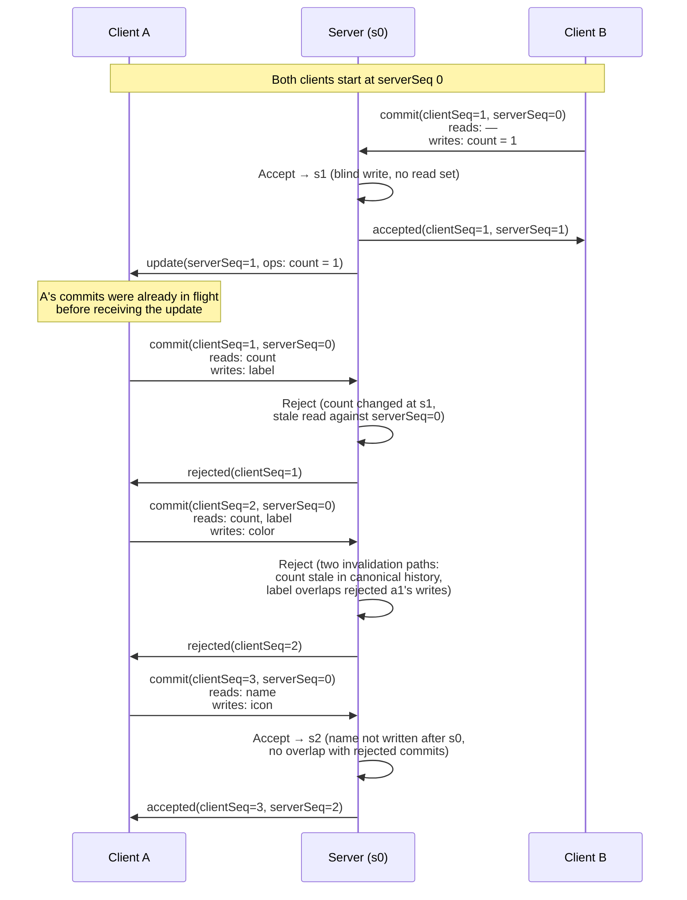

# Sync Protocol

## Overview

This protocol synchronises a set of documents across multiple clients via a central server in a star topology. Clients maintain an optimistic local view of pending changes while the server maintains a single canonical history. Each commit carries a read set describing what the client observed when authoring it, allowing the server to reject commits that were based on stale data.

---

## Motivation

The current system identifies versions by content hashes. While content-addressable versioning has its merits, it introduces three practical costs.

First, tracking a line of changes is complex. Hashes have no inherent ordering, so reconstructing the sequence of edits to a document requires additional bookkeeping — parent pointers, DAG traversal, or auxiliary indices — just to answer questions like "what changed since version X?"

Second, computing versions from content is expensive. Every version requires hashing the full content (or a canonical serialization of it), which adds CPU overhead on every write path for both clients and the server.

Third, network overhead is larger than necessary. Hashes are typically 32–64 bytes, and every message that references a version must include them. When a single commit might reference multiple versions across its read set, this adds up.

This protocol replaces content hashes with monotonically increasing sequence numbers — a single `serverSeq` for canonical history, and a per-session `clientSeq` for in-flight commits. Ordering becomes implicit, version references shrink to one or two integers, and no hashing is required on any write path. The database layer also simplifies: an append-only `commits` table keyed by `serverSeq` replaces any content-addressed storage, and the current state of each document is a single row in `docs` rather than a graph of hash-linked revisions.

---

## Core Concepts

### Global Sequence Number

The server maintains a single monotonically increasing sequence number (`serverSeq`) across all documents. Every accepted commit increments this counter. This means all version references — whether for staleness checks, garbage collection, or client observation progress — are points on a single shared timeline.

### Client Sequence Number

Each client maintains its own monotonically increasing `clientSeq` per session. This serves two purposes: identifying a specific pending message so it can be referenced by later messages in the same chain, and allowing the server to track which of a client's messages have been confirmed or rejected.

### Relationship to Vector Clocks

The combination of `serverSeq` and `clientSeq` is a simplified vector clock. A full vector clock is a map of `participant → seq` across all participants, used in peer-to-peer systems to track causality between any two nodes. This system needs only two dimensions — the server and the submitting client — because the star topology and server authority collapse the peer-to-peer problem: once a commit is accepted, its position in canonical history is fully described by `serverSeq` alone. The client dimension only exists transiently to cover the narrow window of pending changes the server has not yet seen. On acceptance, a message is integrated into the server's canonical event chain, incrementing `serverSeq`. The message's `clientSeq` is retired and its causal position becomes the newly assigned `serverSeq` permanently. A pure Lamport clock is insufficient because it cannot express a dependency on an event the server has not yet observed.

### Pending Chain

A client may have multiple unconfirmed messages in flight at once. The server infers dependencies between them by checking whether a commit's reads overlap with the writes of any prior pending `clientSeq`. If any message is rejected, all subsequent messages whose reads overlap with the rejected commit's writes are also rejected — regardless of which documents those later messages write to.


### Read Set

Each commit declares what the client read when authoring it as an abstract read set. The server uses this to determine whether any of those reads have since been invalidated by other commits. The mechanism for determining whether a read conflicts with a write is defined separately. A blind write — one with no read set entry for the written document — carries no staleness dependency and follows last-write-wins semantics.

### Optimistic Local View

Clients apply their own pending changes to their local snapshot immediately, without waiting for server confirmation. This allows further reads and writes to be based on the optimistic merged state. A client's local view at a given `clientSeq` and `serverSeq` is the subset of the server's state at that `serverSeq` (determined by the client's active subscriptions), together with the client's set of non-conflicting pending commits. When a subscription update arrives whose writes conflict with a pending message's reads, the client rolls back that message and all dependent messages.

---

## Protocol Messages

### Client → Server

```typescript
// submit a set of operations for acceptance into canonical history
{
  type:      "commit",
  clientSeq: number,        // client's monotonic message id for this session
  serverSeq: number,        // latest global serverSeq the client has processed
  readSet:   any,              // abstract description of what was read; conflict
                               // resolution rules are defined separately
  ops:       any[],
  signature: string,
}

// subscribe to updates for documents matching a selector
{ type: "subscribe",   selector: any }

// unsubscribe from updates for documents matching a selector
{ type: "unsubscribe", selector: any }

```

### Server → Client (targeted)

```typescript
{ type: "accepted", clientSeq: number, serverSeq: number }
{ type: "rejected", clientSeq: number }

// response to a subscribe request; carries current value for one or more docs
// the serverSeq here becomes this client's floor for revision retention
{
  type:      "subscribed",
  serverSeq: number,
  docs: {
    [docId: string]: any,  // current snapshot for each subscribed doc
  },
}
```

### Server → Client (subscription updates)

```typescript
{
  type:      "update",
  serverSeq: number,
  ops:       any[],
}
```

There is no broadcast to all clients. Only clients subscribed to at least one document touched by a commit receive the subscription update — and the originating client is excluded, since it already knows the ops it wrote and receives the `serverSeq` via the `accepted` response instead. The client derives what changed by inspecting the `ops` directly. The client advances its local `serverSeq` from subscription update messages, `accepted` responses, or `subscribed` responses.

Since the server processes commits sequentially and the WebSocket stream is ordered, the server will send subscription updates for any commits processed before the client's own commit before sending the `accepted` response. The client may not receive an update for every `serverSeq` in the sequence — commits on unsubscribed documents produce no update — but the client's view of its subscribed documents is fully up to date at each `serverSeq` it observes. The `accepted` response therefore always arrives after the client has processed all relevant subscription updates up to that point.

A client's `serverSeq` may lag behind the true server `serverSeq` for commits on unsubscribed documents. This is correct behaviour — a client can only reference subscribed documents in its `readSet`, so commits on unsubscribed documents are irrelevant to its staleness checks.

### Snapshot window

The server maintains in-memory snapshots indexed by `serverSeq`, each capturing the state of every document written in that commit. Only the latest value per document is persisted to the database; older snapshots exist only in memory. A client that disconnects and reconnects must re-subscribe from scratch, receiving a fresh copy of the document at the current `serverSeq`.

Alongside snapshots, the server retains the ops for each accepted commit, also keyed by `serverSeq`. These are used to check read/write overlap when evaluating staleness.

GC is per-entry rather than based on a global floor. A document entry in a snapshot is retained only while at least one client subscribed to that document has an `echoedServerSeq` at or below the snapshot's `serverSeq`; once no such client exists the entry is removed, and the snapshot itself is dropped when it becomes empty. Commit ops follow the same rule: a commit is retained only while at least one subscriber to any of its written documents has an `echoedServerSeq` at or below the commit's `serverSeq`.

### Client eviction

A client that is slow to advance its `serverSeq` keeps snapshot and commit entries alive for the documents it is subscribed to. The memory cost is proportional to the commit rate on those specific documents, not all documents in the space.

The server should disconnect clients based on the memory overhead they are actually causing. Tracking per-client memory contribution and evicting the worst offenders above a threshold is a more targeted policy than a blanket timeout. This applies equally to stalled clients and to legitimately active clients that cannot keep up with the commit rate on their subscribed documents.

---

## Server Acceptance Rules

A commit message is accepted if and only if all of the following hold.

### 1. Pending chain is valid

The server checks whether any rejected commit in `rejectedSeqs` for this client has writes that overlap with the current commit's reads. If there is any overlap, the commit is rejected, because the client's optimistic read included changes from a rejected `clientSeq`.

Rejection propagates: when a message is rejected the entire commit (including its `clientSeq`, ops, and the `serverSeq` at time of rejection) is stored in `rejectedSeqs`. Any later message whose read set overlaps with the rejected commit's writes is also rejected and stored. A rejected commit anywhere in a dependency chain is therefore always present in `rejectedSeqs` by the time a later message's read set overlaps with it, even if intermediate `clientSeq`s were accepted.

When a commit is accepted, the server records the mapping from the client's `clientSeq` and `message.serverSeq` pair to the assigned `serverSeq` in `integratedSeqs`.

The per-client tracking structures for `rejectedSeqs` and `integratedSeqs` are described in the Server Storage section.

### 2. Read set is not stale

The server checks whether any of the commit's reads have been invalidated by commits in canonical history between `message.serverSeq` and the current `serverSeq`, excluding commits that appear in this client's `integratedSeqs`. Those integrated commits are the client's own prior pending writes that have been accepted into canonical history — the client's optimistic view already included them, so they do not constitute conflicts.

The server must also check `rejectedSeqs` for any entries whose `serverSeq` matches `message.serverSeq` and whose writes overlap with the commit's reads. These represent commits from this client that were rejected at the same server state the current commit is based on — the client's optimistic view included those writes, but they never entered canonical history, so the revision comparison alone would not detect the conflict.

In practice, this check uses the in-memory snapshot window rather than scanning the commits table. The server scans the retained commit ops for any entry with a `serverSeq` greater than `message.serverSeq` whose ops overlap with the commit's read set, excluding entries in `integratedSeqs`. Since `message.serverSeq` is always within the window for well-behaved clients, no database scan is required.

### 3. Garbage collection

Since the server→client WebSocket stream is ordered, a rejection or acceptance message is always delivered before any subsequent subscription updates. If the client has advanced its `serverSeq` past the point at which a commit was rejected or accepted, it must have already received and processed that response.

The server can therefore use the `serverSeq` echoed in each incoming commit to prune stale tracking state. Any entry in `rejectedSeqs` whose recorded `serverSeq` is older than the commit's `message.serverSeq` can be discarded, because the client has already processed the rejection and rolled back accordingly. Likewise, any entry in `integratedSeqs` whose assigned `serverSeq` (the value) is older than `message.serverSeq` can be discarded, because the client has already observed the acceptance. No additional fields are needed on the commit message — the existing `serverSeq` echo is sufficient.

---

## Client Behaviour

### Processing incoming messages

**`accepted`**: The client's vector clock advances — `serverSeq` increases — but its model of documents does not change. The client already applied the commit optimistically, so acceptance is purely a confirmation that the commit's causal position is now permanent.

**`rejected`**: The client rolls back the rejected commit locally. Any dependent pending commits will have already been rolled back when the client processed the `update` message that caused the conflict. The rejection message's primary purpose is to allow the client to clean up its own tracking structures — confirming which pending commits were rejected so it can discard them definitively.

**`update`**: The client advances its `serverSeq` and applies the ops to its local document model. This is the only message type that changes the client's view of document content (apart from its own local commits). If the update's writes overlap with any pending commit's reads, the client must roll back that commit and all dependent commits, since the server will reject them when it processes them. [^1]

[^1]: This rollback requirement assumes the conflict detection strategy treats any concurrent write to a read key as a conflict. If the strategy is changed to compare values — for example, accepting a commit when the read key's current value equals what the client observed, even though it was written to in the interim — then the client cannot roll back on a write overlap alone. A key that was incremented and then decremented by other clients would have the same value at a later sequence, and the server would not reject the commit. Under such a strategy, the client would need to wait for the server's authoritative accept or reject instead of rolling back eagerly.

**`subscribed`**: The client adds the returned documents to its local model and advances its `serverSeq` to the value in the response. WebSocket ordering guarantees that any subscription updates for already-subscribed documents up to this point have already been delivered, so the advance is safe.

### Transactions must not span snapshot upgrades

A transaction's read set and ops must be computed entirely within a single snapshot version. No incoming server messages should be applied to the local snapshot between when a transaction begins reading and when it is submitted. Incoming server messages should be buffered while a transaction is open, and only applied to the snapshot once the transaction has been submitted.

---

## Server Storage

### Persistent tables

**`commits`** — canonical history, append-only:
```
serverSeq   PK
userId
ops         (JSON)
signature
```

**`docs`** — materialized document state:
```
docId      PK
value      (JSON)
serverSeq
```

`serverSeq` is the `serverSeq` of the last commit that touched this document. Every accepted commit updates both fields atomically with the commit being appended. Only the latest value per document is persisted. `docs` can be rebuilt from scratch by replaying `commits` in `serverSeq` order.

### In-memory state

Everything else is ephemeral and reset on reconnection:

```typescript
// per connected client
{
  clientSessionId: string,
  userId:          string,
  ws:              WebSocket,
  serverSeq:       number,                   // latest serverSeq echoed by this client
  rejectedSeqs:    Map<number, { serverSeq: number, commit: Commit }>,  // clientSeq -> rejected commit
  integratedSeqs:  Map<string, number>,      // `${clientSeq}:${serverSeq}` -> serverSeq at acceptance
  subscriptions:   Set<string>,             // matched docIds from active selectors
}

// per space
{
  snapshots: Map<number, Map<string, any>>, // serverSeq -> docId -> value, sliding window
  commits:   Map<number, CommitOp[]>,       // serverSeq -> ops, sliding window
}
```


---

## Guarantees

- **Accepted commits are causally consistent.** If a commit is accepted, nothing it declared in its read set was modified by another client between `message.serverSeq` and the point of acceptance. The effective base may be higher than `message.serverSeq` if the client's own prior pending commits were integrated into canonical history — those commits may have modified reads in the read set, but since they were part of the client's optimistic view this does not constitute a conflict.

- **Dependent chains fail together, by read/write overlap.** If a message is rejected, all subsequent messages from the same client whose reads overlap with the rejected commit's writes are also rejected, regardless of which documents those later messages write to. Messages whose reads do not overlap with the rejected commit's writes are unaffected.

- **Blind writes are always accepted (modulo chain validity).** A commit that does not include a read set entry for the document it writes to carries no staleness check and follows last-write-wins semantics.

- **Eventual consistency.** All clients that apply subscription updates in order will converge to the same canonical state for any document they are subscribed to.

- **Optimistic reads are always based on a consistent snapshot.** Because transactions cannot span snapshot upgrades, the `serverSeq` on a submitted message accurately reflects the state the client read from.

---

## Assumptions

- **WebSocket provides ordered, reliable delivery.** Both the client→server and server→client message streams are ordered. The server will always see a client's messages in `clientSeq` order, and the client will always see server events in serverSeq order. No reordering or deduplication logic is required.

- **Star topology with a single authoritative server.** The server is the sole arbiter of canonical history. There is no peer-to-peer replication or multi-master conflict resolution.

- **Clients subscribe to all documents they may read.** A client receives subscription updates for any document in its read set (except documents it has created locally that have not yet been accepted by the server). This allows pre-emptive rollback without waiting for a server rejection. If a read set references a document that does not exist on the server, the commit that created that document must have been a prior pending `clientSeq` from this client. Since commits are processed in order, if that creation commit was rejected, the referencing commit's reads will overlap with the rejected `clientSeq`'s writes, and the pending chain check will reject it as well.

- **Rebasing rejected changes is not expected.** When a pending chain is rolled back, the client discards it entirely. The system does not attempt to rebase rejected changes onto the new server state.

- **Read/write conflict detection is well-defined.** The mechanism for determining whether a commit's reads overlap with another commit's writes is defined separately and assumed to be correct. The protocol depends on this overlap check being deterministic and consistent between client and server.

- **The server processes one message at a time.** Acceptance decisions are made serially. There is no concurrent acceptance of two messages from different clients for the same document that could result in both being accepted despite conflicting reads.

---

## Open Questions

### Conflict Detection

The protocol delegates conflict detection to a separate mechanism, but the design of that mechanism is not yet settled. The likely approach is to derive read sets and write sets from the path-based access patterns already used by client transactions — a commit that reads `foo/bar` declares that path in its read set, and a commit that writes `foo/bar` declares it in its write set.

The subtlety is around semi-blind writes and path granularity. A write to `foo/bar` should be invalidated by an earlier write to `foo` that replaces the entire value with a non-object (e.g. `foo = 1`), since the subtree the client wrote into no longer exists. But two simultaneous blind writes to `foo/bar` and `foo/baz` — or even two blind writes to `foo/bar` — should not conflict, since neither client declared a read dependency on the other's path.

This means conflict detection needs to be aware of the hierarchical structure of paths: a write to a parent path invalidates reads of child paths (because the parent replacement destroys the subtree), but sibling blind writes at the same depth do not conflict with each other. The exact rules for when a write at one path invalidates a read at another — especially across different levels of the hierarchy — still need to be defined.

A simpler alternative is to continue using the doc-level conflict detection already in place. Under this strategy, any read or write to a document marks that document's version, and all subsequent commits that involve reads or writes to an earlier version of the same document are considered conflicts. This is coarser — it will reject commits that the path-based approach would accept — but it is well understood, already implemented, and avoids the subtleties around hierarchical path overlap entirely. The path-based approach could be adopted later as a refinement if the false rejection rate under doc-level detection proves too high in practice.

### Signatures

The commit message includes a `signature` field, but the signing scheme is not yet defined. The goal is to produce a verifiable record proving that the current state of a document is the result of its participating clients' expressed intents — not just that each commit was individually signed.

Individual commit signatures alone are insufficient. A commit expresses intent relative to the state the client observed: "given what I saw, I authorize these operations." But if another client can collude with the server to substitute content in canonical history before the signed commit, the intent is subverted. For example, a client might sign a commit authorizing payment for the product in their cart, but if a prior commit (from a colluding client) silently replaced the cart contents, the signature attests to an intent that was never actually held.

The working approach is to maintain a rolling hash over canonical history that is updated each time a commit is integrated into `serverSeq`. Clients would include the hash corresponding to their `message.serverSeq` in their commit signature. This binds the signature not just to the client's own operations but to the specific history they were authored against. Verifying the chain of signatures then proves that each client's intent was formed on top of an unbroken, mutually attested history — any tampering with an earlier commit would break the hash chain and invalidate all subsequent signatures.

The details of the hash function, what exactly is included in each hash step, and how verification works in practice are still to be determined.

---

## Appendix: Conflict Example

Two clients, A and B, both start from `serverSeq 0`. Client B submits a blind write first. Client A has multiple commits already in flight based on s0, demonstrating staleness rejection, pending chain propagation, and independent commit survival.

