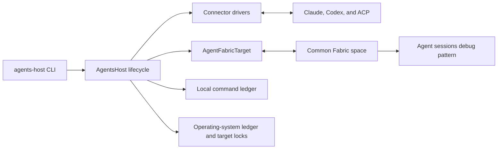

# Agent connector host

`@commonfabric/agents-host` is a command-line host for
`@commonfabric/agents-connector`. It supplies the process-level behavior that
the connector deliberately leaves to its caller:

- source configuration and driver lifecycle;
- Common Fabric identity, runtime, and destination space;
- full session collection and publication;
- command admission, execution claims, and graceful draining;
- local process exclusion around the command ledger and Fabric target;
- health and activity publication; and
- deployment of a debug pattern with inspection and confirmed command
  submission.

The connector remains reusable library code. This package is an operational
program built on that library. The debug pattern remains separate from both at
[`../patterns/agent-sessions-debug`](../patterns/agent-sessions-debug/README.md).

## Run it

Create a JSONC configuration. [`example.config.jsonc`](example.config.jsonc) is
the smallest complete example.

```sh
deno task agents-host \
  --config ./agents.jsonc \
  --api-url http://localhost:8000 \
  --identity ./operator.key \
  --space my-agent-space
```

`CF_API_URL`, `CF_IDENTITY`, and `CF_SPACE` can supply the three connection
options. Command-line values take precedence.

The program prints the destination space DID, command cell ID, receipt cell ID,
durable command ledger path, and debug piece ID after the initial collection.
The owner-confidential debug registration is not added to the space-wide default
app registry. The printed piece ID is its local discovery handle.

## Command-line interface

| Option              | Meaning                                                                 |
| ------------------- | ----------------------------------------------------------------------- |
| `--config <path>`   | Required JSONC source configuration                                     |
| `--api-url <url>`   | Common Fabric API URL, or `CF_API_URL`                                  |
| `--identity <path>` | PKCS#8 identity file, or `CF_IDENTITY`                                  |
| `--space <value>`   | Space name or DID, or `CF_SPACE`                                        |
| `--once`            | Collect once without accepting commands, publish final health, and exit |
| `--no-debug-view`   | Skip deployment of the built-in debug pattern                           |
| `-h`, `--help`      | Print usage                                                             |

The command ledger lives in the operating system's durable per-user state
directory. Its filename is derived from the Fabric API URL origin, the resolved
space DID, and the configured owner DID. Credentials, paths, queries, and
fragments do not create separate histories. Configurations in different
directories, and a space name and its equivalent DID, therefore use the same
command history for one owner. The host locks the ledger file and also takes a
target lock using the same target identity. The target locks for one user are
kept below the operating system's runtime directory. `CF_AGENTS_HOST_LOCK_DIR`
overrides the runtime lock directory. Windows also keeps a `.previous` ledger
generation beside the printed path. The connector alternates between those files
so an interrupted write cannot destroy the newest valid command history.

The host creates its state and lock directories for the current user only. On
systems with Unix permissions, it rejects a directory or existing file owned by
another user, permissions that grant group or other-user access, and symbolic
links at the final directory or file path. Ledger files and lock files use mode
`0600`; their directories use mode `0700`.

Long-running mode responds to three signals:

| Signal    | Behavior                                                                |
| --------- | ----------------------------------------------------------------------- |
| `SIGHUP`  | Request a complete collection                                           |
| `SIGINT`  | Stop accepting work, finish active work, publish final health, and exit |
| `SIGTERM` | Stop accepting work, finish active work, publish final health, and exit |

Long-running mode requests a complete collection every `collectionIntervalMs`.
The default is 15 minutes. Set the value to `0` to disable periodic collection.
If a collection is already running, the command-line wrapper keeps one pending
request. Further timer ticks and `SIGHUP` signals are covered by that pending
collection instead of creating a growing queue.

Successful provider commands trigger a targeted refresh through the connector. A
prompt driver can also request a refresh after its operation becomes active.
Every prompt triggers another refresh after its terminal outcome, including a
failure.

## Configuration file

The configuration uses one unversioned schema and remains strict. Unknown fields
are errors so misspelled options do not silently change provider behavior.

```jsonc
{
  "schema": "commonfabric.agents-host.config",
  "ownerDid": "did:key:replace-with-the-identity-did",
  "collectionIntervalMs": 900000,
  "checkoutRoots": ["/workspace/checkouts"],
  "sources": [
    {
      "id": "codex",
      "driver": "codex-app-server",
      "enabled": true,
      "codexTransport": "stdio",
      "cwd": "/path/to/worktree",
      "env": {
        "EXAMPLE_PROVIDER_OPTION": "value"
      },
      "allowDangerFullAccess": false
    }
  ]
}
```

`ownerDid` identifies the person whose local sessions and workspaces this host
publishes. It must match the DID in the PKCS#8 file selected by `--identity`.
Startup fails before opening Fabric storage when they differ.

Every connector cause and stored protocol envelope includes this owner DID.
Session graphs, indexes, health, commands, and receipts carry a Common Fabric
confidentiality label for that owner. Connector-managed cells also require the
owner principal and the connector writer identity for changes. The debug command
queue requires the owner principal and its compiled, verified command submission
handler. A different principal cannot write commands into it.

Source IDs must already be trimmed and lowercase. They are durable identities in
session keys and command routing. Duplicate IDs are rejected.

`collectionIntervalMs` must be an integer from `0` through `2147483647`. It
controls complete collection in long-running mode and is ignored by `--once`.

`checkoutRoots` is an optional array of absolute directories. Every complete
collection finds Git checkouts below those roots and publishes their current
branch, commit, and remotes in the session indexes. Discovery stops descending
when it finds a checkout. A failed or cancelled discovery leaves the previous
session and checkout indexes unchanged.

The source fields are the connector's `AgentSourceConfig` contract:

| Field                   | Use                                                                             |
| ----------------------- | ------------------------------------------------------------------------------- |
| `id`                    | Stable, lowercase source ID                                                     |
| `driver`                | `claude-agent-sdk`, `codex-app-server`, or `acp`                                |
| `enabled`               | Whether this host starts the source                                             |
| `command`               | Complete provider process command; required for an enabled ACP source           |
| `cwd`                   | Default provider process or prompt working directory                            |
| `env`                   | Additional provider environment values                                          |
| `configDir`             | Claude configuration directory                                                  |
| `codexBin`              | Codex executable used when `command` is absent                                  |
| `codexHome`             | Codex home directory                                                            |
| `codexTransport`        | `stdio`, `managed`, or `proxy`                                                  |
| `codexSocket`           | Socket passed to Codex proxy mode                                               |
| `allowDangerFullAccess` | Allows the connector's explicitly unrestricted Claude or Codex execution policy |

Provider behavior and the native protocols behind these fields are documented in
the connector's [`docs/interfaces.md`](../connectors/agents/docs/interfaces.md).

## Architecture



### Startup

1. The CLI validates its flags and parses the JSONC configuration.
2. `openAgentFabricRuntime()` reads the identity and verifies that its DID
   matches `ownerDid`. It then creates the requested session, opens remote
   storage, checks API health, and opens an owner-scoped `AgentFabricTarget` in
   the resolved space DID.
3. The process derives one target identity from the API URL origin, resolved
   space DID, and owner DID. It uses that identity to locate the durable command
   ledger and the runtime target lock.
4. The process takes exclusive operating-system locks for the target and ledger.
   A second command executor for that target under the same operating-system
   user fails immediately.
5. `deployAgentSessionsDebugView()` compiles the repository pattern and links
   its owner-confidential inputs to the target's cells. The pattern owns the
   command composer, while the host supplies the deterministic owner-scoped
   command queue before the pattern starts. The host labels the rendered result
   for the same owner. The queue's write policy accepts only the configured
   owner through the pattern's command-sending handler. The host binds command
   processing to that exact protected queue. It stores the debug registration
   under the owner label and does not add the piece to the space-wide default
   app registry. `--no-debug-view` skips this step and disables command
   acceptance.
6. The host opens the command ledger.
7. `AgentsHost.start()` creates and starts every enabled driver. A failed source
   remains visible in health while successful sources continue. A source whose
   failed startup cannot be cleaned up makes the complete host startup fail. The
   host then publishes recovered and previously unpublished receipts from the
   ledger.
8. The host performs and publishes one complete collection. It then subscribes
   to the owner-protected Fabric command cell unless `--once` or
   `--no-debug-view` was used.

The command-line host keeps startup health local until it has completed these
steps and owns a ready or degraded host. Its first health publication includes
the complete bounded startup activity history. If startup is cancelled earlier,
the process leaves no active health value from that attempt. Once the final
health publication begins, ownership has transferred to the running host. A
signal received during that publication is handled by the normal shutdown path,
which publishes terminal health.

Operating-system locks coordinate processes owned by one user. Deployments that
run this host under multiple users or on more than one machine must provide
external single-instance coordination for each Fabric API, space, and owner. The
connector also reads each command's deterministic Fabric receipt before a
provider call. This prevents sequential failover from repeating an operation
when the replacement host does not share the earlier host's local ledger.

### Collection

The command-line wrapper requests collections periodically and on `SIGHUP`. It
keeps one pending request while a collection is active. Calls that reach
`AgentsHost.synchronize(reason)` are serialized. Each collection asks every
running driver for its complete inventory and session snapshots. The host
allocates a target observation sequence before those reads. It publishes all
successful and partial source results together through
`AgentFabricTarget.publish()`. The sequence prevents that collection from
overwriting a newer session refresh if the refresh finishes first.

Provider read failures do not discard sessions read successfully from the same
source. They make that source and the overall host degraded. A Fabric
publication failure marks the collection and host failed and is returned to the
caller. A later explicit collection can restore ready or degraded status.

### Commands

The host passes each command-cell snapshot to `CommandWorker.handle()`. The
worker validates commands, makes a durable claim in `CommandLedger`, publishes
an in-flight receipt, calls the selected driver, and publishes the terminal
receipt. Before the local claim, it reads the deterministic Fabric receipt so a
replacement host cannot repeat an already claimed command. Ledger entries remain
marked for publication until the Fabric write succeeds, so startup can republish
a terminal receipt left behind by a failed write. Successful commands refresh
their affected session. The refresh still runs when the provider operation
succeeded but terminal receipt publication failed. The ledger keeps that receipt
pending for a later publication attempt.

The command cell is a shallow action array. A valid element is either a command
object or a JSON string containing that object. The debug pattern writes JSON
strings so each append remains one inline action value. `CommandWorker` decodes
either representation before it validates the command schema and fields.

The host's receipt callback records command ID, source ID, native session ID,
status, and structured error details in the activity history. Post-command
refresh success or failure is also recorded. A failed refresh degrades the
source until a later complete collection succeeds. Health does not copy prompt
text or other command payload values.

### Shutdown

The host cancels command admission and stops accepting new collections. It waits
for an active collection and drains admitted commands while the drivers and
Fabric are still available. It makes one final publication attempt for receipts
left pending by command execution, then stops the drivers and publishes stopped
health. The wrapper flushes storage, disposes the runtime, and releases the
process locks. Command, receipt, provider-stop, health, storage, disposal, or
lock failures produce a failing process exit after the remaining cleanup runs.

No part of this lifecycle uses an elapsed-time limit, sleep, or retry loop.

## Debug data

The host publishes `commonfabric.agent-connector.health` with these host-owned
fields:

- overall status and timestamps;
- destination space, debug piece, and all five top-level cell IDs;
- command admission, pending receipt publications, failed command count, and the
  latest command-processing error;
- the latest collection reason, state, timestamps, session count, or error;
- every configured source's lifecycle, current capabilities, collection
  completeness, session count, and errors; and
- the most recent 200 lifecycle and receipt events.

The activity bound applies to the health value, not the command receipt index or
session data. Activity IDs are unique within one host lifetime.

The host does not copy configured commands, provider environment values, or
identity bytes into health. Provider error messages remain visible and can
contain provider-supplied context. The debug pattern shows the actual Fabric
command values, including prompt payloads, because it is an inspection tool.
Common Fabric permits those reads only for the configured owner. Membership in
the destination space without the owner identity does not grant access to
session, workspace, health, command, or receipt content.

The connector has one owner-scoped storage layout. Protocol schema names and
deterministic cell causes are not versioned. Future readers must keep existing
stored values and causes readable. New fields must be optional so older writers
can omit them without changing the meaning of existing fields or identities.

The debug pattern's inspection surfaces cannot change connector data. Its
command composer can append a validated command after showing the exact value in
a confirmation modal. The command queue requires the configured owner and the
debug pattern's command-sending handler. Another principal cannot modify that
queue, including by reusing the pattern handler. The pattern cannot write
indexes, health, receipts, session manifests, or event chunks. Drafts,
confirmation state, tab selection, and filters are session-scoped and are not
shared between viewers.

## Programmatic API

The package root exports the following orchestration surfaces:

| API                                   | Contract                                                                                        |
| ------------------------------------- | ----------------------------------------------------------------------------------------------- |
| `parseAgentsHostConfig(value)`        | Validates the current configuration and returns the collection interval and normalized sources  |
| `loadAgentsHostConfig(path)`          | Reads JSONC and then applies the same validation                                                |
| `parseAgentsHostCliOptions(argv)`     | Resolves flags and supported environment fallbacks                                              |
| `openAgentFabricRuntime(options)`     | Opens the identity session, remote runtime, piece manager, and connector target                 |
| `deployAgentSessionsDebugView(...)`   | Creates or updates the owner-confidential debug piece and its private registration              |
| `AgentsHost`                          | Owns driver, collection, command, health, activity, and shutdown lifecycle                      |
| `startAgentsHost(options)`            | Takes both process locks, opens every dependency, starts the host, and returns a running handle |
| `RunningAgentsHost.stop(reason?)`     | Performs one idempotent graceful shutdown and runtime disposal                                  |
| `AgentsHostProcessLock.acquire(path)` | Takes one non-blocking operating-system lock                                                    |
| `defaultTargetProcessLockPath(...)`   | Derives the local executor lock from the API URL origin, resolved space DID, and owner DID      |
| `parseAgentFabricApiUrl(value)`       | Parses an API URL and reports a credential-free error when the value is invalid                 |

`startAgentsHost()` is the main embedding API. Its caller supplies connection
values, parsed source configurations, and an optional startup abort signal. It
can disable command admission or debug deployment. Embedders can override its
target lock path. Tests and other hosts can inject a driver factory.

The startup signal is active while identity and runtime setup, debug deployment,
receipt recovery, and initial collection are pending. Cancellation closes
command admission, starts driver and runtime teardown, and waits for the
interrupted operations to become quiescent before it releases either lock. It
also reports failures from any detached startup operation that finishes during
cleanup. It does not use an elapsed-time limit.

`AgentsHost` accepts an initialized target and ledger. Its public
`synchronize(reason, signal?)` method is the scheduling boundary. Canceling its
caller-facing promise does not detach the underlying provider or Fabric work.
The next collection and shutdown remain queued until that work has stopped. Its
`health()` method returns a detached snapshot suitable for logging or
assertions. Its `stop(reason, options?)` method is idempotent. Normal shutdown
flushes pending receipts. Startup cancellation disables health publication,
starts driver interruption, and leaves the durable receipt outbox for the next
host while the runtime is being disposed.

`AgentsHost.start()` accepts `deferHealthUntilReady` for an orchestrator that
needs startup ownership semantics. The command-line wrapper sets it.
Intermediate health changes remain in the local activity history. The final
ready or degraded snapshot is the first Fabric health write. That final write is
the ownership boundary and completes even if the startup signal is raised after
it begins. An orchestrator can supply `onHealthOwnership` together with
`deferHealthUntilReady`. The synchronous callback runs immediately before that
first write. Before the callback, cancellation can interrupt provider startup.
After the callback, cleanup publishes terminal health before disposing the
runtime.

`AgentsHost.stop()` normally publishes stopping and stopped health, drains
commands, flushes pending receipts, and then stops drivers. Its options expose
the narrower startup-cancellation path used by `startAgentsHost()`:

| Stop option                   | Effect                                                                      |
| ----------------------------- | --------------------------------------------------------------------------- |
| `flushPendingReceipts: false` | Leaves the durable receipt outbox for the next host                         |
| `interruptInFlight: true`     | Starts driver shutdown before waiting for an active collection              |
| `publishHealth: false`        | Does not write health for a startup attempt that published no active health |

## Tests

```sh
deno task --cwd packages/agents-host test
deno task cf check packages/patterns/agent-sessions-debug/main.tsx --no-run
deno task cf test packages/patterns/agent-sessions-debug/main.test.tsx --verbose
```
