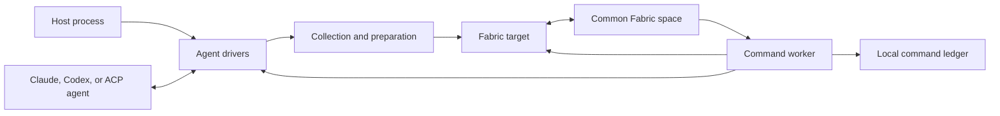

# Agent connector architecture

The agent connector has two data paths. The collection path reads sessions from
coding agents and publishes them into Common Fabric. The command path reads
commands from Common Fabric, invokes the appropriate agent, and writes receipts
back to Common Fabric.

## Components

### Host process

The host owns process-level policy. It selects enabled sources, provides their
configuration, creates drivers, and controls their lifecycle. It also creates
the Common Fabric runtime, chooses the destination space DID, and supplies the
owner DID for the person whose local agents are being synchronized.

The host decides when to run a full collection. It decides whether to subscribe
to commands, poll commands, or do both. It also supplies health details and the
location of the local command ledger.

The connector never opens a Common Fabric connection by itself. It receives an
initialized runtime, destination space, and owner DID through
`AgentFabricConnection`.

### Agent drivers

An `AgentDriver` is the package's normalized provider boundary. It exposes
session inventory, session reads, prompts, cancellation, renaming, mode
selection, and provider configuration changes. Each driver advertises which of
those operations it supports.

Provider-specific code stays behind this interface:

- `ClaudeAgentSdkDriver` calls the Claude Agent SDK.
- `CodexAppServerDriver` speaks JSON-RPC to a Codex App Server process.
- `AcpDriver` speaks Agent Client Protocol through the ACP SDK.

The drivers preserve native provider values in `SessionSummary.raw` and
`NativeSessionSnapshot.events`. They also produce a small normalized message
view for indexes and user interfaces.

### Collection and preparation

`collectSource()` walks every inventory page from one driver. It then reads each
listed session. A provider or session read error is returned in the collection
result instead of discarding successfully read sessions. An optional owner
signal stops work at provider call boundaries.

`prepareSession()` derives the stable session key, divides native events into
chunks, computes content hashes, and computes a snapshot hash. The snapshot hash
excludes chunk contents themselves and includes each chunk's structural metadata
and content hash.

`GitContextResolver` optionally enriches a session from its working directory.
It records the repository remote, current branch, and worktree root when those
values are available. One Fabric publication shares an observation scope, so
sessions with the same directory or repository root reuse Git command results.
The next publication creates a fresh scope.

### Fabric target

`AgentFabricTarget` maps collected sources to deterministic cells in one Common
Fabric space. It stores native event chunks before the session manifest. It then
publishes the recent and complete indexes after all changed session graphs have
committed.

The target compares snapshot hashes with the previous index. It does not rewrite
an unchanged session graph. It still refreshes source capabilities, recent
message previews, and synchronization status in the indexes.

A complete source inventory marks previously known missing sessions as deleted.
An incomplete inventory preserves prior sessions and marks affected sessions
partial. A normal full publish marks untouched prior sessions stale. The host
can set `preserveUntouchedStatus` when refreshing one session after a command.

Every full collection allocates an observation sequence before it reads a
provider. A targeted refresh allocates another sequence before its session read.
The target records the newest successfully published sequence for each session
and the newest complete sequence for each source. If an older collection
finishes after a newer refresh, it retains the newer session graph, index row,
and synchronization status. It also does not delete a newer session that was
absent from the older inventory. An older complete collection cannot restore a
session absent from a newer complete inventory.

### Command worker and ledger

`CommandWorker` validates command values and deduplicates command IDs. It
persists and publishes an in-flight receipt before it invokes a provider. This
claim prevents a process restart from silently executing the same command again.
Before making that claim, it reads the deterministic receipt cell. A receipt
from an earlier host prevents sequential failover from repeating the provider
operation when the new host has no local ledger history.

Commands for one session run in order. Different sessions can run concurrently.
A cancellation admitted after a prompt waits until the driver reports that its
cancellation method can address the prompt. It then bypasses the remaining
per-session queue. Claude reports this milestone while session metadata lookup
is pending. ACP and Codex report it after their provider operation has started.

Prompt execution gives the driver a callback that refreshes the affected
session. A driver calls and awaits it after the provider operation has started
and cancellation can address it. The worker refreshes the session again after
every terminal outcome. Drivers whose session reads report active state can
therefore publish activity that exists only while a connector-owned prompt is
running.

`CommandLedger` stores the latest receipt for every command ID in a local JSON
file. It also records which receipts have not completed publication. On restart,
`recoverUnpublishedReceipts()` changes any in-flight receipt to unknown and
republishes it together with terminal receipts left pending by an earlier
publication failure. The connector cannot infer whether a provider completed an
operation after the process lost contact with it.

After a successful provider command, the worker asks every target to refresh the
affected session. It does this even when terminal receipt publication fails. The
ledger retains the terminal receipt for a later publication attempt.

## State ownership

The provider owns native sessions and native event history. The connector reads
that state and invokes supported provider operations.

Common Fabric owns the published session projection, source indexes, command
queue, health value, and command receipts. The individual command receipt is the
shared command claim across sequential hosts. Fabric causes determine the
durable identity of those cells.

The local ledger records command execution claims across restarts of one host.
The Fabric receipt protects sequential handoff to a host without that local
state. The ledger is not a second source of session data.

The host owns source configuration, scheduling, health policy, process locks,
Common Fabric credentials, and deployment.

## Lifecycle

A host normally performs these steps:

1. Build one `AgentSourceConfig` for every enabled source.
2. Create each driver with `createAgentDriver()` and call `start()`.
3. Open every `AgentFabricTarget` with an initialized runtime, space DID, and
   owner DID.
4. Open `CommandLedger`, create `CommandWorker`, and call
   `recoverUnpublishedReceipts()`.
5. Run `collectSource()` for each driver and publish all results together.
6. Subscribe to or poll each target's command cell and pass values to
   `CommandWorker.handle()`.
7. Publish host-defined health details when they change.

Shutdown first stops command admission. The host calls `CommandWorker.drain()`
while drivers and Fabric targets are still usable, because admitted provider
work and terminal receipt publication may still be active. It calls
`recoverUnpublishedReceipts()` once more to flush receipts left pending by a
failed command task, then stops the drivers. The Common Fabric runtime can be
disconnected after those operations finish.

## Concurrency and failure behavior

Fabric target mutations use one serial queue per target. This prevents writes
for a session refresh, full index publication, and receipt index from
overlapping. Observation sequences preserve the order in which full collections
and targeted refreshes begin when their provider reads finish in a different
order. The target retains the newest successfully published sequence for each
session and complete source inventory.

The command ledger also serializes its read, update, and durable write sequence.
Unix writes synchronize a temporary file, rename it, and synchronize the parent
directory. Windows alternates between two synchronized generation files so an
interrupted write does not destroy the newest valid state. The ledger accepts
only private state directories and files owned by the current user on systems
with Unix permissions. A failed ledger mutation does not poison later mutations.

Fabric graph writes use one Common Fabric transaction per batch. A failed
transaction is reported to the caller. The connector does not retry it.

The Codex and ACP transports keep protocol calls pending until the provider
answers, the host aborts startup, or the provider process exits. The Claude SDK
driver follows the SDK's async query lifetime. The package does not impose
elapsed-time limits on provider work.
