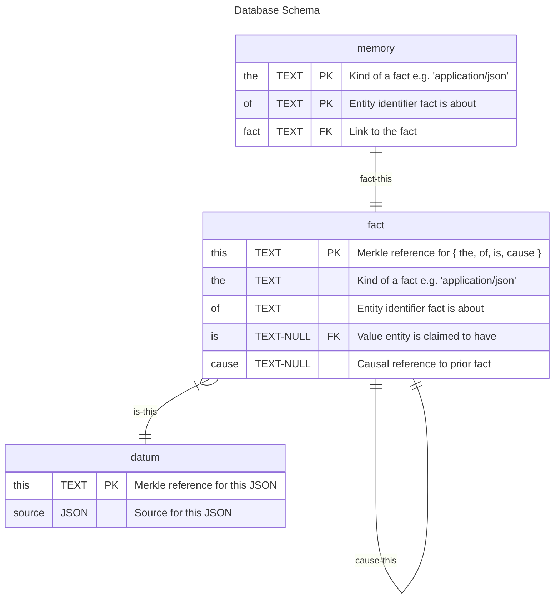

# Common Memory

Persistent, transactional memory store.

## Getting Started

You can start a deno HTTP service by running following command from the package root

```sh
deno task start
# Task start deno run --allow-read --allow-write --allow-net --allow-ffi --allow-env deno.ts
# Mounting memory http://0.0.0.0:8001/
# from file:///Users/gozala/labs/memory/memory/
```

It will print out service URL endpoint and `file:` URL for the directory where memory will be persisted in `.sqlite` files.

## Database Migrations

You can upgrade database to latest version by running following command from the package root

```sh
deno task migrate ./path/to/db.sqlite
```

## Data Model

Memory records are represented as a discrete facts in the shape of `{the, of, is, cause}` following types describe it more detail.

```ts
/**
 * Unique identifier for the mutable entity.
 */
export type Entity = string;

/**
 * Type of the fact, usually formatted as media type, usually `application/json`,
 * but it could be anything else. It just adds a dimension, e.g. you could store
 * metadata under `the: "application/meta+json"`.
 */
export type The = string;

/**
 * Describes state of the memory.
 */
type Assertion = {
  the: The;
  of: Entity;
  is: JSONValue;
  /**
   * Reference to the previous `Fact` this is a successive state or reference
   * to a `Unclaimed` memory if it is the first (genesis) state.
   */
  cause: Reference<Fact> | Reference<Unclaimed>;
};

/**
 * Represents retracted assertion. It is effectively a tombstone denoting that
 * memory no longer exists (has being deleted).
 */
type Retraction = {
  the: The;
  of: Entity;
  is?: undefined;
  cause: Reference<Assertion>;
};

/**
 * Represents existing memory state.
 */
type Fact = Assertion | Retraction;

/**
 * Represents potentially not yet existing memory state.
 */
type State = Fact | Unclaimed;

/**
 * Describes not yet existing memory.
 */
type Unclaimed = {
  the: The;
  of: Entity;
  is?: undefined;
  cause?: undefined;
};
```

### Space

Service has a notion of a memory "space", which is roughly equivalent to a data repository. Some facts may be replicated across different memory spaces while others may diverge.

> ℹ️ Space is envisioned to grow into a "collaboration unit" and become a boundary for sharing and access control.

At the moment space are identified by an arbitrary string identifier, although it is recommended to use [did:key] or other identifiers with provable authority.

### Entity

Represents a unique identifier for a specific **mutable** memory and is represented by `of` field.

At the moment entities are identified by an arbitrary string identifier, although it is recommended to derive them from seed data e.g. using [merkle reference]s.

When determinism is not relevant, [UUID]s could be used instead.

### Value

Discrete state of the entity in a memory space is represented via arbitrary `JSON` value and represented by an `is` field.

### Causality

Every fact has causal reference to prior fact memory had prior. This establish linear history of changes for each entity in memory space and is persisted by the service.

Casual references are used to impose [compare and swap (CAS)][CAS] transactional guarantees. Service will reject assertion / retraction if a causal reference is not consistent with current state in the service.

Causal references are represented via [merkle reference]s formatted as [IPLD Links in DAG-JSON] encoding and look like

```json
{ "/": "baedreigv6dnlwjzyyzk2z2ld2kapmu6hvqp46f3axmgdowebqgbts5jksi" }
```

## HTTP API

### Transact

Service accepts HTTP `PATCH` requests with `content-type: application/json` in the following format

```ts
type Assert = { assert: Assertion };
type Retract = { retract: Assertion };
type Patch = { [space: string]: Assert | Retract };
```

Here is an example payload

```json
{
  "did:key:z6Mkk89bC3JrVqKie71YEcc5M1SMVxuCgNx6zLZ8SYJsxALi": {
    "assert": {
      "the": "application/json",
      "of": "baedreigv6dnlwjzyyzk2z2ld2kapmu6hvqp46f3axmgdowebqgbts5jksi",
      "is": { "hello": "world" },
      "cause": {
        "/": "baedreiayyshoe2moi4rexyuxp2ag7a22sfymkytfph345g6dmfqtoesabm"
      }
    }
  }
}
```

Service should always respond with `content-type: application/json` response. It will return `{ ok: {} }` with `200` status code if transaction was applied. Service will respond with `409` status code and `{ error: { conflict: {...} } }` if specified `cause` field was out of sync with state on the service. Service may respond with `500` if underlying store is failing e.g. if it is out of memory space.

### Subscribe

Service accepts `Upgrade: websocket` requests which can be used to subscribe for memory updates across spaces. Service excepts following messages from the websocket client

```ts
type Command = Watch | Unwatch;
type Address = { the: The; of: Entity };
type Watch = { watch: { [space: string]: Address } };
type Unwatch = { unwatch: { [space: string]: Address } };
```

Service will send following messages to the websocket client. If requested memory address does not exist service responds with `Unclaimed` state, in all other instances it will respond with a latest `Fact` for the requested memory address.

```ts
type Notification = { [space: string]: State };
```

[did:key]: https://w3c-ccg.github.io/did-method-key/
[merkle reference]: https://github.com/Gozala/merkle-reference/blob/main/docs/spec.md
[UUID]: https://en.wikipedia.org/wiki/Universally_unique_identifier
[CAS]: https://en.wikipedia.org/wiki/Compare-and-swap
[IPLD Links in DAG-JSON]: https://ipld.io/specs/codecs/dag-json/spec/#links

## Persistence

Service persists each memory space into a separate SQLite database with a following schema.

> ℹ️ SQLite is admittedly an odd choice for persisting JSON documents, but at the currently convenience has being prioritized over everything else.


