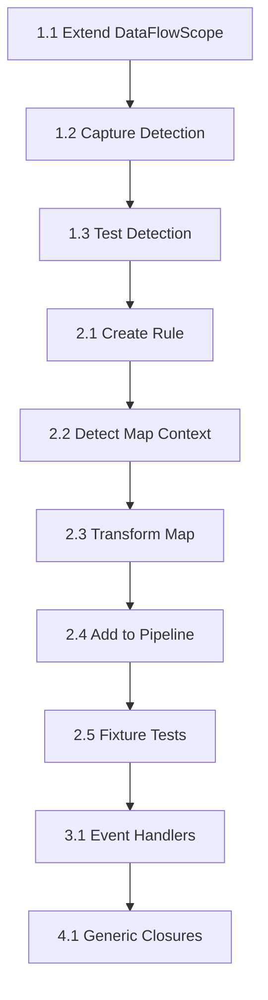

# Closure Implementation Roadmap

_Created: 2025-09-24_ _Status: Ready for Implementation_

## Executive Summary

This roadmap provides a concrete, step-by-step plan for implementing closure
support in the CommonTools TypeScript transformer. We'll start with the simplest
case (map callbacks) and progressively build toward full closure support.

## Implementation Phases

### Phase 1: Foundation - Capture Detection (Simplified!)

#### Step 1.1: Create Closure Transform Rule

**File**: `src/opaque-ref/rules/closure-transform.ts` (new)

```typescript
export function createClosureTransformRule(): OpaqueRefRule {
  return {
    name: "closure-transform",
    transform(sourceFile, context, transformation): ts.SourceFile {
      // This runs BEFORE jsx-expression transformation
    },
  };
}
```

#### Step 1.2: Implement Capture Detection

**File**: `src/opaque-ref/rules/closure-transform.ts`

Use TypeScript's symbol table directly:

```typescript
function collectCaptures(
  func: ts.FunctionLikeDeclaration,
  checker: ts.TypeChecker,
): Set<ts.Identifier> {
  const captures = new Set<ts.Identifier>();

  function visit(node: ts.Node) {
    if (ts.isIdentifier(node)) {
      const symbol = checker.getSymbolAtLocation(node);
      if (!symbol) return;

      const declarations = symbol.getDeclarations();
      if (!declarations) return;

      // Check if declared outside the function
      const isDeclaredOutside = declarations.some((decl) =>
        !isNodeWithin(decl, func)
      );

      if (isDeclaredOutside) {
        captures.add(node);
      }
    }
    ts.forEachChild(node, visit);
  }

  if (func.body) visit(func.body);
  return captures;
}
```

**Key Insight**: No need to maintain our own scope tree - TypeScript already
knows where everything is declared!

#### Step 1.3: Test Capture Detection

**File**: `test/opaque-ref/capture-detection.test.ts` (new)

Create unit tests for:

- Single level capture
- Multi-level capture
- Mixed reactive/non-reactive captures
- Captures in different closure types

### Phase 2: Map Callback Transformation (Week 1-2)

#### Step 2.1: Create Closure Transform Rule

**File**: `src/opaque-ref/rules/closure-transform.ts` (new)

```typescript
export function createClosureTransformRule(): OpaqueRefRule {
  return {
    name: "closure-transform",
    transform(sourceFile, context, transformation): ts.SourceFile {
      // Implementation here
    },
  };
}
```

#### Step 2.2: Detect Map Callback Context

Implement detection for:

- Array.map() calls on OpaqueRef arrays
- Callback functions that capture outer scope variables
- Differentiate from already-transformed map calls

#### Step 2.3: Transform Map Callbacks

Transform pattern:

```typescript
// From:
state.items.map((item) => item.price * state.discount);

// To:
state.items.map({
  op: recipe(({ elem, params: { discount } }) => elem.price * discount),
  params: { discount: state.discount },
});
```

Implementation steps:

1. Extract captured variables from analysis
2. Build params object
3. Transform callback parameter list
4. Replace captured references with params access
5. Wrap callback in recipe()
6. Transform map call to object form

#### Step 2.4: Add Rule to Pipeline

**File**: `src/opaque-ref/transformer.ts`

```typescript
function createRules(): OpaqueRefRule[] {
  return [
    createClosureTransformRule(), // NEW - runs FIRST to handle captures
    createJsxExpressionRule(), // Then JSX expressions
    createSchemaInjectionRule(), // Finally schema injection
  ];
}
```

#### Step 2.5: Create Fixture Tests

**Directory**: `test/fixtures/closures/`

Create test fixtures:

- `map-single-capture.input.tsx` / `.expected.tsx`
- `map-multiple-captures.input.tsx` / `.expected.tsx`
- `map-nested-property.input.tsx` / `.expected.tsx`

Update `test/fixture-based.test.ts` to include closures directory.

### Phase 3: Event Handler Support (Week 2)

#### Step 3.1: Detect Event Handler Context

Enhance closure rule to detect:

- JSX event handler attributes (onClick, onChange, etc.)
- Inline arrow functions in handler positions
- Captured state variables

#### Step 3.2: Transform Event Handlers

Transform pattern:

```typescript
// From:
<button onClick={() => state.count++}>

// To:
<button onClick={handler((_, {count}) => count.set(count.get() + 1), {count: state.count})}>
```

#### Step 3.3: Handle State Mutations

Detect when captured variables are mutated:

- Assignment expressions
- Update expressions (++, --)
- Method calls that mutate

Transform mutations to use Cell API when appropriate.

#### Step 3.4: Create Event Handler Tests

Add fixtures:

- `event-handler-read.input.tsx` / `.expected.tsx`
- `event-handler-mutation.input.tsx` / `.expected.tsx`
- `event-handler-complex.input.tsx` / `.expected.tsx`

### Phase 4: Generic Closure Support (Week 3)

#### Step 4.1: Detect Generic Closures

Identify closures that aren't in special contexts:

- Variable declarations with arrow functions
- Function expressions
- Return statements with functions

#### Step 4.2: Implement Lift+Curry Pattern

Transform pattern:

```typescript
// From:
const compute = () => state.a + state.b;

// To:
const compute = lift(({ a, b }) => a + b).curry({ a: state.a, b: state.b });
```

Note: This requires either:

- Runtime curry support (check if available)
- Alternative transformation pattern

#### Step 4.3: Handle Edge Cases

- Nested closures
- Closures returning closures
- Mixed synchronous/asynchronous closures

### Phase 5: Integration & Polish (Week 3-4)

#### Step 5.1: Performance Optimization

- Cache capture analysis results
- Optimize scope traversal
- Minimize AST walks

#### Step 5.2: Error Handling

- Clear error messages for unsupported patterns
- Diagnostic improvements
- Source map preservation

#### Step 5.3: Documentation

- Update transformer documentation
- Add inline code comments
- Create migration guide for users

#### Step 5.4: Integration Testing

- Full pipeline tests
- Runtime compatibility tests
- Performance benchmarks

## Implementation Order & Dependencies



## Key Files to Modify

### Core Changes

1. `src/opaque-ref/dataflow.ts` - Add capture detection
2. `src/opaque-ref/types.ts` - Add capture-related types
3. `src/opaque-ref/transformer.ts` - Add closure rule to pipeline

### New Files

1. `src/opaque-ref/rules/closure-transform.ts` - Main closure transformation
   logic
2. `src/opaque-ref/rewrite/closure-helpers.ts` - Helper functions for closure
   transforms
3. `test/opaque-ref/capture-detection.test.ts` - Unit tests
4. `test/fixtures/closures/` - Fixture tests directory

### Updates Needed

1. `src/opaque-ref/transforms.ts` - May need new transform helpers
2. `test/fixture-based.test.ts` - Add closures configuration

## Success Criteria

### Phase 1 Complete When:

- [ ] Capture detection reliably identifies all captured variables
- [ ] Unit tests pass for capture detection
- [ ] DataFlowAnalysis includes capture information

### Phase 2 Complete When:

- [ ] Map callbacks with captures transform correctly
- [ ] Fixture tests pass for map transformations
- [ ] No regression in existing tests

### Phase 3 Complete When:

- [ ] Event handlers maintain reactivity
- [ ] State mutations work correctly
- [ ] All event handler fixtures pass

### Phase 4 Complete When:

- [ ] Generic closures transform appropriately
- [ ] Edge cases handled gracefully
- [ ] Full test suite passes

### Phase 5 Complete When:

- [ ] Performance impact < 10%
- [ ] Documentation complete
- [ ] Ready for production use

## Risk Mitigation

### Technical Risks

1. **Breaking existing transforms**: Mitigate with comprehensive test suite
2. **Performance degradation**: Profile and optimize incrementally
3. **Runtime incompatibility**: Test against actual runtime early

### Implementation Risks

1. **Scope creep**: Stick to phased approach, defer edge cases
2. **Complex edge cases**: Document as known limitations initially
3. **Integration issues**: Test with other rules frequently

## Next Steps for Implementation Context

When starting implementation:

1. **Begin with Phase 1.1**: Extend DataFlowScope with captures field
2. **Create branch**: `feature/closure-support`
3. **Set up test infrastructure**: Create test directories and initial fixtures
4. **Implement incrementally**: Complete each step before moving to next
5. **Test continuously**: Run tests after each significant change

## Notes for Future Implementers

- The params pattern for map is established in the notes - follow it closely
- Event handler transformation may need runtime verification
- Generic lift+curry pattern needs runtime support verification
- Consider creating a feature flag to enable/disable closure transformation
  initially
- Keep the existing map parameter detection working alongside closure support

## Open Implementation Questions

1. **Curry implementation**: Does runtime support curry? If not, what's our
   alternative?
2. **Import management**: How do we ensure recipe/handler/lift are imported when
   needed?
3. **Type preservation**: How do we maintain TypeScript types through
   transformation?
4. **Debugging experience**: How can we preserve meaningful stack traces?

These questions should be answered during Phase 1 implementation and documented.
