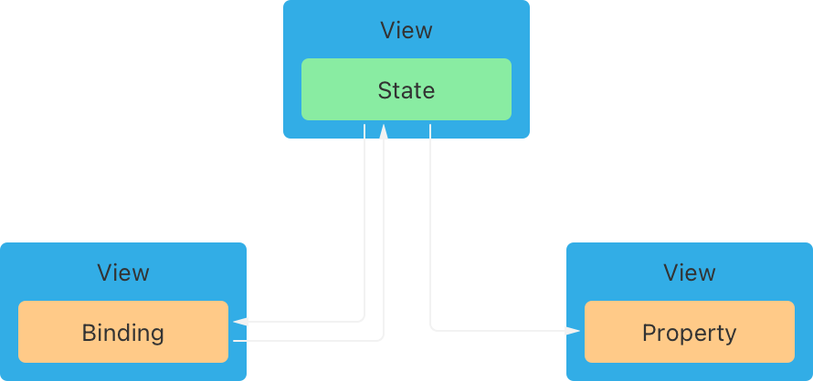

# Common UI

The philosophy of Common UI is inspired by Swift UI, the 'default' configuration should 'just work' if you use the correct building blocks together.

:::{note}
Swift UI operates on a [reactive binding model](https://developer.apple.com/tutorials/swiftui-concepts/driving-changes-in-your-ui-with-state-and-bindings) with [FRP elements](https://developer.apple.com/documentation/combine), making it a short-leap from our needs (as compared with general Web UI).



Swift developers are encouraged to use the defaults as much as possible. By doing less specification you [maintain the dynamic ability to adapt to the user's preferences and environment]( https://developer.apple.com/tutorials/swiftui-concepts/maintaining-the-adaptable-sizes-of-built-in-views). This means you 'know less' about what you'll be drawing than you may have come to expect from an abstraction like Tailwind. The **composition** of components is emphasised over granular control.
:::


Our `ui` package is a web component library implemented in `lit` that interoperates with the Common Tools runtime to produce a Swift UI-like abstraction, this means our components are divided into layers:


# System Components

## ct-theme

Applies a set of theme variables to the entire subtree. Not all components respect the theme yet, but many do. See `packages/ui/src/v2/components/theme-context.ts`

```{code-block} typescript
const localTheme = {
  accentColor: cell("#3b82f6"),
  fontFace: cell("system-ui, -apple-system, sans-serif"),
  borderRadius: cell("0.5rem"),
};

// later...

return {
  [NAME]: "Themed Charm",
  [UI]: (
    <ct-theme theme={localTheme}>
      {/* all components in subtree are themed */}
    </ct-theme>
  )
}
```

Can be nested and overriden further down the subtree.

## ct-render

Used to render a `Cell` that has a `[UI]` property into the DOM. Usually not required inside a pattern, used in the app shell itself.

```{code-block} html
<ct-render $cell={myCharm} />
```

## ct-keybind (beta)

Register keyboard shortcuts with a handler. These registrations are mediated by `packages/shell/src/lib/keyboard-router.ts` in the shell to prevent conflicts with system shortcuts.

```{code-block} html
    <ct-keybind
        code="KeyN"
        alt
        preventDefault
        onct-keybind={createChatRecipe({ ... })}
    />
```

# Layout Components

Layout components do not provide any content themselves, they are used to arrange other components. We draw quite directly from the [Swift UI Layout Fundamentals](https://developer.apple.com/documentation/swiftui/layout-fundamentals).

## ct-screen

Designed to represent content that could fill the entire screen or a panel / content area. This will expand to fill the available space. It offers two optional slots: `header` and `footer`.

When to use: your `<main>` or `<div>` is not growing to full the available space. Typically appears _once_ at the root of a pattern's `[UI]` tree:

```{figure} ./images/diagrams/ct-screen.svg
:name: layout-example
```

```{code-block} html
<ct-screen>
  <ct-heading slot="header">
    Hello
  </ct-heading>

  <div>...</div>
  <div>...</div>

  <div slot="footer">
    World
  </div>
</ct-screen>
```

Inspired by this [Swift UI convention](https://scottsmithdev.com/screen-vs-view-in-swiftui). A `Screen` is just a `View` but it represents the kind of view that MIGHT fill a screen on some device.

## ct-toolbar

Stack several actions into a horizontal bar, typically at the top of `<ct-screen>`.

```{figure} ./images/diagrams/ct-toolbar.svg
:name: layout-example
```

```{code-block} html
<ct-screen>
  <ct-toolbar slot="header">
      <ct-button>A</ct-button>
      <ct-button>B</ct-button>
  </ct-toolbar>
</ct-screen>
```

## Stacks are all you need

... almost. Just the [horizontal and vertical stacks](https://developer.apple.com/tutorials/swiftui-concepts/organizing-and-aligning-content-with-stacks) if you control the [spacing and alignment](https://developer.apple.com/tutorials/swiftui-concepts/adjusting-the-space-between-views).

## ct-vstack

Stack items vertically, this is a layer over the [CSS flexbox API](https://flexbox.malven.co/). You can permuate `gap`, `align`, `justify` and `reverse` attributes to control the behavior.

When to use: any time you need to stack items vertically.

```{figure} ./images/diagrams/ct-vstack-1.svg
:name: layout-example
```

```{code-block} html
<ct-vstack gap="1" align="start" justify="stretch">
    <div>A</div>
    <div>B</div>
    <div>C</div>
</ct-vstack>
```

## ct-hstack

Stack items horizontally, this is a layer over the [CSS flexbox API](https://flexbox.malven.co/). You can permuate `gap`, `align`, `justify` and `reverse` attributes to control the behavior.

When to use: toolbars, column layouts, grouping icons and buttons and text together.

```{figure} ./images/diagrams/ct-hstack.svg
:name: layout-example
```

```{code-block} html
<ct-hstack gap="1" align="start" justify="stretch">
    <div>A</div>
    <div>B</div>
    <div>C</div>
</ct-hstack>
```

## ct-zstack

Currently missing, would allow similar control for layering items on top of one another. [Swift UI ZStack](https://developer.apple.com/documentation/swiftui/zstack).

## ct-vscroll

Wrap tall vertical content in a scrollable container with control over autoscroll and scrollbar appearance. Inspired by [SwiftUI ScrollView](https://developer.apple.com/documentation/swiftui/scrollview).

```{code-block} html
<ct-vscroll height="400px">
  <ct-vstack gap="4">
    <p>Long content...</p>
  </ct-vstack>
</ct-vscroll>
```

In practice we often use a specific set of properties if dealing with a "chat view" that scrolls:

```{code-block} html
<ct-vscroll flex showScrollbar fadeEdges snapToBottom />
```

Here `flex` will force the `vscroll` to expand without a fixed height. `snapToBottom` will automatically scroll to the bottom when new content is added.

## ct-autolayout

Will attempt to lay out the children provided as best it can. Provides two slots for `left` and `right` sidebars (that can be toggled open/shut). On a wide view, items stack horizontally, on a medium view thet stack vertically and on mobile it converts to a tabbed view.

```{figure} ./images/diagrams/ct-autolayout-wide.svg
:name: layout-example
```

```{figure} ./images/diagrams/ct-autolayout-mid.svg
:name: layout-example
```

```{figure} ./images/diagrams/ct-autolayout-narrow.svg
:name: layout-example
```

```{code-block} html
<ct-screen>
  <!-- Header slot - fixed at top -->
  <div slot="header">
    <h2>Header Section</h2>
  </div>

  <!-- ct-autolayout creates responsive multi-panel layout with optional sidebars -->
  <!-- tabNames: Labels for main content panels (shown as tabs on mobile) -->
  <!-- Shows all panels side-by-side in a grid -->
  <ct-autolayout tabNames={["Main", "Second"]}>
    <!-- Left sidebar - use slot="left" -->
    <aside slot="left">
      <h3>Left Sidebar</h3>
      <p>Left content</p>
      <ct-button>Left Button</ct-button>
    </aside>

    <!-- Main content panels - no slot attribute needed -->
    <!-- Number of divs should match number of tabNames -->
    <div>
      <h1>Main Content Area</h1>
      <p>This is the main content with sidebars</p>
      <ct-button>Main Button</ct-button>
    </div>

    <div>
      <h1>Second Content Area</h1>
      <p>This is the second content with sidebars</p>
      <ct-button>Second Button</ct-button>
    </div>

    <!-- Right sidebar - use slot="right" -->
    <aside slot="right">
      <h3>Right Sidebar</h3>
      <p>Right content</p>
      <ct-button>Right Button</ct-button>
    </aside>
  </ct-autolayout>

  <!-- Footer slot - fixed at bottom -->
  <div slot="footer">
    <p>Footer Section</p>
  </div>
</ct-screen>
```

## ct-grid (stale)

`ct-grid` has not been used in production and likely doesn't work, but the intention is to wrap the [CSS Grid API](https://grid.malven.co/) and blend in ideas from [Swift UI Grid](https://developer.apple.com/documentation/swiftui/grid).

## ct-spacer (missing)

[Swift UI Spacer](https://developer.apple.com/documentation/swiftui/spacer)

## Composed Layouts

You can mix-and-match the above components to achieve practically any (standard) layout.

```{code-block} html
<ct-screen>
    <ct-toolbar slot="top">
        <ct-button>hello</ct-button>
    </ct-toolbar>
    <ct-autolayout>
        <ct-vstack slot="left">
            <ct-hstack gap="sm">
                <icon>question</icon>
                <button>hello</button>
                <ct-spacer />
                <button>hello</button>
            </ct-hstack>

            <ct-hstack gap="sm">
                <icon>question</icon>
                <button>hello</button>
            </ct-hstack>
        </ct-vstack>

        <ct-screen>
            <ct-vstack>
                <ct-grid rows="3" cols="4" gap="2">
                    ...
                </ct-grid>
            </ct-vstack>
        </ct-screen>

        <ct-vscroll slot="right">
            <ul>
                <li>Imagine this was long</li>
            </ul>
        </ct-vscroll>
    </ct-autolayout>
</ct-screen>
```

# Visual Components

- typesetting: `ct-label`, `ct-heading`
	- gap: `ct-text` for themed paragraph usecase (`p` works)
	- <p>, <Text>

- gap: `ct-icon` (and `ct-label` has an optional in-built icon)
    - gap: icon set?

- visual: `ct-kdb`, `ct-separator`, `ct-table`, `ct-tool-call`
	- gap: `ct-img` or `ct-media`

# Input Components

- input: `ct-button`, `ct-select`, `ct-input`, `ct-textarea`, `ct-checkbox`, `ct-tags`
	- gap: `ct-search` which has an autocomplete menu
	- gap: `ct-file-picker`
	- redundant: common-send-message, ct-message-input (?)
	    - this is JUST a button and an input
		- the "right" way is:
      - ```{code-block} html
        <ct-form onSubmit={handler({ ... })}>
          <ct-input></ct-input>
          <ct-button type="submit">Submit</ct-button>
        </ct-form>
        ```

      - ```{code-block} typescript
        const EnterToSubmit = recipe(({ myHandler }) => {
          return {
              [UI]: <ct-form onSubmit={myHandler}>
                <ct-input></ct-input>
                <ct-button type="submit">Submit</ct-button>
              </ct-form>
          }
        })

        <EnterToSubmit myHandler={...} />
      ```

# Interactive / Complex Components

- interactive: `ct-collapsible`, `ct-list-item`, `ct-tab-list`, `ct-canvas`
    - `type ListItem = { title: string }`
    - `const items: ListItem[]`
    - Consider using `[NAME]`?
	- gap: re-orderable list
      - ```{code-block} html
        <ct-list editable reorderable onDelete={}>
            {items.map((i: Opaque<{ name: string }>) => <ct-list-item>{i.name}</ct-list-item>)}
        </ct-list>
        ```
    - `editable` only applies to the `title` property of each list item

- complex/integrated (cell interop): `ct-code-editor`, `ct-outliner`, `ct-list`
	- gap: editable table rows

## Chat Components

- chat: `ct-chat`, `ct-prompt-input`, `ct-chat-message`, `ct-tool-call`, `ct-tools-chip`

# Unused/Unproven Components

- stale: `ct-aspect-ratio`, `ct-draggable`, `ct-form`, `ct-grid`, `ct-hgroup`, `ct-input-otp`, `ct-message-input`, `ct-progress`, `ct-radio`, `ct-radio-group`, `ct-slider`, `ct-switch`, `ct-tile`, `ct-toggle`, `ct-toggle-group`, `ct-vgroup`
- superfluous: `ct-resizeable-handle`, `ct-resizable-panel`, `ct-resizeable-panel-group`, `ct-scroll-area`, `ct-tabs`/`ct-tab-list`/`ct-tab-panel`
