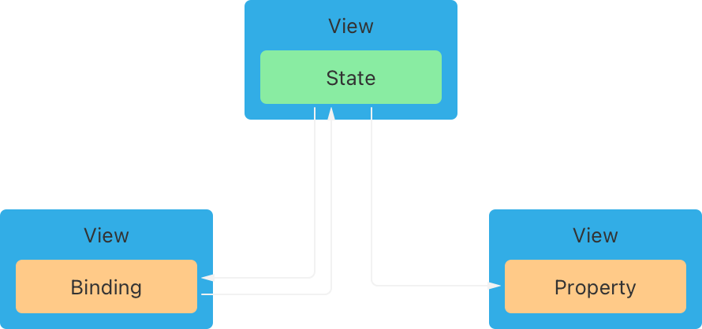

# Common UI

The philosophy of Common UI is inspired by Swift UI, the 'default' configuration should 'just work' if you use the correct building blocks together.

:::{note}
Swift UI operates on a [reactive binding model](https://developer.apple.com/tutorials/swiftui-concepts/driving-changes-in-your-ui-with-state-and-bindings) with [FRP elements](https://developer.apple.com/documentation/combine), making it a short-leap from our needs (as compared with general Web UI).



Swift developers are encouraged to use the defaults as much as possible. By doing less specification you [maintain the dynamic ability to adapt to the user's preferences and environment]( https://developer.apple.com/tutorials/swiftui-concepts/maintaining-the-adaptable-sizes-of-built-in-views). This means you 'know less' about what you'll be drawing than you may have come to expect from an abstraction like Tailwind. The **composition** of components is emphasised over granular control.
:::


Our `ui` package is a web component library implemented in `lit` that interoperates with the Common Fabric runtime to produce a Swift UI-like abstraction, this means our components are divided into layers:


# System Components

## cf-theme

Applies a set of theme variables to the entire subtree. Not all components respect the theme yet, but many do. See `packages/ui/src/v2/components/theme-context.ts`

```{code-block} typescript
const localTheme = {
  accentColor: cell("#3b82f6"),
  fontFace: cell("system-ui, -apple-system, sans-serif"),
  borderRadius: cell("0.5rem"),
};

// later...

return {
  [NAME]: "Themed Piece",
  [UI]: (
    <cf-theme theme={localTheme}>
      {/* all components in subtree are themed */}
    </cf-theme>
  )
}
```

Can be nested and overriden further down the subtree.

## cf-render

Used to render a `Cell` that has a `[UI]` property into the DOM. Usually not required inside a pattern, used in the app shell itself.

```{code-block} html
<cf-render $cell={myCharm} />
```

## cf-keybind (beta)

Register keyboard shortcuts with a handler. These registrations are mediated by `packages/shell/src/lib/keyboard-router.ts` in the shell to prevent conflicts with system shortcuts.

```{code-block} html
    <cf-keybind
        code="KeyN"
        alt
        preventDefault
        oncf-keybind={createChatPattern({ ... })}
    />
```

# Layout Components

Layout components do not provide any content themselves, they are used to arrange other components. We draw quite directly from the [Swift UI Layout Fundamentals](https://developer.apple.com/documentation/swiftui/layout-fundamentals).

## cf-screen

Designed to represent content that could fill the entire screen or a panel / content area. This will expand to fill the available space. It offers two optional slots: `header` and `footer`.

When to use: your `<main>` or `<div>` is not growing to full the available space. Typically appears _once_ at the root of a pattern's `[UI]` tree:

```{figure} ./images/diagrams/cf-screen.svg
:name: layout-example
```

```{code-block} html
<cf-screen>
  <cf-heading slot="header">
    Hello
  </cf-heading>

  <div>...</div>
  <div>...</div>

  <div slot="footer">
    World
  </div>
</cf-screen>
```

Inspired by this [Swift UI convention](https://scottsmithdev.com/screen-vs-view-in-swiftui). A `Screen` is just a `View` but it represents the kind of view that MIGHT fill a screen on some device.

## cf-toolbar

Stack several actions into a horizontal bar, typically at the top of `<cf-screen>`.

```{figure} ./images/diagrams/cf-toolbar.svg
:name: layout-example
```

```{code-block} html
<cf-screen>
  <cf-toolbar slot="header">
      <cf-button>A</cf-button>
      <cf-button>B</cf-button>
  </cf-toolbar>
</cf-screen>
```

## Stacks are all you need

... almost. Just the [horizontal and vertical stacks](https://developer.apple.com/tutorials/swiftui-concepts/organizing-and-aligning-content-with-stacks) if you control the [spacing and alignment](https://developer.apple.com/tutorials/swiftui-concepts/adjusting-the-space-between-views).

## cf-vstack

Stack items vertically, this is a layer over the [CSS flexbox API](https://flexbox.malven.co/). You can permuate `gap`, `align`, `justify` and `reverse` attributes to control the behavior.

When to use: any time you need to stack items vertically.

```{figure} ./images/diagrams/cf-vstack-1.svg
:name: layout-example
```

```{code-block} html
<cf-vstack gap="1" align="start" justify="stretch">
    <div>A</div>
    <div>B</div>
    <div>C</div>
</cf-vstack>
```

## cf-hstack

Stack items horizontally, this is a layer over the [CSS flexbox API](https://flexbox.malven.co/). You can permuate `gap`, `align`, `justify` and `reverse` attributes to control the behavior.

When to use: toolbars, column layouts, grouping icons and buttons and text together.

```{figure} ./images/diagrams/cf-hstack.svg
:name: layout-example
```

```{code-block} html
<cf-hstack gap="1" align="start" justify="stretch">
    <div>A</div>
    <div>B</div>
    <div>C</div>
</cf-hstack>
```

## Layered Layouts (gap)

There is no dedicated z-stack primitive right now. For overlapping content, use
plain positioned HTML/CSS inside the existing `cf-*` layout primitives. See
[SwiftUI ZStack](https://developer.apple.com/documentation/swiftui/zstack) for
the intended shape of this missing abstraction.

## cf-vscroll

Wrap tall vertical content in a scrollable container with control over autoscroll and scrollbar appearance. Inspired by [SwiftUI ScrollView](https://developer.apple.com/documentation/swiftui/scrollview).

```{code-block} html
<cf-vscroll height="400px">
  <cf-vstack gap="4">
    <p>Long content...</p>
  </cf-vstack>
</cf-vscroll>
```

In practice we often use a specific set of properties if dealing with a "chat view" that scrolls:

```{code-block} html
<cf-vscroll flex showScrollbar fadeEdges snapToBottom />
```

Here `flex` will force the `vscroll` to expand without a fixed height. `snapToBottom` will automatically scroll to the bottom when new content is added.

## cf-autolayout

Will attempt to lay out the children provided as best it can. Provides two slots for `left` and `right` sidebars (that can be toggled open/shut). On a wide view, items stack horizontally, on a medium view thet stack vertically and on mobile it converts to a tabbed view.

```{figure} ./images/diagrams/cf-autolayout-wide.svg
:name: layout-example
```

```{figure} ./images/diagrams/cf-autolayout-mid.svg
:name: layout-example
```

```{figure} ./images/diagrams/cf-autolayout-narrow.svg
:name: layout-example
```

```{code-block} html
<cf-screen>
  <!-- Header slot - fixed at top -->
  <div slot="header">
    <h2>Header Section</h2>
  </div>

  <!-- cf-autolayout creates responsive multi-panel layout with optional sidebars -->
  <!-- tabNames: Labels for main content panels (shown as tabs on mobile) -->
  <!-- Shows all panels side-by-side in a grid -->
  <cf-autolayout tabNames={["Main", "Second"]}>
    <!-- Left sidebar - use slot="left" -->
    <aside slot="left">
      <h3>Left Sidebar</h3>
      <p>Left content</p>
      <cf-button>Left Button</cf-button>
    </aside>

    <!-- Main content panels - no slot attribute needed -->
    <!-- Number of divs should match number of tabNames -->
    <div>
      <h1>Main Content Area</h1>
      <p>This is the main content with sidebars</p>
      <cf-button>Main Button</cf-button>
    </div>

    <div>
      <h1>Second Content Area</h1>
      <p>This is the second content with sidebars</p>
      <cf-button>Second Button</cf-button>
    </div>

    <!-- Right sidebar - use slot="right" -->
    <aside slot="right">
      <h3>Right Sidebar</h3>
      <p>Right content</p>
      <cf-button>Right Button</cf-button>
    </aside>
  </cf-autolayout>

  <!-- Footer slot - fixed at bottom -->
  <div slot="footer">
    <p>Footer Section</p>
  </div>
</cf-screen>
```

## cf-grid (stale)

`cf-grid` has not been used in production and likely doesn't work, but the intention is to wrap the [CSS Grid API](https://grid.malven.co/) and blend in ideas from [Swift UI Grid](https://developer.apple.com/documentation/swiftui/grid).

## Spacer (gap)

There is no dedicated spacer primitive right now. Use flex growth on a plain
element when you need one side of a stack to push the other side away. See
[SwiftUI Spacer](https://developer.apple.com/documentation/swiftui/spacer).

## Composed Layouts

You can mix-and-match the above components to achieve practically any (standard) layout.

```{code-block} html
<cf-screen>
    <cf-toolbar slot="top">
        <cf-button>hello</cf-button>
    </cf-toolbar>
    <cf-autolayout>
        <cf-vstack slot="left">
            <cf-hstack gap="1">
                <icon>question</icon>
                <button>hello</button>
                <div style="flex: 1"></div>
                <button>hello</button>
            </cf-hstack>

            <cf-hstack gap="1">
                <icon>question</icon>
                <button>hello</button>
            </cf-hstack>
        </cf-vstack>

        <cf-screen>
            <cf-vstack>
                <cf-grid rows="3" cols="4" gap="2">
                    ...
                </cf-grid>
            </cf-vstack>
        </cf-screen>

        <cf-vscroll slot="right">
            <ul>
                <li>Imagine this was long</li>
            </ul>
        </cf-vscroll>
    </cf-autolayout>
</cf-screen>
```

# Visual Components

- typesetting: `cf-label`, `cf-heading`
	- gap: themed paragraph/text primitive (`p` works)
	- <p>, <Text>

- gap: icon primitive (and `cf-label` has an optional in-built icon)
    - gap: icon set?

- visual: `cf-kbd`, `cf-separator`, `cf-table`, `cf-tool-call`
	- gap: media/image primitive

# Input Components

- input: `cf-button`, `cf-select`, `cf-input`, `cf-textarea`, `cf-checkbox`, `cf-tags`
	- gap: search input with autocomplete menu
	- gap: dedicated file picker
	- redundant: common-send-message, cf-message-input (?)
	    - this is JUST a button and an input
		- the "right" way is:
      - ```{code-block} html
        <cf-form oncf-submit={handler({ ... })}>
          <cf-input></cf-input>
          <cf-button type="submit">Submit</cf-button>
        </cf-form>
        ```

      - ```{code-block} typescript
        const EnterToSubmit = pattern(({ myHandler }) => {
          return {
              [UI]: <cf-form oncf-submit={myHandler}>
                <cf-input></cf-input>
                <cf-button type="submit">Submit</cf-button>
              </cf-form>
          }
        })

        <EnterToSubmit myHandler={...} />
      ```

# Interactive / Complex Components

- interactive: `cf-collapsible`, `cf-tab-list`, `cf-canvas`

- complex/integrated (cell interop): `cf-code-editor`
	- gap: tree/outliner editor
	- gap: editable table rows

## Chat Components

- chat: `cf-chat`, `cf-prompt-input`, `cf-chat-message`, `cf-tool-call`, `cf-tools-chip`

# Unused/Unproven Components

- stale: `cf-aspect-ratio`, `cf-draggable`, `cf-form`, `cf-grid`, `cf-hgroup`, `cf-input-otp`, `cf-message-input`, `cf-progress`, `cf-radio`, `cf-radio-group`, `cf-slider`, `cf-switch`, `cf-tile`, `cf-toggle`, `cf-toggle-group`, `cf-vgroup`
- superfluous: `cf-resizeable-handle`, `cf-resizable-panel`, `cf-resizeable-panel-group`, `cf-scroll-area`, `cf-tabs`/`cf-tab-list`/`cf-tab-panel`
