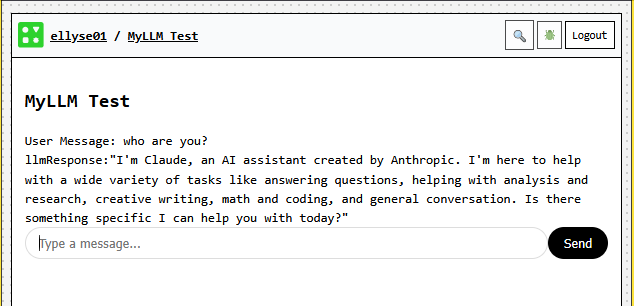

(skeleton_recipe)=
## Skeleton Recipe
Let's first create a skeleton recipe. We'll need the basic imports. These are so common that you should generally just copy and paste them.

```{code-block} typescript
:label: imports
:linenos: true
:emphasize-lines: 1
:caption: Imports for Recipe
/// <cts-enable />
import {
  BuiltInLLMContent,
  Cell,
  cell,
  Default,
  derive,
  h,
  handler,
  ifElse,
  llm,
  NAME,
  recipe,
  UI,
} from "commontools";
```
Notice line 1 begins with `/// <cts-enable`, which is important because it enables the Common Tools AST Transformer. This allows you to use TypeScript types for many of the function parameters instead of passing in JSONSchema which can be quite verbose and difficult to read; it also enables automatic transformation of recipes you write to forms that use the reactive wrappers `derive` and `ifElse` without you having to write them yourself. We generally have this at the start of all recipes.

The next step is to append our recipe function to the code, right after the imports. You can see `recipe` imported on line 32 in the code snippet above ([](#imports)). This is the main entry point for your recipe, you can think of it like *main()* in many languages.
Normally, the recipe function takes in extra arguments, but for now, we'll leave it empty.

```{code-block} typescript
:label: llm_code_02
:linenos: true
:emphasize-lines: 1
:caption: Skeleton Recipe function

export default recipe("LLM Test", () => {
  return {
    [NAME]: "MyLLM Test",
    [UI]: (
      <div>
        <h2>MyLLM Test</h2>
      </div>
    ),
  };
});
```

Note that we are using `export` on line 1, this is because a single recipe source file may have multiple recipes in it. When the system is building a charm from the source file, it needs the main entry point, which will be the recipe that you export.

The [NAME] symbol is used as a property in the created charm. It is used for displaying the charm and also often for debugging.

The [UI] property has all the information to render the charm in the browser. It contains a mix of JSX and interpolated function calls using `{some_function()}` syntax. The results of these functions are inserted into display for rendering. We'll learn more about what works in the UI property in future sections.

When you deploy and browse to your charm, you should see something that looks like this:


**Figure**: Placeholder Recipe

## Add User Input
Now that we have a working deployed charm, let's continue to iterate and add a user input form.
This will eventually serve as the user's input to the LLM call.

We'll update our `recipe` function to create a `Cell` to hold the value of the user input, add the JSX component that gets user text input, and also display the user input.
A `Cell` is like a variable in programming languages. Cells can store values and can be displayed in a recipe's [UI]. They are also persistent and automatically saved to the datastore.

Here's our updated Recipe:
```{code-block} typescript
:label: llm_code_03
:linenos: true
:emphasize-lines: 2, 11, 15
:caption: Adding the Input JSX Component
export default recipe("LLM Test", () => {
  const userMessage = cell<string>(undefined);

  return {
    [NAME]: "MyLLM Test",
    [UI]: (
      <div>
        <h2>My LLM Test</h2>
        <div>User Message: {userMessage}</div>
        <div>
          <common-send-message
            name="Send"
            placeholder="Type a message..."
            appearance="rounded"
            onmessagesend={textInputHandler({ userMessage })}
          />
        </div>
      </div>
    ),
    userMessage,
  };
});
```
On line 2, we have a call to cell(). This will create a Cell with the default value passed in.
We'll use this cell to store the text the user types in our user input component.

On line 11, we've added the `<common-send-message>` component. Note that regular HTML forms are not allowed in the recipe UI. These restrictions are there for data privacy and security reasons.
The `placeholder` property (line 13) shows faded text in the input form as its default value. The `onmessagesend` property (line 15) is called when the user submits their message (presses enter or clicks on the submit button). The value for `onmessagesend` is the function that gets executed to handle the event. We'll define that next. The parameters you send must be wrapped in an object. Example: `{ userMessage }`. Additional parameters would be comma separated.


Before this code will actually work, we'll need to define the textInputHandler function. This should be at the same level as the `recipe` function. 

```{code-block} typescript
:label: llm_code_04
:linenos: true
:emphasize-lines: 
:caption: Adding the Event Handler

const textInputHandler = handler<
  { detail: { message: string } },
  { userMessage: Cell<string> }
>(({ detail: { message } }, { userMessage }) => {
  userMessage.set(message);
});
```

We first imported the function `handler` from {ref}`imports`. It takes in type parameters for the Event it will handle and the Args it will be passed (`handler<Event, Args>`). The shape of `Event` is based on the component you use. In our case, we used the component `common-send-message`. It takes in an event with the shape `{detail: {message: string}}`, you see this reflected on line 2. The shape of `Args` depends on what we are passing into the handler. We've set this in {ref}`llm_code_03` line 15, where we pass in `userMessage`, which is a Cell. We therefore set the Args type as `{ userMessage: Cell<string> }` (line 3).

Now that we've told `handler` what to expect as types, we can send the actual parameters on line 4. Here we pretty much repeat the type information with the actual variables.

Our function body is just a single line (line 5). It simply sets the value of the `userMessage` cell to the user input. Cells have set() and get() functions. There are other functions which we'll discover in other chapters.

After deploying your charm, you should see something like this:


**Figure**: Recipe with Handler

(calling_llm)=
## Calling the LLM!

The next step is the real pay-off. We'll finally call the LLM. We'll add the built-in call right after the userMessage definition in the recipe. The actual location doesn't matter as long as it's in the `recipe`'s body.
```{code-block} typescript
:label: llm_builtin
:linenos: true
:emphasize-lines:
:caption: Adding the LLM built-in call
export default recipe("LLM Test", () => {
  const userMessage = cell<string>(undefined);

  const llmResponse = llm({
    system:
      "You are a helpful assistant. Answer questions clearly and concisely.",
    messages: derive(userMessage, (msg) =>
      msg ? [{ role: "user", content: msg, }] : []), });
```

Lines 4-8 are new. We imported the `llm` function on line 10 in our {ref}`imports`.
We define a variable `llmResponse` to hold the return value of the llm call.
The parameter to `llm` is an object of the shape `{system: string, messages: BuiltInLLMMessage[]}`. The `BuiltInLLMParams` type looks like this, but really you only need to worry about `system` and `messages` for now:
```
export interface BuiltInLLMParams {
  messages?: BuiltInLLMMessage[];
  model?: string;
  system?: string;
  stop?: string;
  maxTokens?: number;
  mode?: "json";
  tools?: Record<string, BuiltInLLMTool>;
}
```
You can see on line 5-8 that our shape is
`{system: string, messages: Array<{role: "user", content: msg}>}`. So what's the `derive` all about here?
This gets a bit technical. The parameters to a built-in like `llm()` are
passed as an `Opaque` object. Opaque objects mirror the expected type, and
any property you pass in as an `OpaqueRef` (such as `Cell`, `derive`)
stays reactive. Plain values still stay static. We want the
`messages` property to be reactive so it updates whenever `userMessage`
changes. The easiest way to do that here is to wrap the transformation in
`derive`, which returns an `OpaqueRef`.

We are calling `derive(userMessage, (msg) => function_body())` on line 7. This means that the reactive node depends on `userMessage`; it will be called each time userMessage is updated. `userMessage` is passed in as the first arg to the anonymous function here, as `msg`.

Looking at the function body on line 8, we see it first checks if `msg` is defined. This is important because `derive` will be called initially with an `undefined` value. We do not want to pass that along, so we do an explicit check here. If it is defined, we then return a well-formed message array, with just one message. This looks like `[ {role: "user", content: msg} ]`. Otherwise, we return `[]`, the empty list.

Notice that we do not have to explicitly call the llm() function each time we get an input.
This is handled for us by the reactive system we just talked about. Specifically, the `llm()` built-in will re-execute every time `userMessages` is updated. We can then use the variable `llmResponse` to view the response, which we'll do right now.

We'll add a new section to the recipe [UI] to display the current value of the `llmResponse`. Luckily, this is very straightforward:
```{code-block} html
:label: llm_response
:linenos: true
:emphasize-lines:
:caption: Display llmResponse
    <div>
      llmResponse:
      {llmResponse.result ? JSON.stringify(llmResponse.result) : ""}
    </div>
```
`llmResponse` is typed as `Opaque<LLMBuiltInState>`. The important thing to know about this is that it has a `result?` property (the ? means it is optional). This is where the result of the llm call is stored.
Because `result` is optional, we guard with a ternary before stringifying so that we don't render `undefined` while the LLM is still working.
The result can be either a direct string or an array of parts. We call JSON.stringify() because
this just makes it easier to do a bunch of work to display it. It won't be pretty, but you'll get
content you're looking for.

:::{dropdown} Detailed explanation
:animate: fade-in

The AST Transformer (enabled via `/// <cts-enable />`) rewrites that ternary expression into `{ifElse(llmResponse.result, derive(llmResponse.result, _v1 => JSON.stringify(_v1)), "")}`. You'll still need to import `ifElse` (even though you never call it yourself) alongside the existing `derive` import for the generated code to type-check.
:::

If you deploy and run it, you should be able to enter a message into the input form, then wait a few seconds and see a response from our friendly LLM. Here is what it looks like for me:


**Figure**: Final Recipe

## The Final Flow
Et voilà ! Hopefully that worked for you. The full source code is listed at the end of this section.

Here is the flow control at a high level.
When the system first loads, it executes the body of the recipe() function, which creates the `userMessage` cell, and `llmResponse` which holds the result of calling `llm()`.

Technically, the `llm()` built-in is called once with the undefined userMessage upon its initialization.

The charm then renders the code in the [UI] section and the system sets the reactive node to display the llmResponse with the conditional expression we wrote (`{llmResponse.result ? ... : ""}`) and the user's message with `{userMessage}`.
These initially don't show anything since the values are undefined.

The user types a prompt into the `<common-send-message>` component which triggers the `textInputHandler()`. The handler gets passed in the event, which contains the user's message (as a normal js object), and also the `userMessage` which is a Cell. The handler sets the cell's value with the event message.

The `userMessage` has been updated now and therefore kicks off the reactive system.
We re-render the portion of the UI that contains `User Message: {userMessage}` since the cell contained within the braces has changed.
The `llm()` built-in notices that its object (the messages property) has been updated and runs again.
In a few seconds, it gets a response back from the LLM.
This sets `llmResponse.result`, which triggers the generated `ifElse(derive(...))` wrapper behind that conditional expression.
And finally we see the `llmResponse: ...` in the [UI].

There's a lot more to discover with the llm() function call (such as sending a list of user and agent messages for history or even tool use) and even more to learn about the Common Tools runtime system.


```{code-block} typescript
:label: llm_full_code
:linenos: true
:emphasize-lines:
:caption: Full Code
/// <cts-enable />
import {
  BuiltInLLMContent,
  Cell,
  cell,
  Default,
  derive,
  h,
  handler,
  ifElse,
  llm,
  NAME,
  recipe,
  UI,
} from "commontools";

const textInputHandler = handler<
  { detail: { message: string } },
  { userMessage: Cell<string> }
>(({ detail: { message } }, { userMessage }) => {
  userMessage.set(message);
});

export default recipe("LLM Test", () => {
  const userMessage = cell<string>(undefined);

  const llmResponse = llm({
    system:
      "You are a helpful assistant. Answer questions clearly and concisely.",
    messages: derive(userMessage, (msg) =>
      msg ? [{ role: "user", content: msg, }] : []), });

  return {
    [NAME]: "MyLLM Test",
    [UI]: (
      <div>
        <h2>MyLLM Test</h2>
        <div>User Message: {userMessage}</div>
        <div>
          llmResponse:
          {llmResponse.result ? JSON.stringify(llmResponse.result) : ""}
        </div>
        <div>
          <common-send-message
            name="Send"
            placeholder="Type a message..."
            appearance="rounded"
            onmessagesend={textInputHandler({ userMessage })}
          />
        </div>
      </div>
    ),
  };
});
```
