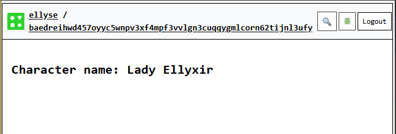

## State and Cells

We'll be learning how to handle state within the Common Tools runtime.
The most direct way to store state is via `Cells`.
Cells store and access data. We can set data in a cell via the set() function. We can also retrieve data via the get() function, we'll demonstrate that in a later section.
There are many ways to create cells and we'll get to all of them, but for now, we'll start with the `cell<T>()` function available in Recipes.
We've already used this in {ref}`calling_llm`

Creating a cell is quite easy! Let's create the beginnings of a
character sheet, one we might use playing a table top role playing game. Don't worry if you don't get the reference, it should be easy to follow.

```{code-block} typescript
export default recipe("state test", () => {
  const characterName = cell<string>("");
}
```
Here, we have created a cell with a type argument of `string`,
and its initial value is the empty string.

Let's now set `characterName` to something a bit more interesting.

```{code-block} typescript
export default recipe("state test", () => {
  const characterName = cell<string>("");
  characterName.set("Lady Ellyxir");
}
```
We can now display the cell within the `[UI]` section of the recipe:
```{code-block} typescript
/// <cts-enable />
import {
  cell,
  h,
  recipe,
  UI,
} from "commontools";

export default recipe("state test", () => {
  const characterName = cell<string>("");
  characterName.set("Lady Ellyxir");
  return {
    [UI]: (
      <div>
        <h2>Character name: {characterName}</h2>
      </div>
    ),
  };
});
```
The `{characterName}` snippet creates a reactive node behind the scenes. This means the rendered character name is updated whenever the cell changes.

We can now deploy the code. See the section {ref}`deploy_charms` for how to do this.

It'll look a bit like this:

**Figure**: Character Name set

## Deriving from Cells

We often have computed states which are derived from existing states.

A concrete example of derived state is AC (Armor Class).
Its value is affected by another state value, Dexterity.
We'll build out this example.

First, let's create the Dexterity attribute. Not surprisingly, we'll use a `Cell` to store this data. We'll also display it in the `[UI]` section.

```{code-block} typescript
:label: state_display_dex
:linenos: true
:emphasize-lines: 2,3,8
:caption: Displaying DEX
  const characterName = cell<string>("");
  const dex = cell<number>(16);
  ...
    [UI]: (
      <div>
        <h2>Character name: {characterName}</h2>
        <li>DEX: {dex}</li>
      </div>
  ...
```
The highlighted lines are the ones we added. It should be pretty self-explanatory. We create the dex cell to store Dexterity and we display on line 8.

If all we want to do is display the derived calculation, we can simply put it between the `{}` symbols. Let's display our dexterity modifier. We'll use this later to calculate our Armor Class.

```{code-block} typescript
:label: state_display_dex_modifier
:linenos: true
:emphasize-lines: 5
:caption: Displaying DEX Modifier
    [UI]: (
      <div>
        <h2>Character name: {characterName}</h2>
        <li>DEX: {dex}</li>
        <li>DEX Modifier: {Math.floor((dex - 10) / 2)}</li>
      </div>
  ...
```

It should look a bit like this:


Let's now calculate Armor Class.
It's defined as `10 + Dexterity modifier`. We *could* do that same thing
and just display it inline, however, this gets complicated to read
after a while. Instead we'll introduce `lift()` which lets you
create a reactive state based on inputs such as cells.

## Lift

A lift takes a regular function and allows it to be used with
reactive nodes. For example, here's a regular TypeScript function to
calculate armor class:
```{code-block} typescript
:label: state_ac
:linenos: false
:emphasize-lines: 
  const calcAC = (dex: number) : number =>
    10 + Math.floor((dex - 10) / 2);
```

We can't just pass our `dex` variable into this function since `dex` isn't a regular `number` (it's a `Cell`). This is the magic of `lift`. It takes in the regular function and returns a new function that can take in matching reactive components as parameters.

We create the lifted function with the following code in the recipe body:
```{code-block} typescript
:label: state_ac_lift
:linenos: false
:emphasize-lines: 
  const ac = lift(calcAC)(dex);
```
We can now use the reference to the lift `ac` just like we'd use any cell reference.

:::{dropdown} Detailed explanation
:animate: fade-in

`lift` returns a function that matches the passed in function's
argument list but accepts reactive component versions of each parameter instead.

In our code above, we immediately call this function with the parameter `dex`.
The return value is a reactive component this will be updated anytime
the input is updated (in our case, the `dex Cell`).

We can instead defer calling this `lift`'d function or even call it repeatedly. Each new call will result in a new reactive component that is tracked independently of the others.
:::

Here, we add it to the `[UI]` on line 5:
```{code-block} typescript
:label: state_ac_lift_display
:linenos: true
:emphasize-lines: 5
      <div>
        <h2>Character name: {characterName}</h2>
        <li>DEX: {dex}</li>
        <li>DEX Modifier: {Math.floor((dex - 10) / 2)}</li>
        <li>AC: {ac}</li>
      </div>
```

Note: we must import `lift` and `derive`. We'll need `derive` because of some behind-the-scenes code transformation, but we will not be using it directly in this section. (See {doc}`cts` for more information).

Here's what the full Recipe looks like:
```{code-block} typescript
:label: state_code_full
:linenos: true
:emphasize-lines: 7,8,14,15,16,17,23,24
:caption: Full State Code
/// <cts-enable />
import {
  cell,
  h,
  recipe,
  UI,
  lift,
  derive,
} from "commontools";

export default recipe("state test", () => {
  const characterName = cell<string>("");
  characterName.set("Lady Ellyxir");
  const dex = cell<number>(16);
  const calcAC = (dex: number) : number =>
    10 + Math.floor((dex - 10) / 2);
  const ac = lift(calcAC)(dex);
  return {
    [UI]: (
      <div>
        <h2>Character name: {characterName}</h2>
        <li>DEX: {dex}</li>
        <li>DEX Modifier: {Math.floor((dex - 10) / 2)}</li>
        <li>AC: {ac}</li>
      </div>
    ),
  };
});
```

It should render something similar to this:

**Figure:** Display derived `ac` for Armor Class

We've demonstrated the following state-related concepts:
* How to create a simple `Cell`
* Set its value
* Display the cell in `[UI]`
* Create UI that calculates a derived value (DEX Modifier)
* Create a lifted function from regular TypeScript
* Use the lifted function as a reactive component in `[UI]`

In the next section, we will learn how user input can
modify state.

### Credits
We used the Open Source SRD 5.1 for character sheet information.
See [SRD 5.1](https://www.dndbeyond.com/srd).
It is licensed under
Creative Commons Attribution 4.0 International (“CC-BY-4.0”)

