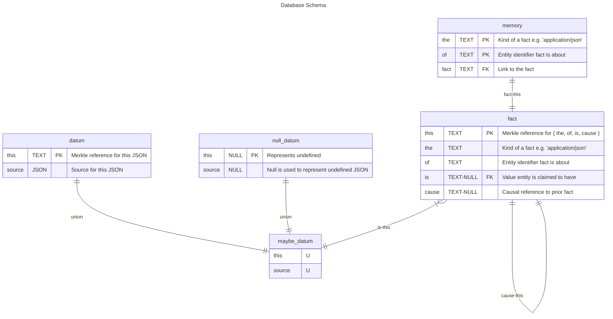

```mermaid
---
title: Database Schema
---
erDiagram
datum {
  this    TEXT PK "Merkle reference for this JSON"
  source  JSON    "Source for this JSON"
}

maybe_datum {
  this    U
  source  U
}

null_datum {
  this   NULL PK  "Represents undefined"
  source NULL     "Null is used to represent undefined JSON"
}

fact {
  this    TEXT PK "Merkle reference for { the, of, is, cause }"
  the     TEXT "Kind of a fact e.g. 'application/json'"
  of      TEXT "Entity identifier fact is about"
  is      TEXT-NULL FK "Value entity is claimed to have"
  cause   TEXT-NULL    "Causal reference to prior fact"
}

memory {
  the   TEXT  PK "Kind of a fact e.g. 'application/json'"
  of    TEXT  PK "Entity identifier fact is about"
  fact  TEXT FK  "Link to the fact"
}


fact }|--|| maybe_datum: is-this
fact ||--|| fact: cause-this
memory ||--|| fact: fact-this
datum ||--|| maybe_datum: union
null_datum ||--|| maybe_datum: union
```
