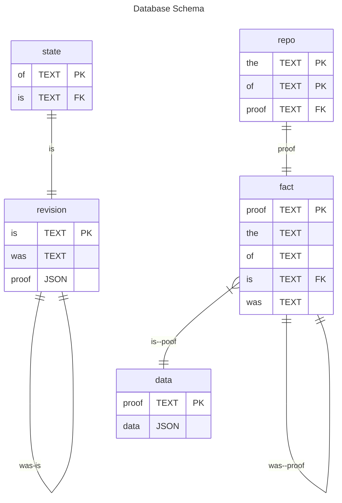

```js
assert({
  "the": "document/state",
  of: "a98e93ca-cd93-4671-a582-b72bca9ff18d",
  "is": { v: 1 },
}, {
  at: "did:key:zAlice",
})


retract({
  "the": "document/state",
  of: "a98e93ca-cd93-4671-a582-b72bca9ff18d",
  is: { "#": "bafy...stuff" },
  cause: { "#": "bafy..last" }
})

commit({
  "the": "document/state",
  "of": "a98e93ca-cd93-4671-a582-b72bca9ff18d",
  "is": { "#": "bafy...stuff" },
  "cause": { "#": "bafy..last" }
})
```

## An alternative view

```js
assert({
  the: "application/json",
  of: "a98e93ca-cd93-4671-a582-b72bca9ff18d",
  is: { v: 1 },
  cause: { v: 0 } 
})

const v2 = assert({
  the: "application/json",
  of: "a98e93ca-cd93-4671-a582-b72bca9ff18d",
  was: {
    v: 2
  },
  cause: refer({
    the: "application/json",
    of: "a98e93ca-cd93-4671-a582-b72bca9ff18d",
    is: { v: 1 },
    cause: refer({
      the: "application/json",
      of: "a98e93ca-cd93-4671-a582-b72bca9ff18d"
      is: { v: 0 },
    })
  })
})


assert.deepEqual(v2, {
  ok: {
    the: "application/json",
    of: "a98e93ca-cd93-4671-a582-b72bca9ff18d"
    is: "bafy..v2",
    cause: { "/": "bafy..rev1" }
  }
})


retract({
  the: "application/json",
  of: "a98e93ca-cd93-4671-a582-b72bca9ff18d",
  is: "bafy..v2",
  cause: { "/": "bafy..rev1" }
})


const assert = ({ the, of, is, cause }) => {
  const fact = refer({ the, of, is, was })
  
}
```

```sql

CREATE TABLE IF NOT EXISTS datum ('is' TEXT PRIMARY KEY, proof JSON NOT NULL);
CREATE TABLE IF NOT EXISTS fact (proof TEXT PRIMARY KEY, the TEXT NOT NULL, of TEXT NOT NULL, 'is' TEXT NOT NULL, was TEXT, FOREIGN KEY('is') REFERENCES datum('is'));
CREATE TABLE IF NOT EXISTS repo (the TEXT NOT NULL, of TEXT NOT NULL, proof TEXT NOT NULL, FOREIGN KEY(proof) REFERENCES fact(proof), PRIMARY KEY (the, of));


-- SQLite
CREATE VIEW IF NOT EXISTS doc AS
SELECT
  repo.the as the,
  repo.of as of,
  datum.proof as 'is',
  fact.was as was,
  repo.proof as proof
FROM
  repo
JOIN
  fact ON repo.proof = fact.proof
JOIN
  datum ON fact.'is' = datum.'is';
```

## Swap Logic

```js
BEGIN TRANSACTION;

INSERT OR IGNORE INTO datum (id, source)
  VALUES (:id, :source);
INSERT OR IGNORE INTO fact (fact, the, of, 'is', cause)
  VALUES (:fact, :the, :of, :is, :cause);

UPDATE memory SET fact = :fact WHERE fact = :was;

COMMIT;
```
