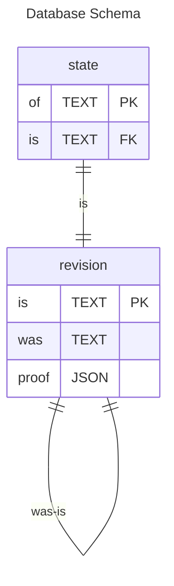

```js
assert({
  "the": "document/state",
  of: "a98e93ca-cd93-4671-a582-b72bca9ff18d",
  "is": { v: 1 },
  "was": {}
}, {
  at: "did:key:zAlice",
})


retract({
  "the": "document/state",
  of: "a98e93ca-cd93-4671-a582-b72bca9ff18d",
  is: { "#": "bafy...stuff" },
  was: { "#": "bafy..last" }
})

commit({
  "the": "document/state",
  "of": "a98e93ca-cd93-4671-a582-b72bca9ff18d",
  "is": { "#": "bafy...stuff" },
  "was": { "#": "bafy..last" }
})
```

## An alternative view

```js
assert({
  the: "document/state",
  of: "a98e93ca-cd93-4671-a582-b72bca9ff18d",
  is: { v: 1 },
  was: { v: 0 } 
})

const v2 = assert({
  this: "a98e93ca-cd93-4671-a582-b72bca9ff18d",
  is: {
    v: 2
  },
  was: refer({
    this: "a98e93ca-cd93-4671-a582-b72bca9ff18d",
    is: { v: 1 },
    was: refer({
      this: "a98e93ca-cd93-4671-a582-b72bca9ff18d"
      is: { v: 0 },
    })
  })
})

assert.deepEqual(v2, {
  ok: {
    this: "a98e93ca-cd93-4671-a582-b72bca9ff18d"
    is: "bafy..v2",
    was: "bafy..v0",
  }
})


const assert = ({ the, of, is, was }) => {
  const fact = refer({ the, of, is, was })
  
}
```
